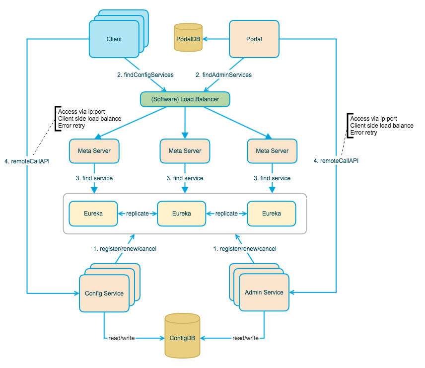
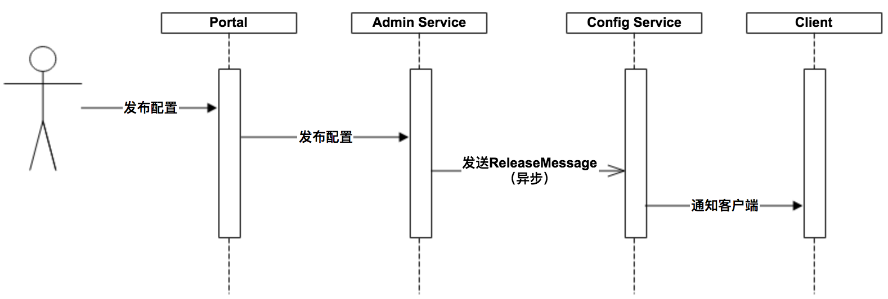
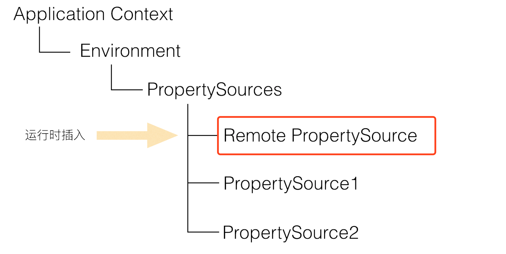

# Apollo 

## What

随着程序功能的日益复杂，程序的配置日益增多：各种功能的开关、参数的配置、服务器的地址……
对程序配置的期望值也越来越高：配置修改后实时生效，灰度发布，分环境、分集群管理配置，完善的权限、审核机制……
在这样的大环境下，传统的通过配置文件、数据库等方式已经越来越无法满足开发人员对配置管理的需求。
Apollo配置中心应运而生！

## Why

* 统一管理不同环境、不同集群的配置
* 配置修改实时生效（热发布）
* 版本发布管理
* 灰度发布
* 权限管理、发布审核、操作审计
* 客户端配置信息监控
* 提供Java和.Net原生客户端
* 提供开放平台API
* 部署简单

## How

### 整体架构

#### ConfigService

* 提供配置获取接口
* 提供配置更新推送接口（基于Http long polling）
  * 服务端使用Spring DeferredResult实现**异步化**，从而大大增加长连接数量
  * 目前使用的tomcat embed默认配置是最多10000个连接（可以调整），使用了4C8G的虚拟机实测可以支撑10000个连接，所以满足需求（一个应用实例只会发起一个**长连接**）。
* 接口服务对象为Apollo客户端

#### Admin Service

* 提供配置管理接口
* 提供配置修改、发布等接口
* 接口服务对象为Portal

#### Meta Server

* Meta Server从Eureka获取Config Service和Admin Service的服务信息，相当于是一个Eureka Client
* 增设一个Meta Server的角色主要是为了封装服务发现的细节，对Portal和Client而言，永远通过一个Http接口获取Admin Service和Config Service的服务信息，而不需要关心背后实际的服务注册和发现组件
* Meta Server只是一个逻辑角色，在部署时和Config Service是在一个JVM进程中的，所以IP、端口和Config Service一致

#### Eureka

* Config Service和Admin Service会向Eureka注册服务，并保持心跳
* 为了简单起见，目前Eureka在部署时和Config Service是在一个JVM进程中的（通过Spring Cloud Netflix）

**为什么采用Eureka作为服务注册中心，而不是传统的Zookeeper、etcd？**

* 完整的Service Registry和Service Discovery实现 经过了Netflix生产环境的考验
* 和SpringCloud 无缝集成。 Eureka还支持在我们应用自身的容器中启动，也就是说我们的应用启动完之后，既充当了Eureka的角色，同时也是服务的提供者。这样就极大的提高了服务的可用性。 减少外部依赖
* 开源

#### Portal

* 提供Web界面供用户管理配置
* 通过Meta Server获取Admin Service服务列表（IP+Port），通过IP+Port访问服务
* 在Portal侧做load balance、错误重试

#### Client

* Apollo提供的客户端程序，为应用提供配置获取、实时更新等功能
* 通过Meta Server获取Config Service服务列表（IP+Port），通过IP+Port访问服务
* 在Client侧做load balance、错误重试

### 服务端设计

#### 配置发布后的实时推送设计

 

**ReleaseMessage**
没有引入mq，采用的线程每秒定时扫描机制

### 客户端设计

上图简要描述了Apollo客户端的实现原理：

1. 客户端和服务端保持了一个长连接，从而能第一时间获得配置更新的推送。
2. 客户端还会定时从Apollo配置中心服务端拉取应用的最新配置。
   * 这是一个fallback机制，为了防止推送机制失效导致配置不更新
   * 客户端定时拉取会上报本地版本，所以一般情况下，对于定时拉取的操作，服务端都会返回304 - Not Modified
   * 定时频率默认为每5分钟拉取一次，客户端也可以通过在运行时指定System Property: apollo.refreshInterval来覆盖，单位为分钟。
3. 客户端从Apollo配置中心服务端获取到应用的最新配置后，会保存在内存中
4. 客户端会把从服务端获取到的配置在本地文件系统缓存一份
5. 在遇到服务不可用，或网络不通的时候，依然能从本地恢复配置
6. 应用程序从Apollo客户端获取最新的配置、订阅配置更新通知

#### 配置更新推送实现 | Config Service通知客户端的实现方式

前面提到了Apollo客户端和服务端保持了一个长连接，从而能第一时间获得配置更新的推送。

长连接实际上我们是通过Http Long Polling实现的，具体而言：

* 客户端发起一个Http请求到服务端
* 服务端会保持住这个连接60秒
  * 如果在60秒内有客户端关心的配置变化，被保持住的客户端请求会立即返回，并告知客户端有配置变化的namespace信息，客户端会据此拉取对应namespace的最新配置
  * 如果在60秒内没有客户端关心的配置变化，那么会返回Http状态码304给客户端
* 客户端在收到服务端请求后会立即重新发起连接，回到第一步

考虑到会有数万客户端向服务端发起长连，在服务端我们使用了async servlet(Spring DeferredResult)来服务Http Long Polling请求。

### 和Spring集成的原理

Spring从3.1版本开始增加了ConfigurableEnvironment和PropertySource：
