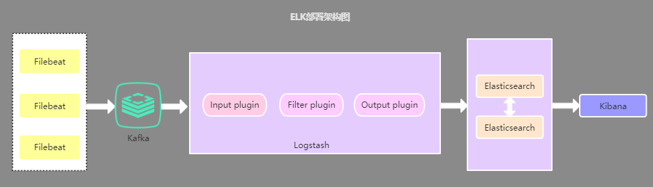

# 分布式日志系统

## 概述

ELK 已经成为目前最流行的集中式日志解决方案，它主要是由Beats、Logstash、Elasticsearch、Kibana等组件组成，来共同完成实时日志的收集，存储，展示等一站式的解决方案。本文将会介绍ELK常见的架构以及相关问题解决。

`Filebeat`：Filebeat是一款轻量级，占用服务资源非常少的数据收集引擎，它是ELK家族的新成员，可以代替Logstash作为在应用服务器端的日志收集引擎，支持将收集到的数据输出到Kafka，Redis等队列。        
`Logstash`：数据收集引擎，相较于Filebeat比较重量级，但它集成了大量的插件，支持丰富的数据源收集，对收集的数据可以过滤，分析，格式化日志格式。         
`Elasticsearch`：分布式数据搜索引擎，基于Apache Lucene实现，可集群，提供数据的集中式存储，分析，以及强大的数据搜索和聚合功能。
`Kibana`：数据的可视化平台，通过该web平台可以实时的查看 Elasticsearch 中的相关数据，并提供了丰富的图表统计功能。

## 常见架构

* Logstash作为日志收集器

Logstash比较耗服务器资源，所以会增加应用服务器端的负载压力。

* **Filebeat作为日志收集器**

Filebeat作为应用服务器端的日志收集器(占用资源少)，一般Filebeat会配合Logstash一起使用，这种部署方式也是目前最常用的架构。

* 引入缓存队列的部署架构

这种架构主要是解决大数据量下的日志收集方案，使用缓存队列主要是解决数据安全与均衡Logstash与Elasticsearch负载压力。

