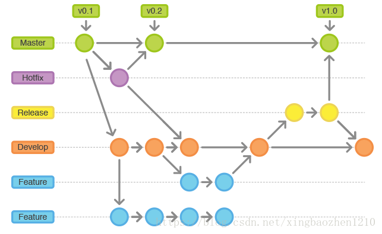

# Git

## 常用命令

```shell
git config --global user.name "Your Name" 
git config --global user.email "email@example.com" 

git init
git add 
git commit -m 
git push [-f]

git clone 
git branch 
git checkout -b 

git pull = git fetch   +git merge

```

`reset`(重置)和`revert`（提交回滚）区别 
reset是回朔到指定的commit版本（指定commit版本之后的操作都消失了）。       
revert是删除指定的commit操作的内容（指定的版本内容消失，之前和之后commit版本内的操作都保留），但是这个操作也会做了一个commit提交版本。(反向提交)


## GitFlow

* `Master`  最稳定的分支
* `Develop` 主开发分支
* `Feature` 新特性开发。
* `Release` 发布到 test，提测、BUG 修复。
* `HotFix`  线上 BUG 修复。



!> 流程

* 新特性开发

接到一个新产品特性 a；
从 develop 分出新分支 feature/a；
在 feature/a 开发特性 a；
完成开发，结束特性 a，代码合并到 develop；

* 提测

从 develop（此时 develop 可能包含多个特性：feature/a、feature/b ...）分出新分支 release/v1.2.0；
在 release/v1.2.0 上修复 QA 测试的 BUG；
完成测试，结束 release/v1.2.0，代码合并到 develop 和 master；

* 修复线上 BUG

从 master 分出新分支 hotfix/v1.2.1；
修复 BUG；
完成 BUG 修复，结束 hotfix/v1.2.1，代码合并到 develop 和 master；