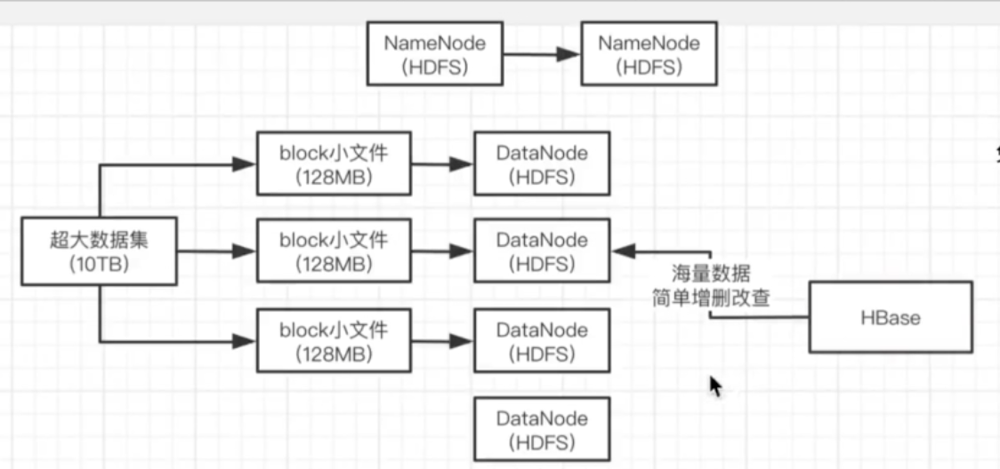
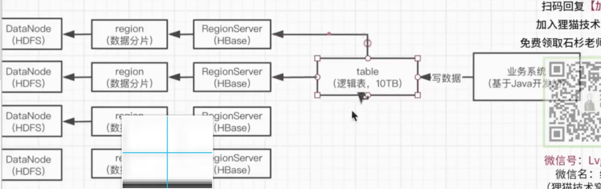
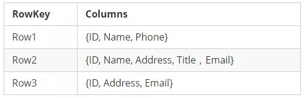
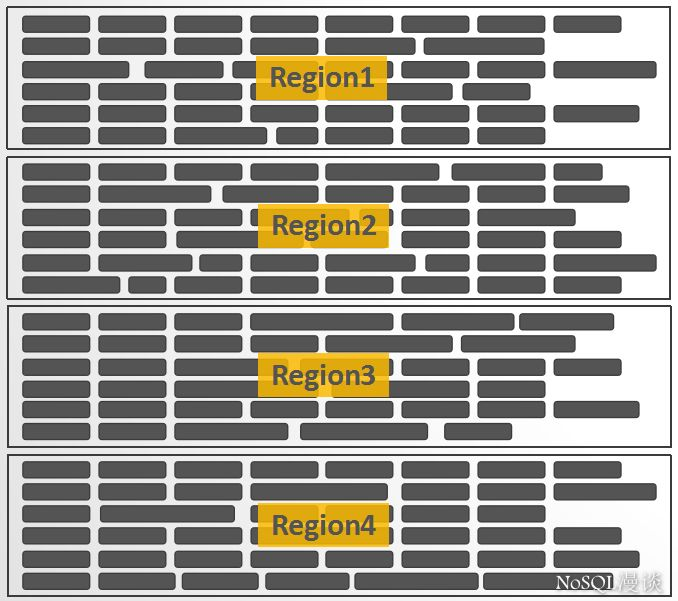
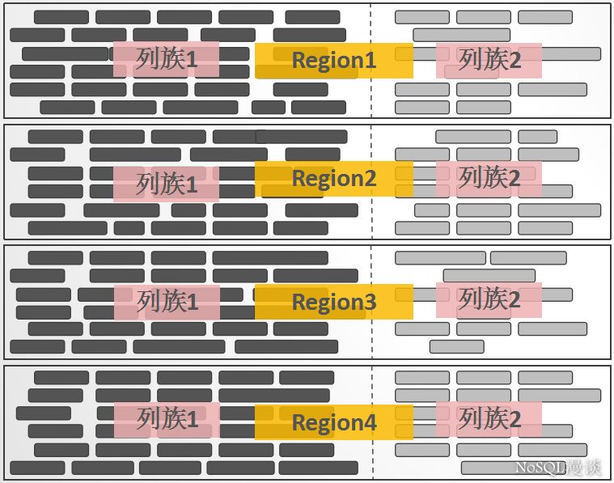
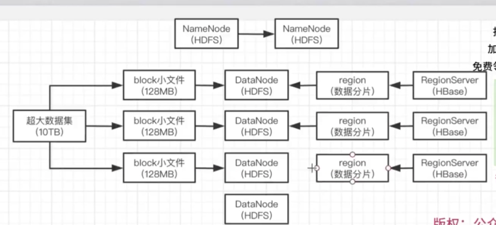

# HBase 

## What  

我们主要用来存储一些 运营商数据  数据量很大。且  非规则
HBase是Apache的Hadoop项目的子项目，是Hadoop Database的简称。

HBase是一个高可靠性、高性能、面向列、可伸缩的分布式存储系统，利用HBase技术可在廉价PC Server上搭建起大规模结构化存储集群。

HBase不同于一般的关系数据库，它是一个适合于**非结构化数据存储**的数据库，HBase**基于列**的而不是基于行的模式。

**hbase为基于hdfs的nosql数据库，不支持类似sql语句，对hdfs做一些简单的增删查改。**

**很多场景是需要对海量数据做基础的增删改查，不需要复杂的sql语法支持，那么天然可以用hbase，海量数据可以存储，分布式的nosql支持**

## Why

hbase表的特性

1、大

hbase表可以存储海量的数据。
2、无模式

mysql表中每一行列的字段是相同，而hbase表中每一行数据可以有截然不同的列。
3、面向列

hbase表中的数据可以有很多个列，后期它就是按照不同的列去存储数据，写入到不同的文件中。
面向列族进行存储数据。
4、稀疏

在hbase表中为null的列并不占用实际的存储空间。
5、数据的多版本

对于hbase表中的数据在进行数据更新的时候，它并没有把之前的结果数据直接删除掉，而是保留数据的多个版本，每一个数据都给一个版本号，这个版本号就是按照我们插入数据的时间戳去确定。
6、数据类型单一

无论是什么类型的数据，最后都被转换成了字节数组存储在hbase表中

## 特点

（1）分布式架构

 

hbase定位是分布式nosql数据库，把自己的nosql数据库的功能是通过多台机器来实现的，有多个RegionServer，分布式管理数据，分布式执行你的各种nosql数据库的操作

 

（2）分布式数据存储和自动数据分片

 

这个功能是极为强大的，比如你搞一个hbase里的表，然后在表里搞很多很多的数据，这个表会分为很多的region，每个region里是一个数据分片，然后这些region数据分片就会分散在多台机器上

 

假设你的表里的数据太多了，此时region会自动进行分裂，分裂成更多的region，自动分散在更多的机器上，对我们使用是极为方便的

 

（3）集成hdfs作为分布式文件存储系统

（1）强一致读写

 

他不是zk那种最终一致性，是强一致的，你写成功了立马就可以读。这个功能是极为实用的，他是依靠的分布式存储才做到的，zk那种是属于主从同步，你读follower机器是可能读到不一致数据的

 

（2）高可用

 

每台机器上部署一个RegionServer，管理一大堆的region数据分片，RegionServer都是支持高可用的，一个RegionServer挂掉不会导致数据丢失，他自动可以由别的机器接管他的工作运行下去

 

（3）支持mapreduce/spark这种分布式计算引擎

 

对hbase里的数据进行分布式计算，可以从hbase里分布式抽数据去计算，也可以把计算后的结果写入hbase分布式存储

 

（4）Java API/thrift API/REST API的支持

 

当然支持Java API了，咱们的Java业务系统经常会有海量数据NoSQL存储的需求，此时就可以基于Java API来操作hbase里的数据了

 

（5）支持协处理器，块缓存和布隆过滤器，可以用于优化查询性能

 

（6）hbase现在最新版本都是支持web界面的方式来对hbase集群进行运维管理的

## 使用场景

### 1.海量数据场景

什么叫做海量数据？说不好听的，假设你就几百万数据，用MySQL就可以轻松高兴了，要是你有几千万数据呢？基本到MySQL的瓶颈和极限了。要是你有几亿条数据呢？而且每天数据量还在不停的增长呢？

这个时候你就可以使用hbase了，他天生就是分布式的，可以扩容很方便，数据分布式存储，自动数据分片，完善的运维管理，底层集成hdfs做分布式文件系统，增删改查的nosql功能都支持，你几亿到几十亿的数据放里面很适合，而且数据还一直在增长

绝对比mysql分库分表要来的方便的多

### 2. 只需要简单的增删改查的支持

你对海量的数据仅仅就是简单的增删改查的支持，绝对没有MySQL那种关系型数据库支持的列类型、索引、事务、SQL语法，那么多高阶的特性，你要是不需要索引、SQL和事务，那妥妥的用hbase就可以了

 

虽然hbase之上有很多开源组件，可以搞二级索引 es、phoniex可以支持SQL，但是说实话，真的没必要，人家hbase就不是干这个的，麻烦大家别折腾他好吗

## 数据模型

hbase里其实也是建一个一个的表

表里有很多行的数据，但是其实这个表说白了就是一个逻辑模型，物理上根本没那么简单的，一个表的数据当然是拆为很多region分散在不同的机器上的，要是表里数据太多了，region数量还会变多，这样你加更多机器，region可以自动迁移到不同的机器上去

每一行都有一个rowkey，还有很多列，表里的数据行都是按照rowkey排序的，大致可以把rowkey理解为mysql里的主键id，在hbase里每一行数据都有一个rowkey行健来唯一的标识一行数据

每一行都有一个rowkey，还有很多列，表里的数据行都是按照rowkey排序的，大致可以把rowkey理解为mysql里的主键id，在hbase里每一行数据都有一个rowkey行健来唯一的标识一行数据

 

所以一般设计rowkey是一门讲究活，后续还会讲如何设计rowkey的，因为一般要把同一类数据的rowkey设计的相似一些，比如说用户id=1的订单，就应该叫做order_1_xx之类的，这样一个用户的订单就会在排序之后靠近在一起 

rowkey         列

order_1_110     xxx

order_1_111     xxx

order_2_256     xxx

rowkey         order:base       order:detail      order:extent

order_1_110      xxx             xxx

order_1_111     x1(t1); x2(t2)     xxx            xxx

 

每一行数据都有一些列族，就是column family，每个列族都包含一些列，每个列族都有一系列的存储属性，比如说是否把列族里的列值缓存在内存里，列族里的数据如何进行压缩，类似这种

 

一个表里有固定的一些列族，每一行都有这些列族，当然有可能你一行数据在某个列族里没存什么东西，是有可能的

 

然后就是列，每个列就是一个列族+分号+列限定符（column qualifier），比如说列族是order，列可能就是order:base，或者是order:detail

 

每个表的列族是固定的，但是每一行数据有哪些列是不固定的，插入数据的时候可以动态可以给这行数据设定多个列，每个列都是属于一个列族，就是一个列族+分号+列限定符的形式，就可以确定一个列

 

时间戳，timestamp，每一行的每个列的值写入的时候就会有一个时间戳，时间戳就代表了这一行这个列的某个版本的值，当然这个timestamp你也可以自己插入的时候指定一个timestamp也是ok的

 

单元格，也就是cell，其实就是一行的某个列族下的某个列（由列限定符来确定）的某个timestamp版本对应的值，说白了就这么个东西，在hbase里，每一行的每个列的值，是有多个版本的，每个版本都是一个cell

稀疏矩阵、 黑块就是key value

#### RowKey

用来表示唯一一行记录的主键，HBase的数据是按照RowKey的字典顺序进行全局排序的，所有的查询都只能依赖于这一个排序维度。

>通过下面一个例子来说明一下"字典排序"的原理：
>RowKey列表{"abc", "a", "bdf", "cdf", "def"}按字典排序后的结果为{"a", "abc", "bdf", "cdf", "defg"}
>也就是说，当两个RowKey进行排序时，先对比两个RowKey的第一个字节，如果相同，则对比第二个字节，依次类推...如果在对比到第M个字节时，已经超出了其中一个RowKey的字节长度，那么，短的RowKey要被排在另外一个RowKey的前面。

#### 稀疏矩阵

**每一行中，列的组成都是灵活的，行与行之间并不需要遵循相同的列定义**

#### Region

**横向切割**成一个个"子表"，这一个个"子表"就是Region

**Region**是HBase中负载均衡的基本单元，当一个Region增长到一定大小以后，会自动分裂成两个。

#### Column Family

**纵向切割**

分布式数据存储和自动数据分片

 

这个功能是极为强大的，比如你搞一个hbase里的表，然后在表里搞很多很多的数据，这个表会分为很多的region，每个region里是一个数据分片，然后这些region数据分片就会分散在多台机器上

 假设你的表里的数据太多了，此时region会自动进行分裂，分裂成更多的region，自动分散在更多的机器上，对我们使用是极为方便的

### KeyValue

KeyValue的设计不是源自Bigtable，而是要追溯至论文"The log-structured merge-tree(LSM-Tree)"。每一行中的每一列数据，都被包装成独立的拥有特定结构的KeyValue，KeyValue中包含了丰富的自我描述信息:

看的出来，KeyValue是支撑"稀疏矩阵"设计的一个关键点：一些Key相同的任意数量的独立KeyValue就可以构成一行数据。但这种设计带来的一个显而易见的缺点：**每一个KeyValue所携带的自我描述信息，会带来显著的数据膨胀。**

## 列式存储

hbase，列式存储的一个系统，他不是说按一行一行的格式来进行存储的，按列来进行存储的

 

rowkey     timestamp   列         值

order_1_110  t3         order:base   xxx

order_1_110  t4         order:detail  xxx

order_1_111  t1         order:base   x1

order_1_111  t2         order:base   x2

order_1_111  t5         order:detail  xxx

order_1_111  t6         order:extent  xxx