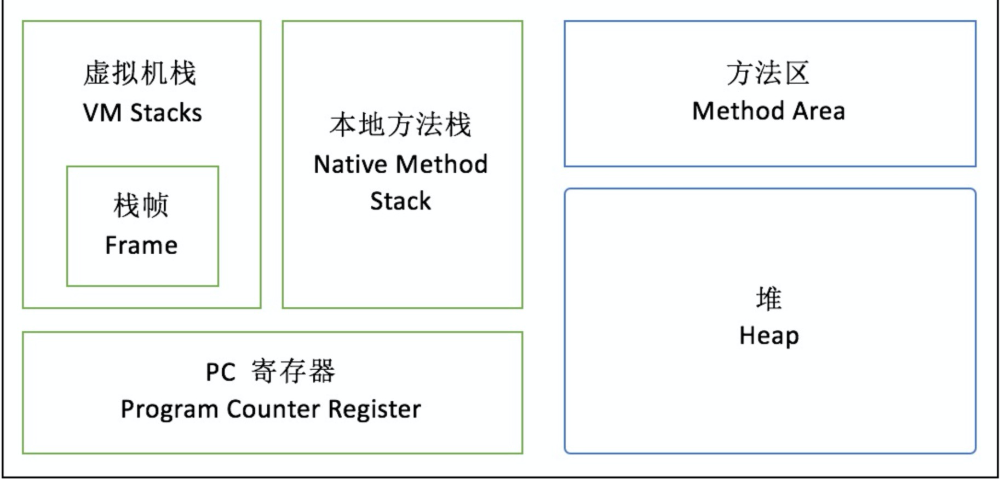

# JVM

## 内存结构
* JVM内存模型
  

* JDK8 Hotshot实现的

  

  方法区的实现 jdk8之前 是持久代 放到堆中  但是容易引发OOM 后来引入元数据
  虚拟机栈
  堆 heap     新生代（Eden so s1） 老年代  字符串常量   Eden放不下 YGC   old放不下  YGC          Survivor
  元数据  常量池 类元数据  方法元数据 字段 静态属性 方法 常量   方法区  -perm -元数据
  本地方法栈 native 程序计数器

1. Heap(堆区)

Heap区OOM故障的主要发源地，存储着几乎所有的实例对象。堆由垃圾回收器自动回收，堆区由各个子线程共享使用。 -Xms256M -Xmxl024M，其中 -X 表示它是 JVM 运行参数， ms 是 memory start 的简 称， mx 是 memory max 的简称，**JVM 的 Xms 和 Xmx 设置成一样大小，避免在 GC 后调整堆大小时带来的额外压力 。**
堆区分为新生代和老年代。新生代包括一个Eden和两个Survivor（幸存者）


2. Metaspace(元空间) JDK8

对应JVM规范的方法区概念。 元空间的前身是持久代Perm区。 大小固定难以调优，当发生FGC的时候需要移动类元信息。 如果动态加载的类过多容易产生 

```java
“Exception in thread 'dubbo client x.x connector' java.lang.OutOtemoryError: PennGen space
```
元空间是在本地内存分配的，Perm区中的所有内容中字符串常量移至堆内存，其他内容包括类元信息、字段、静态属性、方法、常量等 都移动至元空间内，

3. JVM Stack(虚拟机栈)
栈是一个先进后出的数据结构， `StackOverflowError 表示请求的栈溢出，导致内存耗尽，通常出现在递归方法中`。

## 垃圾回收

绝大多数对象在Eden区生成，当Eden区满的时候触发YGC(Young Garbage)。回收时Enden区没有被引用的对象直接回收，依然存活的放到Surivor。 Surivor有S1和S2两个区 交替使用。GC的时候把存活的对象放到未使用一个区。然后清除另一个区。一个对象在S1和S2来回交换次数有上限默认15，每次YGC 次数+1，`-XX:MaxTenuringThreshold`可以设置。如果 YGC 要移送的对象大于Survivor 区容量的上限，直接移交给老年代。如果老年代也放不下触发FGC(Full Garbage Collection),FGC后再放不下OOM `-XX:+HeapDumpOnOutOfMemoryError` 发生OOM时输出堆栈信息

**新生代GC（Minor GC）:指发生新生代的的垃圾收集动作，Minor GC非常频繁，回收速度一般也比较快。**     
**老年代GC（Major GC/Full GC）:指发生在老年代的GC，出现了Major GC经常会伴随至少一次的Minor GC（并非绝对），Major GC的速度一般会比Minor GC的慢10倍以上。**         

**垃圾回收( Garbage Collection, GC )。垃圾回收的主要目的是 清除不再使用的对象，自动释放内存。**

* 判断对象是否存活的标准 可达性分析
如果 个对象与 GC Roots 之间没有直接或间接的引用关系，比如某个失去任何引用的对象，或者两个互相环岛状循环引用的对象等 则可以回收

在Java语言里，可作为GC Roots对象的包括如下几种：

a.虚拟机栈(栈桢中的本地变量表)中的引用的对象

b.方法区中的类静态属性引用的对象

c.方法区中的常量引用的对象

d.本地方法栈中JNI的引用的对象

### 垃圾回收算法

* 标记-清除算法

从每个GC Roots出发，依次标记有引用关系的对象，最后将没有被标记的对象清除。但是这种算法会带来大量的空间碎片’导致需要分配 -个较大连续空间时容易触发 FGC。
    1. 效率问题
    2. 空间问题（标记清除后会产生大量不连续的碎片）
* 标记-整理算法

类似磁盘整理， 标记存活的对象。将存活的对象整理到内存一端，形成连续的已使用空间，最后把已使用空间之 外的部分全部清理掉 ， 这样就不会产生空间碎片的问题。

* Mark-Copy算法

能够并行地标记和整理将空间分为两块，每次只激活其中一块 ， 垃圾回收时只需把存活的对象复制到另一块未激活空间上，将未激活空间标记为己激活，将己激活空间标记为未激活，然后清除原空间中的原对象。堆内存空间分为较大的 Eden 和两块较小 的 Survivor，每次只使用 Eden 和 Survivor 区的块。这种情形下的“ Mark”Copy” 减 少了内存空间的浪费。 Mark-Copy 现在作为主流的YGC算法进行新生代的垃圾回收

* 分代收集算法
根据各个年代的特点选择合适的垃圾收集算法。

比如在新生代中，每次收集都会有大量对象死去，所以可以选择**复制算法**，只需要付出少量对象的复制成本就可以完成每次垃圾收集。而老年代的对象存活几率是比较高的，而且没有额外的空间对它进行分配担保，所以我们必须选择**“标记-清除”或“标记-整理”**算法进行垃圾收集。

### 4. 分代收集

现在的商业虚拟机采用分代收集算法，它根据对象存活周期将内存划分为几块，不同块采用适当的收集算法。

一般将堆分为新生代和老年代。

- 新生代使用：复制算法
- 老年代使用：标记 - 清除 或者 标记 - 整理 算法


### 垃圾回收器

垃圾回收器( Garbage Collector )是实现垃圾回收算法并应用在 NM 环境中的内 存管理模块。当前实现的垃圾回收器有数十种，本节只介绍 Serial、 CMS、 Gl 三种。

* Serial 回收器是一个主要应用于 YGC 的垃圾回收器，采用串行单线程的方式完 成 GC 任务，**单线程**  **Stop The World**  **新生代采用复制算法，老年代采用标记-整理算法** 如果频繁FGC影响性能  

* CMS 回收器( Concurrent Mark Sweep Collector )是回收停顿时间比较短、目前
比较常用的垃圾回收器。  **标记一清除算法** 大量垃圾碎片

**CMS（Concurrent Mark Sweep）收集器是一种以获取最短回收停顿时间为目标的收集器。它而非常符合在注重用户体验的应用上使用。**

**CMS（Concurrent Mark Sweep）收集器是HotSpot虚拟机第一款真正意义上的并发收集器，它第一次实现了让垃圾收集线程与用户线程（基本上）同时工作。**

* G1 回收器

**G1 (Garbage-First)是一款面向服务器的垃圾收集器,主要针对配备多颗处理器及大容量内存的机器. 以极高概率满足GC停顿时间要求的同时,还具备高吞吐量性能特征.**

Hotspot在 JDK7 中推出了新代 G1 回收器和 CMS 相比， GI 具备压缩功能 ， 能避免碎片问题， GI 的暂停时间更加可控。性能总体还是非常不错的

GI 将 Java 堆空间分割成了若干相同大小的 区域， G1 采用的Mark-Copy ， GI 的一大优势在于**可预测的停顿时间**， 能够尽可能快地在指定时间内完成垃圾回收任务。

## 类加载
* 类加载机制
虚拟机把描述类的数据从class文件加载到内存，并对数据进行校验、转换、解析和初始化。
* **java语言中类型的加载连接以及初始化过程都是在程序运行期间完成的**

这种策略虽然会使类加载时稍微增加一些性能开销，但是会为java应用程序提供高度的灵活性。java里天生就可以动态扩展语言特性就是依赖运行期间动态加载和动态连接这个特点实现的。比如，如果编写一个面向接口的程序，可以等到运行时再指定其具体实现类。
* 类加载过程


    * 加载
    1. 通过类型的完全限定名，产生一个代表该类型的二进制数据流
    2. 解析这个二进制数据流为方法区内的数据结构
    3. 创建一个表示该类型的java.lang.Class类的实例，作为方法区这个类的各种数据的访问入口。
    * 验证
      为了确保Class文件的字节流中包含的信息符合当前虚拟机的要求，并且不会危害虚拟机自身的安全。
    * 准备
      准备阶段是正式为类变量分配内存并设置类变量初始值的阶段，这些变量所使用的内存都将在方法区中进行分配。（备注：这时候进行内存分配的仅包括类变量（被static修饰的变量），而不包括实例变量，实例变量将会在对象实例化时随着对象一起分配在Java堆中）。
      初始值通常是数据类型的零值：
         > 对于：public static int value = 123;，那么变量value在准备阶段过后的初始值为0而不是123，这时候尚未开始执行任何java方法，把value赋值为123的动作将在初始化阶段才会被执行。
         > 一些特殊情况：
         > 对于：public static final int value = 123;编译时Javac将会为value生成ConstantValue属性，在准备阶段虚拟机就会根据ConstantValue的设置将value赋值为123。
    * 解析
      解析阶段是虚拟机将常量池内的符号引用替换为直接引用的过程。
    * 初始化
      到了初始化阶段，才真正开始执行类中定义的java程序代码（或者说是字节码）。
  
* 类初始化 
    虚拟机规范严格规定了有且只有五种情况必须立即对类进行“初始化”：
    * 使用new关键字实例化对象的时候、读取或设置一个类的静态字段的时候，已经调用一个类的静态方法的时候。

    * 使用java.lang.reflect包的方法对类进行反射调用的时候，如果类没有初始化，则需要先触发其初始化。

    * 当初始化一个类的时候，如果发现其父类没有被初始化就会先初始化它的父类。

    * 当虚拟机启动的时候，用户需要指定一个要执行的主类（就是包含main()方法的那个类），虚拟机会先初始化这个类；

    * 使用Jdk1.7动态语言支持的时候的一些情况。

    而对于接口，当一个接口在初始化时，并不要求其父接口全部都完成了初始化，只有在真正使用到父接口时（如引用父接口中定义的常量）才会初始化。       
    **其他情况不会进行初始化**        
    ①通过子类引用父类静态字段，不会导致子类初始化； 

    ```java
public class P {
    public static int abc = 123;
static{
    System.out.println("P is init");
    }
    }
    public class S extends P {
    static{
    System.out.println("S is init");
    }
    }
    public class Test {
    public static void main(String[] args) {
    System.out.println(S.abc);
    }
    }
    //输出结果 P is init
    ```
    
    ```java
    public class P {
    public static int abc = 123;
    static{
    System.out.println("P is init");
    }
    }
    public class S extends P {
    static{
    System.out.println("S is init");
    }
      public static void main(String[] args) {
    System.out.println(S.abc);
    }
    }
    
    //输出结果 P is init <br>  S is init
    ```
    
    ②通过数组定义引用类，不会触发此类的初始化                       
    
    ③常量在编译阶段会存入调用类的常量池中，本质上并没有直接引用定义常量的类，因此不会触发定义常量的类的初始化        
    
* 类初始化的加载顺序。         
    (1) 父类静态代码块(包括静态初始化块，静态属性，但不包括静态方法)        
    (2) 子类静态代码块(包括静态初始化块，静态属性，但不包括静态方法 )           
    (3) 父类非静态代码块( 包括非静态初始化块，非静态属性 )     
    (4) 父类构造函数         
    (5) 子类非静态代码块 ( 包括非静态初始化块，非静态属性 )       
    (6) 子类构造函数       
    
* 对象的创建

    ①类加载检查：检查这个符号引用代表的类是否已被加载过、解析和初始化过

    ②分配内存 分配方式有 “指针碰撞” 和 “空闲列表” 两种

    ③初始化零值

    ④设置对象头 虚拟机要对对象进行必要的设置，例如这个对象是那个类的实例、如何才能找到类的元数据信息、对象的哈希吗、对象的 GC 分代年龄等信息。 这些信息存放在对象头中。 另外，根据虚拟机当前运行状态的不同，如是否启用偏向锁等，对象头会有不同的设置方式。

    ⑤执行 init 方法： 在上面工作都完成之后，从虚拟机的视角来看，一个新的对象已经产生了，但从 Java 程序的视角来看，对象创建才刚开始，<init> 方法还没有执行，所有的字段都还为零。所以一般来说，执行 new 指令之后会接着执行 <init> 方法，把对象按照程序员的意愿进行初始化，这样一个真正可用的对象才算完全产生出来。

* 类与类加载器
  对于任意一个类，都需要由加载它的类加载器和这个类本身一同确立其在Java虚拟机中的唯一性。**如果两个类来源于同一个Class文件，只要加载它们的类加载器不同，那么这两个类就必定不相等。**
  
* 类加载器分类
  * 启动类加载器（Bootstrap）
  C++实现 是虚拟机的一部分 加载 <Java_Runtime_Home>\lib目录中的，或者被-Xbootclasspath参数所指定的路径
  * 其他类加载器 java实现
    * 扩展类加载器 （Extension ClassLoader）
    加载 <Java_Runtime_Home>\lib\ext目录
    * 应用程序类加载器（Application ClassLoader）
    加载用户类路径（ClassPath）上所指定的类库 一般情况下这个就是程序中默认的类加载器。
## 双亲委派模型
* 双亲委派模型
    

    双亲委派模型（Pattern Delegation Model）,要求除了顶层的启动类加载器外，其余的类加载器都应该有自己的**父类加载器**。这里父子关系通常是子类通过**组合**关系而不是继承关系来复用父加载器的代码。

    如果一个类加载器收到了类加载的请求，先把这个**请求委派给父类加载器**去完成（所以所有的加载请求最终都应该传送到顶层的启动类加载器中），只有当父加载器反馈自己无法完成加载请求时，子加载器才会尝试自己去加载。

    使用双亲委派模型来组织类加载器之间的关系，有一个显而易见的好处就是java类随着它的类加载器一起具备了一种带有优先级的**层次**关系。

    **委托机制的意义 — 防止内存中出现多份同样的字节码**


* JDK中的ClassLoader
```java
1 protected synchronized Class<?> loadClass(String name, boolean   resolve)
2     throws ClassNotFoundException
3     {
4     // First, check if the class has already been loaded
5     Class c = findLoadedClass(name);
6     if (c == null) {
7         try {
8         if (parent != null) {
9             c = parent.loadClass(name, false);
10         } else {
11             c = findBootstrapClass0(name);
12         }
13         } catch (ClassNotFoundException e) {
14             // If still not found, then invoke findClass in order
15             // to find the class.
16             c = findClass(name);
17         }
18     }
19     if (resolve) {
20         resolveClass(c);
21     }
22     return c;
23     }
```

方法原理很简单，一步一步解释一下：

1、第5行，首先查找.class是否被加载过

2、第6行~第12行，如果.class文件没有被加载过，那么会去找加载器的父加载器。如果父加载器不是null（不是Bootstrap ClassLoader），那么就执行父加载器的loadClass方法，把类加载请求一直向上抛，直到父加载器为null（是Bootstrap ClassLoader）为止

3、第13行~第17行，父加载器开始尝试加载.class文件，加载成功就返回一个java.lang.Class，加载不成功就抛出一个ClassNotFoundException，给子加载器去加载

4、第19行~第21行，如果要解析这个.class文件的话，就解析一下，解析的作用类加载的文章里面也写了，主要就是将符号引用替换为直接引用的过程

我们看一下findClass这个方法：
```java
protected Class<?> findClass(String name) throws ClassNotFoundException {
    throw new ClassNotFoundException(name);
    }
```
是的，没有具体实现，只抛了一个异常，而且是protected的，这充分证明了：这个方法就是给**开发者重写用的**。

* 自定义类加载器

1、如果不想打破双亲委派模型，那么只需要重写findClass方法即可
2、如果想打破双亲委派模型，那么就重写整个loadClass方法 

不打破双亲委派模型的 自定义类加载器开发步骤

**第一步**，自定义一个实体类Person.java，我把它编译后的Person.class放在D盘根目录下

**第二步**，自定义一个类加载器，里面主要是一些IO和NIO的内容，另外注意一下`defineClass`方法可以把二进制流字节组成的文件转换为一个java.lang.Class----只要二进制字节流的内容符合Class文件规范。我们自定义的MyClassLoader继承自java.lang.ClassLoader，就像上面说的，只实现findClass方法：
```java
public class MyClassLoader extends ClassLoader
{
    public MyClassLoader()
    {
        
    }
    
    public MyClassLoader(ClassLoader parent)
    {
        super(parent);
    }
    
    protected Class<?> findClass(String name) throws ClassNotFoundException
    {
        File file = getClassFile(name);
        try
        {
            byte[] bytes = getClassBytes(file);
            Class<?> c = this.defineClass(name, bytes, 0, bytes.length);
            return c;
        } 
        catch (Exception e)
        {
            e.printStackTrace();
        }
        
        return super.findClass(name);
    }
    
    private File getClassFile(String name)
    {
        File file = new File("D:/Person.class");
        return file;
    }
    
    private byte[] getClassBytes(File file) throws Exception
    {
        // 这里要读入.class的字节，因此要使用字节流
        FileInputStream fis = new FileInputStream(file);
        FileChannel fc = fis.getChannel();
        ByteArrayOutputStream baos = new ByteArrayOutputStream();
        WritableByteChannel wbc = Channels.newChannel(baos);
        ByteBuffer by = ByteBuffer.allocate(1024);
        
        while (true)
        {
            int i = fc.read(by);
            if (i == 0 || i == -1)
                break;
            by.flip();
            wbc.write(by);
            by.clear();
        }
        
        fis.close();
        
        return baos.toByteArray();
    }
}
```
**第三步**，Class.forName有一个三个参数的重载方法，可以指定类加载器，平时我们使用的Class.forName("XX.XX.XXX")都是使用的系统类加载器Application ClassLoader。

```java
MyClassLoader mcl = new MyClassLoader();        
Class<?> c1 = Class.forName("com.xrq.classloader.Person", true, mcl); 
```


* 能不能自己写个类叫java.lang.System？

答案：可以 自定义类加载器 打破双亲委派模型。 重写loadClass方法

解释：为了不让我们写System类，类加载采用委托机制，这样可以保证爸爸们优先，爸爸们能找到的类，儿子就没有机会加载。而System类是Bootstrap加载器加载的，就算自己重写，也总是使用Java系统提供的System，自己写的System类根本没有机会得到加载。

即使我们自定义的类加载器也必须继承自ClassLoader，其loadClass()方法里调用了父类的defineClass()方法，并终究调到preDefineClass()方法，因此我们自定义的类加载器也是不能加载以“java.”开头的java类的。我们继续运行下ClassLoaderTest类，输出以下：
不能自己写以"java."开头的类，其要末不能加载进内存，要末即便你用自定义的类加载器去强行加载，也会收到1个SecurityException。


preDefineClass 不允许java开头的包名被defineClass方法构造

```java
    private ProtectionDomain preDefineClass(String name, ProtectionDomain pd)
{
    // Note:  Checking logic in java.lang.invoke.MemberName.checkForTypeAlias
    // relies on the fact that spoofing is impossible if a class has a name
    // of the form "java.*"
    if ((name != null) && name.startsWith("java.")) {
        throw new SecurityException
            ("Prohibited package name: " +
                name.substring(0, name.lastIndexOf('.')));
    }
}
```

## JVM 参数

**1.7及以前  堆内存=新生代+老年代+持久代**

**1.8开始  堆内存=新生代+老年代**

* -Xms: 初始堆大小
* -Xmx: 最大堆大小,默认为物理内存的1/4   xms和xmx设置成一样 避免每次GC后调整堆大小时带来额外压力。避免重新分配内存。
* -Xss: 栈大小
* -Xmn: 新生代大小，通常为 Xmx的 1/3或1/4。新生代 = Eden + 2个Survivor空间。实际可用空间为 = Eden + 1个 Survivor，即90%
* -XX:SurvivorRatio： 新生代中 Eden与Survivor的比值，默认值为 8。即Eden占新生代空间的 8/10,另外两个 Survivor各占 1/10
* -XX:NewRatio = n: 设置新生代和老年代的比值，如 n = 3,表示新生代:老年代 = 1:3。
* -XX:PermSize： 永久代(方法区)的初始大小，(前提是永久代存在的情况下，在JDK 1.8及以后，永久代被移除了)
* -XX:+PrintGCDetails：打印 GC 信息
* -XX:+HeapDumpOnOutOfMemoryError：让虚拟机在发生内存溢出时 Dump 出当前的内存堆转储快照，以便分析用

