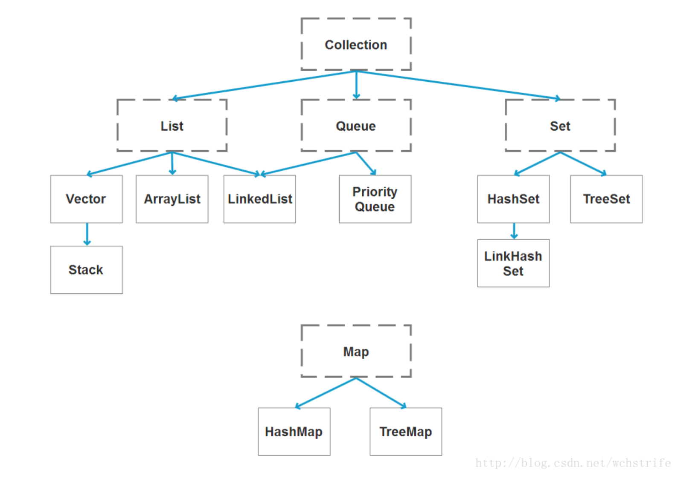
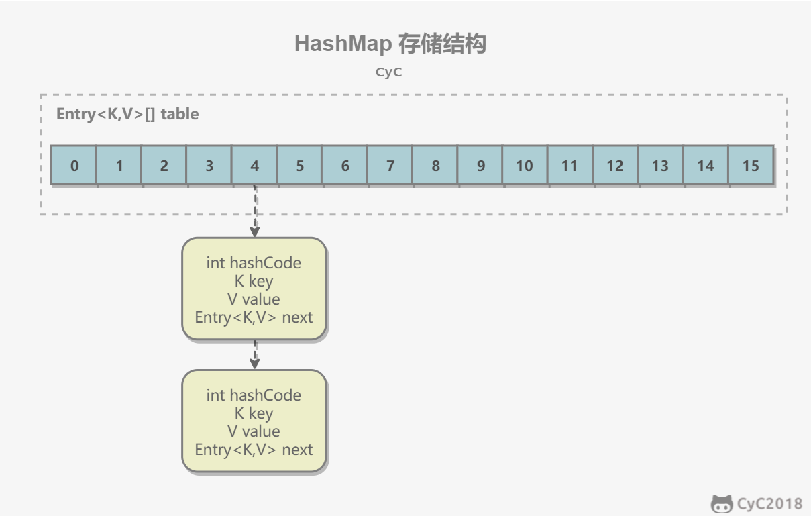
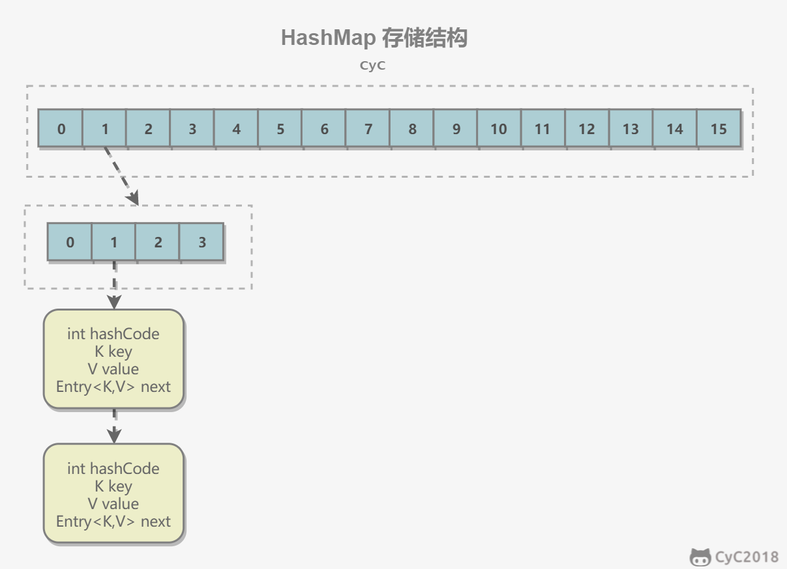

## 容器



## ArrayList

### 概览

因为 ArrayList 是基于数组实现的，所以支持快速随机访问。RandomAccess 接口标识着该类支持快速随机访问。

```java
public class ArrayList<E> extends AbstractList<E>
        implements List<E>, RandomAccess, Cloneable, java.io.Serializable
```

数组的默认大小为 10。

```java
private static final int DEFAULT_CAPACITY = 10;
```


### 扩容

添加元素时使用 ensureCapacityInternal() 方法来保证容量足够，如果不够时，需要使用 grow() 方法进行扩容，新容量的大小为 `oldCapacity + (oldCapacity >> 1)`，也就是**旧容量的 1.5 倍**。

扩容操作需要调用 `Arrays.copyOf()` 把原数组整个复制到新数组中，这个操作代价很高，**因此最好在创建 ArrayList 对象时就指定大概的容量大小，减少扩容操作的次数。**

```java
public boolean add(E e) {
    ensureCapacityInternal(size + 1);  // Increments modCount!!
    elementData[size++] = e;
    return true;
}

private void ensureCapacityInternal(int minCapacity) {
    if (elementData == DEFAULTCAPACITY_EMPTY_ELEMENTDATA) {
        minCapacity = Math.max(DEFAULT_CAPACITY, minCapacity);
    }
    ensureExplicitCapacity(minCapacity);
}

private void ensureExplicitCapacity(int minCapacity) {
    modCount++;
    // overflow-conscious code
    if (minCapacity - elementData.length > 0)
        grow(minCapacity);
}

private void grow(int minCapacity) {
    // overflow-conscious code
    int oldCapacity = elementData.length;
    int newCapacity = oldCapacity + (oldCapacity >> 1);
    if (newCapacity - minCapacity < 0)
        newCapacity = minCapacity;
    if (newCapacity - MAX_ARRAY_SIZE > 0)
        newCapacity = hugeCapacity(minCapacity);
    // minCapacity is usually close to size, so this is a win:
    elementData = Arrays.copyOf(elementData, newCapacity);
}
```

### 删除元素

需要调用 System.arraycopy() 将 index+1 后面的元素都复制从index 位置上，该操作的时间复杂度为 O(N)，可以看到 ArrayList 删除元素的代价是非常高的。

```java
public E remove(int index) {
    rangeCheck(index);
    modCount++;
    E oldValue = elementData(index);
    int numMoved = size - index - 1;
    if (numMoved > 0)
        System.arraycopy(elementData, index+1, elementData, index, numMoved);
    elementData[--size] = null; // clear to let GC do its work
    return oldValue;
}
```

### 序列化

ArrayList 基于数组实现，并且具有动态扩容特性，因此保存元素的数组不一定都会被使用，那么就没必要全部进行序列化。

保存元素的数组 elementData 使用 transient 修饰，该关键字声明数组默认不会被序列化。

```java
transient Object[] elementData; // non-private to simplify nested class access
```

###  Fail-Fast

modCount 用来记录 ArrayList 结构发生变化的次数。结构发生变化是指添加或者删除至少一个元素的所有操作，或者是调整内部数组的大小，仅仅只是设置元素的值不算结构发生变化。

在进行序列化或者迭代等操作时，需要比较操作前后 modCount 是否改变，如果改变了需要抛出 ConcurrentModificationException。代码参考上节序列化中的 writeObject() 方法。

```java
final void checkForComodification() {
            if (modCount != expectedModCount)
                throw new ConcurrentModificationException();
        }
```

调用list.remove()方法导致modCount和expectedModCount的值不一致。

直接调用List.remove()方法 

```java
 public E remove(int index) {
        rangeCheck(index);

        modCount++;
        E oldValue = elementData(index);

        int numMoved = size - index - 1;
        if (numMoved > 0)
            System.arraycopy(elementData, index+1, elementData, index,
                             numMoved);
        elementData[--size] = null; // clear to let GC do its work

        return oldValue;
    }
```

Itr的remove方法

```java
 public void remove() {
            if (lastRet < 0)
                throw new IllegalStateException();
            checkForComodification();

            try {
                ArrayList.this.remove(lastRet);
                cursor = lastRet;
                lastRet = -1;
                expectedModCount = modCount; //保持expectedModCount 和modcount一致 所以不会报错
            } catch (IndexOutOfBoundsException ex) {
                throw new ConcurrentModificationException();
            }
        }
```

所以删除请使用迭代器 或者 fori 倒着删除


#### 总结

因为ArrayList和HashMap的Iterator都是上面所说的“fail-fast Iterator”，Iterator在获取下一个元素，删除元素时，都会比较expectedModCount和modCount，不一致就会抛出异常。

所以当使用Iterator遍历元素(for-each遍历底层实现也是Iterator)时，需要删除元素，一定需要使用 **Iterator的remove()方法** 来删除，而不是直接调用ArrayList或HashMap自身的remove()方法,否则会导致Iterator中的expectedModCount没有及时更新，之后获取下一个元素或者删除元素时，expectedModCount和modCount不一致，然后抛出ConcurrentModificationException异常。

## Vector

它的实现与 ArrayList 类似，但是使用了 synchronized 进行同步。 

```java
public synchronized boolean add(E e) {
    modCount++;
    ensureCapacityHelper(elementCount + 1);
    elementData[elementCount++] = e;
    return true;
}

public synchronized E get(int index) {
    if (index >= elementCount)
        throw new ArrayIndexOutOfBoundsException(index);

    return elementData(index);
}
```


### 替代方案

vector性能差 已经不推荐使用了

可以使用 `Collections.synchronizedList();` 得到一个线程安全的 ArrayList。

```java
List<String> list = new ArrayList<>();
List<String> synList = Collections.synchronizedList(list);
```

也可以使用 concurrent 并发包下的 CopyOnWriteArrayList 类。

```java
List<String> list = new CopyOnWriteArrayList<>();
```

## CopyOnWriteArrayList

### 1. 读写分离

写操作在一个复制的数组上进行，读操作还是在原始数组中进行，读写分离，互不影响。

写操作需要加锁，防止并发写入时导致写入数据丢失。

写操作结束之后需要把原始数组指向新的复制数组。

volatile保证可见性

```java
/** The array, accessed only via getArray/setArray. */
private transient volatile Object[] array;
```

```java
public boolean add(E e) {
    final ReentrantLock lock = this.lock;
    lock.lock();
    try {
        Object[] elements = getArray();
        int len = elements.length;
        Object[] newElements = Arrays.copyOf(elements, len + 1);
        newElements[len] = e;
        setArray(newElements);
        return true;
    } finally {
        lock.unlock();
    }
}

final void setArray(Object[] a) {
    array = a;
}
```

```java
@SuppressWarnings("unchecked")
private E get(Object[] a, int index) {
    return (E) a[index];
}
```

### 适用场景

CopyOnWriteArrayList 在写操作的同时允许读操作，大大提高了读操作的性能，因此很适合读多写少的应用场景。

但是 CopyOnWriteArrayList 有其缺陷：

- 内存占用：在写操作时需要复制一个新的数组，使得内存占用为原来的两倍左右；
- 数据不一致：读操作不能读取实时性的数据，因为部分写操作的数据还未同步到读数组中。

所以 CopyOnWriteArrayList 不适合内存敏感以及对实时性要求很高的场景。


## LinkedList

### 概览

基于双向链表实现，使用 Node 存储链表节点信息。

```java
private static class Node<E> {
    E item;
    Node<E> next;
    Node<E> prev;
}
```

每个链表存储了 first 和 last 指针：

```java
transient Node<E> first;
transient Node<E> last;
```


### 2. 与 ArrayList 的比较

ArrayList 基于动态数组实现，LinkedList 基于双向链表实现。ArrayList 和 LinkedList 的区别可以归结为数组和链表的区别：

- 数组支持随机访问，但插入删除的代价很高，需要移动大量元素；

- 链表不支持随机访问，但插入删除只需要改变指针。

  

ArrayList 和LinkedList

都是线程不安全的
ArrayList底层结构是数组  LinkedList 是双向链表（
插入和删除是否受元素位置的影响：  ArrayList 受影响o(n)  LinkedList不受影响 o(1)
是否支持快速访问 ArrayList 支持  LinkedList 不支持
内存空间利用  ArrayList的空间浪费 主要是List列表末尾会预留一定的空间  LinkedList的空间浪费主要是 每个元素 都要有直接后继和直接前驱和数据


## HashMap

### 1.存储结构 1.7版本

内部包含了一个 Entry 类型的数组 table。Entry 存储着键值对。它包含了四个字段，从 next 字段我们可以看出 Entry 是一个链表。即数组中的每个位置被当成一个桶，一个桶存放一个链表。HashMap 使用拉链法来解决冲突，同一个链表中存放哈希值和散列桶取模运算结果相同的 Entry。



```java
transient Entry[] table;Copy to clipboardErrorCopied
```

```java

static class Entry<K,V> implements Map.Entry<K,V> {
    final K key;
    V value;
    Entry<K,V> next;
    int hash;

    Entry(int h, K k, V v, Entry<K,V> n) {
        value = v;
        next = n;
        key = k;
        hash = h;
    }

    public final K getKey() {
        return key;
    }

    public final V getValue() {
        return value;
    }

    public final V setValue(V newValue) {
        V oldValue = value;
        value = newValue;
        return oldValue;
    }

    public final boolean equals(Object o) {
        if (!(o instanceof Map.Entry))
            return false;
        Map.Entry e = (Map.Entry)o;
        Object k1 = getKey();
        Object k2 = e.getKey();
        if (k1 == k2 || (k1 != null && k1.equals(k2))) {
            Object v1 = getValue();
            Object v2 = e.getValue();
            if (v1 == v2 || (v1 != null && v1.equals(v2)))
                return true;
        }
        return false;
    }

    public final int hashCode() {
        return Objects.hashCode(getKey()) ^ Objects.hashCode(getValue());
    }

    public final String toString() {
        return getKey() + "=" + getValue();
    }
}
```


### 2. 拉链法的工作原理

```java
HashMap<String, String> map = new HashMap<>();
map.put("K1", "V1");
map.put("K2", "V2");
map.put("K3", "V3");Copy to clipboardErrorCopied
```

- 新建一个 HashMap，默认大小为 16；
- 插入 <K1,V1> 键值对，先计算 K1 的 hashCode 为 115，使用除留余数法得到所在的桶下标 115%16=3。
- 插入 <K2,V2> 键值对，先计算 K2 的 hashCode 为 118，使用除留余数法得到所在的桶下标 118%16=6。
- 插入 <K3,V3> 键值对，先计算 K3 的 hashCode 为 118，使用除留余数法得到所在的桶下标 118%16=6，插在 <K2,V2> 前面。

应该注意到链表的插入是以**头插法**方式进行的，例如上面的 <K3,V3> 不是插在 <K2,V2> 后面，而是插入在链表头部。

查找需要分成两步进行：

- 计算键值对所在的桶；
- 在链表上顺序查找，时间复杂度显然和链表的长度成正比。


### 3. put 操作

```java
public V put(K key, V value) {
    if (table == EMPTY_TABLE) {
        inflateTable(threshold);
    }
    // 键为 null 单独处理
    if (key == null)
        return putForNullKey(value);
    int hash = hash(key);
    // 确定桶下标
    int i = indexFor(hash, table.length);
    // 先找出是否已经存在键为 key 的键值对，如果存在的话就更新这个键值对的值为 value
    for (Entry<K,V> e = table[i]; e != null; e = e.next) {
        Object k;
        if (e.hash == hash && ((k = e.key) == key || key.equals(k))) {
            V oldValue = e.value;
            e.value = value;
            e.recordAccess(this);
            return oldValue;
        }
    }

    modCount++;
    // 插入新键值对
    addEntry(hash, key, value, i);
    return null;
}Copy to clipboardErrorCopied
```

**HashMap 允许插入键为 null 的键值对。**但是因为无法调用 null 的 hashCode() 方法，也就无法确定该键值对的桶下标，只能通过强制指定一个桶下标来存放。HashMap 使用第 0 个桶存放键为 null 的键值对。

通过`containsKey(key)` 方法来判断这个key的value为null

```java
private V putForNullKey(V value) {
    for (Entry<K,V> e = table[0]; e != null; e = e.next) {
        if (e.key == null) {
            V oldValue = e.value;
            e.value = value;
            e.recordAccess(this);
            return oldValue;
        }
    }
    modCount++;
    addEntry(0, null, value, 0);
    return null;
}Copy to clipboardErrorCopied
```

**使用链表的头插法，也就是新的键值对插在链表的头部，而不是链表的尾部。**

```java
void addEntry(int hash, K key, V value, int bucketIndex) {
    if ((size >= threshold) && (null != table[bucketIndex])) {
        resize(2 * table.length);
        hash = (null != key) ? hash(key) : 0;
        bucketIndex = indexFor(hash, table.length);
    }

    createEntry(hash, key, value, bucketIndex);
}

void createEntry(int hash, K key, V value, int bucketIndex) {
    Entry<K,V> e = table[bucketIndex];
    // 头插法，链表头部指向新的键值对
    table[bucketIndex] = new Entry<>(hash, key, value, e);
    size++;
}Copy to clipboardErrorCopied
Entry(int h, K k, V v, Entry<K,V> n) {
    value = v;
    next = n;
    key = k;
    hash = h;
}Copy to clipboardErrorCopied
```

### 4. 确定桶下标

很多操作都需要先确定一个键值对所在的桶下标。

```java
int hash = hash(key);
int i = indexFor(hash, table.length);Copy to clipboardErrorCopied
```

**4.1 计算 hash 值**

```java
final int hash(Object k) {
    int h = hashSeed;
    if (0 != h && k instanceof String) {
        return sun.misc.Hashing.stringHash32((String) k);
    }

    h ^= k.hashCode();

    // This function ensures that hashCodes that differ only by
    // constant multiples at each bit position have a bounded
    // number of collisions (approximately 8 at default load factor).
    h ^= (h >>> 20) ^ (h >>> 12);
    return h ^ (h >>> 7) ^ (h >>> 4);
}
public final int hashCode() {
    return Objects.hashCode(key) ^ Objects.hashCode(value);
}
```

**4.2 取模**

令 x = 1<<4，即 x 为 2 的 4 次方，它具有以下性质：

```
x   : 00010000
x-1 : 00001111Copy to clipboardErrorCopied
```

令一个数 y 与 x-1 做与运算，可以去除 y 位级表示的第 4 位以上数：

```
y       : 10110010
x-1     : 00001111
y&(x-1) : 00000010Copy to clipboardErrorCopied
```

这个性质和 y 对 x 取模效果是一样的：

```
y   : 10110010
x   : 00010000
y%x : 00000010Copy to clipboardErrorCopied
```

我们知道，位运算的代价比求模运算小的多，因此在进行这种计算时用位运算的话能带来更高的性能。

确定桶下标的最后一步是将 key 的 hash 值对桶个数取模：hash%capacity，如果能保证 capacity 为 2 的 n 次方，那么就可以将这个操作转换为位运算。

```java
static int indexFor(int h, int length) {
    return h & (length-1);
}Copy to clipboardErrorCopied
```

### 5. 扩容-基本原理

设 HashMap 的 table 长度为 M，需要存储的键值对数量为 N，如果哈希函数满足均匀性的要求，那么每条链表的长度大约为 N/M，因此查找的复杂度为 O(N/M)。

为了让查找的成本降低，应该使 N/M 尽可能小，因此需要保证 M 尽可能大，也就是说 table 要尽可能大。HashMap 采用动态扩容来根据当前的 N 值来调整 M 值，使得空间效率和时间效率都能得到保证。

和扩容相关的参数主要有：capacity、size、threshold 和 load_factor。

| 参数       | 含义                                                         |
| ---------- | ------------------------------------------------------------ |
| capacity   | table 的容量大小，默认为 16。需要注意的是 capacity 必须保证为 2 的 n 次方。 |
| size       | 键值对数量。                                                 |
| threshold  | size 的临界值，当 size 大于等于 threshold 就必须进行扩容操作。 |
| loadFactor | 装载因子，table 能够使用的比例，threshold = (int)(capacity* loadFactor)。0.75 |

```java
static final int DEFAULT_INITIAL_CAPACITY = 16;

static final int MAXIMUM_CAPACITY = 1 << 30;

static final float DEFAULT_LOAD_FACTOR = 0.75f;

transient Entry[] table;

transient int size;

int threshold;

final float loadFactor;

transient int modCount;Copy to clipboardErrorCopied
```

从下面的添加元素代码中可以看出，当需要扩容时，令 capacity 为原来的两倍。

```java
void addEntry(int hash, K key, V value, int bucketIndex) {
    Entry<K,V> e = table[bucketIndex];
    table[bucketIndex] = new Entry<>(hash, key, value, e);
    if (size++ >= threshold)
        resize(2 * table.length);
}Copy to clipboardErrorCopied
```

扩容使用 resize() 实现，需要注意的是，扩容操作同样需要把 oldTable 的所有键值对重新插入 newTable 中，因此这一步是很费时的。

```java
void resize(int newCapacity) {
    Entry[] oldTable = table;
    int oldCapacity = oldTable.length;
    if (oldCapacity == MAXIMUM_CAPACITY) {
        threshold = Integer.MAX_VALUE;
        return;
    }
    Entry[] newTable = new Entry[newCapacity];
    transfer(newTable);
    table = newTable;
    threshold = (int)(newCapacity * loadFactor);
}

void transfer(Entry[] newTable) {
    Entry[] src = table;
    int newCapacity = newTable.length;
    for (int j = 0; j < src.length; j++) {
        Entry<K,V> e = src[j];
        if (e != null) {
            src[j] = null;
            do {
                Entry<K,V> next = e.next;
                int i = indexFor(e.hash, newCapacity);
                e.next = newTable[i];
                newTable[i] = e;
                e = next;
            } while (e != null);
        }
    }
}Copy to clipboardErrorCopied
```

### 6. 扩容-重新计算桶下标

在进行扩容时，需要把键值对重新计算桶下标，从而放到对应的桶上。在前面提到，HashMap 使用 hash%capacity 来确定桶下标。HashMap capacity 为 2 的 n 次方这一特点能够极大降低重新计算桶下标操作的复杂度。

假设原数组长度 capacity 为 16，扩容之后 new capacity 为 32：

```html
capacity     : 00010000
new capacity : 00100000Copy to clipboardErrorCopied
```

对于一个 Key，它的哈希值 hash 在第 5 位：

- 为 0，那么 hash%00010000 = hash%00100000，桶位置和原来一致；
- 为 1，hash%00010000 = hash%00100000 + 16，桶位置是原位置 + 16。

### 7. 计算数组容量

HashMap 构造函数允许用户传入的容量不是 2 的 n 次方，因为它可以自动地将传入的容量转换为 2 的 n 次方。

先考虑如何求一个数的掩码，对于 10010000，它的掩码为 11111111，可以使用以下方法得到：

```
mask |= mask >> 1    11011000
mask |= mask >> 2    11111110
mask |= mask >> 4    11111111Copy to clipboardErrorCopied
```

mask+1 是大于原始数字的最小的 2 的 n 次方。

```
num     10010000
mask+1 100000000Copy to clipboardErrorCopied
```

以下是 HashMap 中计算数组容量的代码：

```java
static final int tableSizeFor(int cap) {
    int n = cap - 1;
    n |= n >>> 1;
    n |= n >>> 2;
    n |= n >>> 4;
    n |= n >>> 8;
    n |= n >>> 16;
    return (n < 0) ? 1 : (n >= MAXIMUM_CAPACITY) ? MAXIMUM_CAPACITY : n + 1;
}Copy to clipboardErrorCopied
```

### 8. 链表转红黑树

从 JDK 1.8 开始，一个桶存储的链表长度大于等于 8 时会将链表转换为红黑树。

目的：主要是为了提升在 hash 冲突严重时（链表过长）的查找性能，使用链表的查找性能是 O(n)，而使用红黑树是 O(logn)。

### 9. 与 Hashtable 的比较

- Hashtable 使用 synchronized 来进行同步。
- HashMap 可以插入键为 null 的 Entry。
- HashMap 的迭代器是 fail-fast 迭代器。
- HashMap 不能保证随着时间的推移 Map 中的元素次序是不变的。

## ConcurrentHashMap



ConcurrentHashMap 和 HashMap 实现上类似，最主要的差别是 ConcurrentHashMap 采用了分段锁（Segment），每个分段锁维护着几个桶（HashEntry），多个线程可以同时访问不同分段锁上的桶，从而使其并发度更高（并发度就是 Segment 的个数）。

Segment 继承自 ReentrantLock。

```java
static final class Segment<K,V> extends ReentrantLock implements Serializable {

    private static final long serialVersionUID = 2249069246763182397L;

    static final int MAX_SCAN_RETRIES =
        Runtime.getRuntime().availableProcessors() > 1 ? 64 : 1;

    transient volatile HashEntry<K,V>[] table;

    transient int count;

    transient int modCount;

    transient int threshold;

    final float loadFactor;
}Copy to clipboardErrorCopied
final Segment<K,V>[] segments;Copy to clipboardErrorCopied
```

默认的并发级别为 16，也就是说默认创建 16 个 Segment。

**JDK 1.8 的改动**

JDK 1.7 使用分段锁机制来实现并发更新操作，核心类为 Segment，它继承自重入锁 ReentrantLock，并发度与 Segment 数量相等。

JDK 1.8 使用了 CAS 操作来支持更高的并发度，在 CAS 操作失败时使用内置锁 synchronized。

ConcurrentHashMap取消了Segment分段锁，采用CAS和synchronized来保证并发安全。数据结构跟HashMap1.8的结构类似，数组+链表/红黑二叉树。Java 8在链表长度超过一定阈值（8）时将链表（寻址时间复杂度为O(N)）转换为红黑树（寻址时间复杂度为O(log(N))）

synchronized只锁定当前链表或红黑二叉树的首节点，这样只要hash不冲突，就不会产生并发，效率又提升N倍。


并且 JDK 1.8 的实现也在链表过长时会转换为红黑树。


## LinkedHashMap

继承自 HashMap，因此具有和 HashMap 一样的快速查找特性。

```java
public class LinkedHashMap<K,V> extends HashMap<K,V> implements Map<K,V>Copy to clipboardErrorCopied
```

内部维护了一个双向链表，用来维护插入顺序或者 LRU 顺序。


## HashTable

不运行Hashtable底层数据结构跟HashMap一致，底层数据结构是一个数组+链表，也是通过链地址法来解决冲突，只是链表过长时，不会转换为红黑树来减少查找时的时间复杂度。Hashtable属于历史遗留类，实际开发中很少使用。

ConcurrentHashMap，HashTable不支持key，value为null

因为get(key)和containsKey(key)两个操作和在一起不是一个原子性操作， 可能在执行中间，有其他线程修改了数据，所以无法区分value为null还是不存在key。 至于ConcurrentHashMap，HashTable的key不能为null，主要是设计者的设计意

## HashSet

HashSet主要实现都是基于HashMap

## Ref

> [容器](https://cyc2018.github.io/CS-Notes/#/notes/Java%20%E5%AE%B9%E5%99%A8?id=vector)
>
> [面试阿里，HashMap 这一篇就够了！](https://mp.weixin.qq.com/s/wIjAj4rAAZccAl-yhmj_TA)

