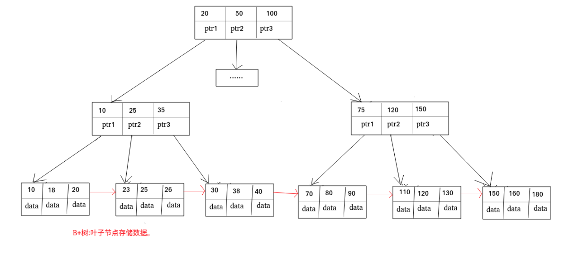

## 基础

* insert

```sql
INSERT INTO table_name ( field1, field2,...fieldN )
                       VALUES
                       ( value1, value2,...valueN );

```

* delete

```sql
DELETE FROM table_name [WHERE Clause]
```

* update

```sql
UPDATE table_name SET field1=new-value1, field2=new-value2
[WHERE Clause]
```

* select

```sql
SELECT column_name,column_name
FROM table_name
[WHERE Clause]
[LIMIT N][ OFFSET M]
```

* 关于join时的顺序(小表在前, 大表在后) 节省运算，在小表和大表进行join时，将小表放在前边，效率会高，hive会将小表进行缓存。
* DISTINCT
* ORDER BY 
* GROUP BY
* LEFT JOIN（左连接） RIGHT JOIN（右连接）
* ALTER
* 当你不再需要该表时， 用 drop；当你仍要保留该表，但要删除所有记录时， 用 truncate；当你要删除部分记录时（always with a WHERE clause), 用 delete.
* utf8 utf8mb4


## 什么是索引

索引是一种用于快速查询和检索数据的数据结构。常见的索引有B树 B+树 Hash

索引的作用相当于目录

打个比方: 我们在查字典的时候，如果没有目录，那我们就只能一页一页的去找我们需要查的那个字，速度很慢。如果有目录了，我们只需要先去目录里查找字的位置，然后直接翻到那一页就行了。

## 为什么要用索引?索引的优缺点分析

### 索引的优点

**可以大大加快 数据的检索速度（大大减少的检索的数据量）, 这也是创建索引的最主要的原因。毕竟大部分系统的读请求总是大于写请求的。 ** 另外，通过创建唯一性索引，可以保证数据库表中每一行数据的唯一性。

### 索引的缺点

1. **创建索引和维护索引需要耗费许多时间**：当对表中的数据进行增删改的时候，如果数据有索引，那么索引也需要动态的修改，会降低SQL执行效率。
2. **占用物理存储空间** ：索引需要使用物理文件存储，也会耗费一定空间。

## B树和B+树区别

平衡二叉树

- B树的所有节点既存放 键(key) 也存放 数据(data);而B+树只有叶子节点存放 key 和 data，其他内节点只存放key。
- B树的叶子节点都是独立的;B+树的叶子节点有一条引用链指向与它相邻的叶子节点。
- B树的检索的过程相当于对范围内的每个节点的关键字做二分查找，可能还没有到达叶子节点，检索就结束了。而B+树的检索效率就很稳定了，任何查找都是从根节点到叶子节点的过程，叶子节点的顺序检索很明显。



##### 与红黑树的比较

红黑树等平衡树也可以用来实现索引，但是文件系统及数据库系统普遍采用 B+ Tree 作为索引结构，主要有以下两个原因：

（一）更少的查找次数

平衡树查找操作的时间复杂度和树高 h 相关，O(h)=O(logdN)，其中 d 为每个节点的出度。

红黑树的出度为 2，而 B+ Tree 的出度一般都非常大，所以红黑树的树高 h 很明显比 B+ Tree 大非常多，查找的次数也就更多。

（二）利用磁盘预读特性

为了减少磁盘 I/O 操作，磁盘往往不是严格按需读取，而是每次都会预读。而B+数中存储的叶子节点在内存中是相邻的，这样可以读取会快一些。

## Hash索引和 B+树索引优劣分析

**Hash索引定位快**

Hash索引指的就是Hash表，最大的优点就是能够在很短的时间内，根据Hash函数定位到数据所在的位置，这是B+树所不能比的。

**Hash冲突问题**

知道HashMap或HashTable的同学，相信都知道它们最大的缺点就是Hash冲突了。不过对于数据库来说这还不算最大的缺点。

!> **Hash索引不支持顺序和范围查询(Hash索引不支持顺序和范围查询是它最大的缺点。**

试想一种情况:

```text
SELECT * FROM tb1 WHERE id < 500;Copy to clipboardErrorCopied
```

B+树是有序的，在这种范围查询中，优势非常大，直接遍历比500小的叶子节点就够了。而Hash索引是根据hash算法来定位的，难不成还要把 1 - 499的数据，每个都进行一次hash计算来定位吗?这就是Hash最大的缺点了。


## 索引类型

### 主键索引(Primary Key)

**数据表的主键列使用的就是主键索引。**

**一张数据表有只能有一个主键，并且主键不能为null，不能重复。**

**在mysql的InnoDB的表中，当没有显示的指定表的主键时，InnoDB会自动先检查表中是否有唯一索引的字段，如果有，则选择该字段为默认的主键，否则InnoDB将会自动创建一个6Byte的自增主键。**

### 二级索引(辅助索引)

**二级索引又称为辅助索引，是因为二级索引的叶子节点存储的数据是主键。也就是说，通过二级索引，可以定位主键的位置。**

唯一索引，普通索引，前缀索引等索引属于二级索引。

**PS:不懂的同学可以暂存疑，慢慢往下看，后面会有答案的，也可以自行搜索。**

1. **唯一索引(Unique Key)** ：唯一索引也是一种约束。**唯一索引的属性列不能出现重复的数据，但是允许数据为NULL，一张表允许创建多个唯一索引。**建立唯一索引的目的大部分时候都是为了该属性列的数据的唯一性，而不是为了查询效率。
2. **普通索引(Index)** ：**普通索引的唯一作用就是为了快速查询数据，一张表允许创建多个普通索引，并允许数据重复和NULL。**
3. **前缀索引(Prefix)** ：前缀索引只适用于字符串类型的数据。前缀索引是对文本的前几个字符创建索引，相比普通索引建立的数据更小， 因为只取前几个字符。
4. **全文索引(Full Text)** ：全文索引主要是为了检索大文本数据中的关键字的信息，是目前搜索引擎数据库使用的一种技术。Mysql5.6之前只有MYISAM引擎支持全文索引，5.6之后InnoDB也支持了全文索引。

## 聚簇索引与非聚簇索引

### 聚簇索引

!> **聚簇索引即索引结构和数据一起存放的索引。主键索引属于聚簇索引。**

innodb 这种数据文件也是索引文件的组织结构 就叫默认的主键索引为聚簇索引，就是因为这个原因innodb表必须要有主键。但是myisam不要求必须有主键

还有一个就是innodb存储引擎下。如果对某个非主键字段创建个索引。那么最后那个叶子节点的值就是主键的值。因为可以用主键的值到聚簇索引里根据主键的值再次查找到数据。

innodb不要使用uuid这种超长字符串作为主键 因为会导致所有非聚簇索引的data都是这个主键值。最终导致索引变的很大，浪费磁盘空间。

还有一个道理。 一般innodb表，建议统一用auto_increment自增值作为主键值，因为这样可以保持聚簇索引直接加记录就可以了。如果用不是单调递增的主键值，可能会导致B+树分裂后重新组织，会浪费时间。 


**聚簇索引与非聚簇索引的最主要的区别是：叶节点是否存放一整行记录**

innodb的索引是聚簇索引，就是所有数据都存在聚簇索引的的叶子节点中，**其他二级索引的的叶子节点值存储KEY字段加对应列的主键值**，如果使用二级索引查找数据，先根据索引查到二级索引对应的行的主键id，然后根据主键id去聚集索引中查找对应的行的数据。（所以innodb必须要有主键）

在 Mysql 中，InnoDB引擎的表的 `.ibd`文件就包含了该表的索引和数据，对于 InnoDB 引擎表来说，该表的索引(B+树)的每个非叶子节点存储索引，叶子节点存储索引和索引对应的数据。

#### 聚簇索引的优点

聚集索引的查询速度非常的快，因为整个B+树本身就是一颗多叉平衡树，叶子节点也都是有序的，定位到索引的节点，就相当于定位到了数据。

#### 聚簇索引的缺点

1. **依赖于有序的数据** ：因为B+树是多路平衡树，如果索引的数据不是有序的，那么就需要在插入时排序，如果数据是整型还好，否则类似于字符串或UUID这种又长又难比较的数据，插入或查找的速度肯定比较慢。
2. **更新代价大** ： 如果对索引列的数据被修改时，那么对应的索引也将会被修改， 而且况聚集索引的叶子节点还存放着数据，修改代价肯定是较大的， 所以对于主键索引来说，主键一般都是不可被修改的。

## 覆盖索引

如果一个索引包含（或者说覆盖）所有需要查询的字段的值，我们就称之为“覆盖索引”。我们知道在InnoDB存储引擎中，如果不是主键索引，叶子节点存储的是主键+列值。最终还是要“回表”，也就是要通过主键再查找一次。这样就会比较慢覆盖索引就是把要查询出的列和索引是对应的，不做回表操作！

**覆盖索引即需要查询的字段正好是索引的字段，那么直接根据该索引，就可以查到数据了， 而无需回表查询。**

> 如主键索引，如果一条SQL需要查询主键，那么正好根据主键索引就可以查到主键。
>
> 再如普通索引，如果一条SQL需要查询name，name字段正好有索引， 那么直接根据这个索引就可以查到数据，也无需回表。

## 索引创建注意点

### 最左前缀原则

虽然我目前的Mysql版本较高，好像不遵守最左前缀原则，索引也会生效。 但是我们仍应遵守最左前缀原则，以免版本更迭带来的麻烦。

### 选择合适的字段

#### 1.不为NULL的字段

索引字段的数据应该尽量不为NULL，因为对于数据为NULL的字段，数据库较难优化。如果字段频繁被查询，但又避免不了为NULL，建议使用0,1,true,false这样语义较为清晰的短值或短字符作为替代。

#### 2.被频繁查询的字段

我们创建索引的字段应该是查询操作非常频繁的字段。

#### 3.被作为条件查询的字段

被作为WHERE条件查询的字段，应该被考虑建立索引。

#### 4.被经常频繁用于连接的字段

经常用于连接的字段可能是一些外键列，对于外键列并不一定要建立外键，只是说该列涉及到表与表的关系。对于频繁被连接查询的字段，可以考虑建立索引，提高多表连接查询的效率。

## 索引优化

### 1. 独立的列

在进行查询时，索引列不能是表达式的一部分，也不能是函数的参数，否则无法使用索引。

例如下面的查询不能使用 actor_id 列的索引：

```sql
SELECT actor_id FROM sakila.actor WHERE actor_id + 1 = 5;Copy to clipboardErrorCopied
```

### 2. 多列索引

在需要使用多个列作为条件进行查询时，使用多列索引比使用多个单列索引性能更好。例如下面的语句中，最好把 actor_id 和 film_id 设置为多列索引。

```sql
SELECT film_id, actor_ id FROM sakila.film_actor
WHERE actor_id = 1 AND film_id = 1;Copy to clipboardErrorCopied
```

### 3. 索引列的顺序

让选择性最强的索引列放在前面。

索引的选择性是指：不重复的索引值和记录总数的比值。最大值为 1，此时每个记录都有唯一的索引与其对应。选择性越高，每个记录的区分度越高，查询效率也越高。

例如下面显示的结果中 customer_id 的选择性比 staff_id 更高，因此最好把 customer_id 列放在多列索引的前面。

```sql
SELECT COUNT(DISTINCT staff_id)/COUNT(*) AS staff_id_selectivity,
COUNT(DISTINCT customer_id)/COUNT(*) AS customer_id_selectivity,
COUNT(*)
FROM payment;Copy to clipboardErrorCopied
   staff_id_selectivity: 0.0001
customer_id_selectivity: 0.0373
               COUNT(*): 16049Copy to clipboardErrorCopied
```

### 4. 前缀索引

对于 BLOB、TEXT 和 VARCHAR 类型的列，必须使用前缀索引，只索引开始的部分字符。

前缀长度的选取需要根据索引选择性来确定。

### 5. 覆盖索引

索引包含所有需要查询的字段的值。

具有以下优点：

- 索引通常远小于数据行的大小，只读取索引能大大减少数据访问量。
- 一些存储引擎（例如 MyISAM）在内存中只缓存索引，而数据依赖于操作系统来缓存。因此，只访问索引可以不使用系统调用（通常比较费时）。
- 对于 InnoDB 引擎，若辅助索引能够覆盖查询，则无需访问主索引。

## 联合索引

一般来说,你有一个表( product): shop id、 product id、 gmt_create,你的so语句要根
据这3个字段来查询,所以你一般来说不是就建立3个索引,一般来说会针对平时要查询的
几个字段,建立一个联合索引

## Mysql的覆盖索引和联合索引的区别

索引覆盖是联合索引查询时的最优情况，不要回表。

覆盖索引只是特定于具体select语录而言的联合索引。也就是说一个联合索引对于某个select语句，通过索引可以直接获取查询结果，而不再需要回表查询啦，就称该联合索引覆盖了这条select语句。

比如一张表 emp(id,name,age,dept,salary,birthday)，有索引idx_emp(name,salary,age)。

对于以下sql语句：

select salary,age from emp where name='nil'; --语句1

select salary,age,dept from emp where name='nil';--语句2

对于语句1，索引idx_emp是该sql的覆盖索引，因为sql所需要的结果(name,salary,age)可以直接通过索引得到，不需要再查询表。

而对于语句2，索引idx_emp不是该sql的覆盖索引，因为sql所需要的结果(name,salary,age,dept)不能通过索引直接获取，因为索引没有列dept的值。所以还必须通过索引的书签(记录地址/主键值)再次回表查找该条记录数据来获取列dept值。

## 联合索引和多个单个索引的区别

联合索引 类似于 姓名  查询时候 使用姓+名 效率很高 。 有姓效率也可 。只有名 就无法命中索引

单个索引 类似于 姓   和   名

故如果只有**多条件联合查询时最好建联合索引！**


## 索引的使用规则

create index(shop id, prpduct id, gmt create)

1. 全列匹配
   这个就是说,你的一个sq里,正好 where条件里就用了这3个字段,那么就一定可以用到
   这个联合索引的:
   select* from product where shop_id=l and product_id=l and gmt_create=2018-01-01 10: 00: 00

2. 最左前缀匹配
   这个就是说,如果你的sq里,正好就用到了联合索引最左边的一个或者几个列表,那么也
   可以用上这个索引,在索引里查找的时候就用最左边的几个列就行了
   eect* from product where shop id=1 and product id=1,这个是没问题的,可以用上这个索
   引的

3. 最左前缀匹配了,但是中间某个值没匹配
   这个是说,如果你的sq里,就用了联合索引的第一个列和第三个列,那么会按照第一个列
   值在索引里找,找完以后对结果集扫描一遍根据第三个列来过滤,第三个列是不走索引去搜
   索的,就是有一个额外的过滤的工作,但是还能用到索引,所以也还好。
   select from product where shop id=l and gmt create=2018-01-01 10: 00: 00
   就是先根据 shop id=1在索引里找,找到比如100行记录,然后对这100行记录再次扫描
   遍,过滤出来 gmt create=201801-0110:000的行
   这个我们在线上系统经常遇到这种情况,就是根据联合索引的前一两个列安索引查,然后后
   面跟一堆复杂的条件,还有函数啥的,但是只要对索引查找结果过滤就好了,根据线上实践,
   单表几百万数据量的时候,性能也还不错的,简单S也就几ms,复杂S也就几百ms
   可接受的

4. 没有最左前缀匹配
   那就不行了,那就在搞笑了,一定不会用索引,所以这个错误千万别犯
   select* from product where product id=1,这个肯定不行

5. 前缀匹配
   这个就是说,如果你不是等值的,比如=,>,<=的操作,是ike操作,那么必须要是ike“XX%
   这种才可以用上索引,比如说
   select* from product where shop_id=l and product_id=l and gmt_create like 2018%6’

6. 范围列匹配
   如果你是范围查询,比如>=,<=, between操作,你只能是符合最左前缀的规则才可以范围,
   范围之后的列就不用索引了
   select*from product where shop_id>=Tand product_d=1
   这里就在联合索引中根据 shop id来查询了*

7. *包含函数
   如果你对某个列用了函数,比如 substring之类的东西,那么那一列不用索引
   select*from product where shop id=1 and BKE(product id)=2
   上面就根据 shop id在联合索引中查询

   

   

   1.最左前缀匹配原则，非常重要的原则，mysql会一直向右匹配直到遇到范围查询(>、<、between、like)就停止匹配，比如a = 1 and b = 2 and c > 3 and d = 4 如果建立(a,b,c,d)顺序的索引，d是用不到索引的，如果建立(a,b,d,c)的索引则都可以用到，a,b,d的顺序可以任意调整。

   2.=和in可以乱序，比如a = 1 and b = 2 and c = 3 建立(a,b,c)索引可以任意顺序，mysql的查询优化器会帮你优化成索引可以识别的形式。

   3.尽量选择区分度高的列作为索引，区分度的公式是count(distinct col)/count(*)，表示字段不重复的比例，比例越大我们扫描的记录数越少，唯一键的区分度是1，而一些状态、性别字段可能在大数据面前区分度就是0，那可能有人会问，这个比例有什么经验值吗？使用场景不同，这个值也很难确定，一般需要join的字段我们都要求是0.1以上，即平均1条扫描10条记录。

   4.索引列不能参与计算，保持列“干净”，比如from_unixtime(create_time) = ’2014-05-29’就不能使用到索引，原因很简单，b+树中存的都是数据表中的字段值，但进行检索时，需要把所有元素都应用函数才能比较，显然成本太大。所以语句应该写成create_time = unix_timestamp(’2014-05-29’)。

   5.尽量的扩展索引，不要新建索引。比如表中已经有a的索引，现在要加(a,b)的索引，那么只需要修改原来的索引即可。

，数据库优化器会判断候选结果集是否超出了全部结果的 5%（估计），如果超过，那么就全表扫描。所以像> < in 这种操作，走不走索引要看本身可能的结果数量。

## Index_merge

这里的type项是index_merge。搜索后发现是MySQL5.0后的新技术，索引合并。index merge 技术简单说就是在用OR，AND连接的多个查询条件时，可以分别使用前后查询中的索引，然后将它们各自的结果合并交集或并集。当然具体是否使用index merge，优化器会自己选择，比如and连接时有联合索引，或干脆全表查询就很快，就没必要使用它了。


## 索引的缺点和使用注意

索引也有缺点。索引会增加磁盘消耗，因为要占用磁盘空间。同时高并发的时候频繁的插入和修改索引，会导致性能损耗。建议尽量创建少的索引，如果一个表一两个索引。两三个索引。


建立索引 也要注意区分度。

在创建索引的时候,要注意一个选择性的问题,COUNT(DISTINCT staff_id)/COUNT(*)就可以
看看选择性,就是这个列的唯一值在总行数的占比,如果过低,就代表这个字段的值其实都
差不多,或者很多行的这个值都类似的,那创建索引几乎没什么意义,你搜一个值定位到
大坨行,还得重新扫描。


 【推荐】建组合索引的时候，区分度最高的在最左边。

正例：如果 where a=? and b=?，a 列的几乎接近于唯一值，那么只需要单建 idx_a 索引即可。

说明：存在非等号和等号混合判断条件时，在建索引时，请把等号条件的列前置。如：where c>? and d=? 

那么即使 c 的区分度更高，也必须把 d 放在索引的最前列，即建立组合索引 idx_d_c。


【推荐】防止因字段类型不同造成的隐式转换，导致索引失效。

38/57

## EXPLAN


**四、type**

表示MySQL在表中找到所需行的方式，又称“访问类型”。

常用的类型有： **ALL, index, range, ref, eq_ref, const, system, NULL（从左到右，性能从差到好）**

ALL：Full Table Scan， MySQL将遍历全表以找到匹配的行

index: Full Index Scan，index与ALL区别为index类型只遍历索引树

range:只检索给定范围的行，使用一个索引来选择行

ref: 表示上述表的连接匹配条件，即哪些列或常量被用于查找索引列上的值

eq_ref: 类似ref，区别就在使用的索引是唯一索引，对于每个索引键值，表中只有一条记录匹配，简单来说，就是多表连接中使用primary key或者 unique key作为关联条件

const、system: 当MySQL对查询某部分进行优化，并转换为一个常量时，使用这些类型访问。如将主键置于where列表中，MySQL就能将该查询转换为一个常量,system是const类型的特例，当查询的表只有一行的情况下，使用system

NULL: MySQL在优化过程中分解语句，执行时甚至不用访问表或索引，例如从一个索引列里选取最小值可以通过单独索引查找完成。


1. SQL 性能优化的目标:至少要达到 range 级别，要求是 ref 级别，如果可以是 consts 最好。

   说明:

   1) consts 单表中最多只有一个匹配行(主键或者唯一索引)，在优化阶段即可读取到数据。 2) ref 指的是使用普通的索引(normal index)。
    3) range 对索引进行范围检索。

   反例:explain 表的结果，type=index，索引物理文件全扫描，速度非常慢，这个 index 级别比较 range 还低，与全表扫描是小巫见大巫。


## 怎么优化慢查询？

首先根据explain+SELECT语句执行，查看结果，


主要分为三个方面

- 1.减少请求的数据量

列方面，避免使用SELECT *，只返回必要的列。

行方面，使用limit语句来限制返回的数据行数。

对频繁访问的数据加缓存，存在redis中。

- 2.减少服务端扫描的行数，主要通过使用索引和命中索引来实现。

使用索引方面，就是去添加一些索引，以及

2.1对于一些常用的条件查询字段，建立联合索引，使用一些联合索引，可以减少查询次数，也可以减少磁盘空间占用。而且当查询的字段在索引中已经包含时，就会使用到覆盖索引。此时在索引中查到数据后就不用在回表了。

2.2避免在查询时，对索引字段进行计算和使用函数，这样会导致不通过索引查询，将一些varchar类型的字段与整型数据进行比较时，会触发隐式类型转换，从而使用函数。

- 3.切分大查询，因为大查询在查询时可能会锁住很多数据，也需要获取到这些数据的行锁才能进行查询，切分成小查询可以减少锁竞争，减少等待获取锁的时间。


我们公司 一般互联网公司 的 sql 大部分都是简单的单表sql 。 而且不使用mysql函数。 计算逻辑都放到java中做。基于这种背景 sql慢 大部分原因都是 没有走索引。 可以看一下慢的sql 有没有走索引。 没有就加上索引

## 不走索引的情况

1. 使用的函数
2. lik
3. 隐形类型转换
4. 对于多列索引，不是使用的第一部分(第一个)，则不会使用索引
5. 如果mysql估计使用全表扫描要比使用索引快,则不使用索引
6. 隐式转换导致索引失效.这一点应当引起重视.也是开发中经常会犯的错误. 由于表的字段tu_mdn定义为varchar2(20),但在查询时把该字段作为number类型以where条件传给Oracle,这样会导致索引失效. 错误的例子：select *from test where tu_mdn=13333333333; 正确的例子：select* from test where tu_mdn='13333333333';


## 一条MySQL更新语句的执行过程是什么样的？


- MySQL 主要分为 Server 层和引擎层，Server 层主要包括连接器、查询缓存、分析器、优化器、执行器，同时还有一个日志模块（binlog），这个日志模块所有执行引擎都可以共用,redolog 只有 InnoDB 有。
- 引擎层是插件式的，目前主要包括，MyISAM,InnoDB,Memory 等。
- 查询语句的执行流程如下：权限校验（如果命中缓存）---》查询缓存---》分析器---》优化器---》权限校验---》执行器---》引擎
- 更新语句执行流程如下：分析器----》权限校验----》执行器---》引擎---redo log(prepare 状态---》binlog---》redo log(commit状态)

## 切分

* 水平切分

水平拆分能够 支持非常大的数据量存储，应用端改造也少，但 分片事务难以解决 ，跨界点Join性能较差，逻辑复杂。《Java工程师修炼之道》的作者推荐 尽量不要对数据进行分片，因为拆分会带来逻辑、部署、运维的各种复杂度 ，一般的数据表在优化得当的情况下支撑千万以下的数据量是没有太大问题的。如果实在要分片，尽量选择客户端分片架构，这样可以减少一次和中间件的网络I/O。

* Sharding 策略
  * 哈希取模：hash(key) % N；
  * 范围：可以是 ID 范围也可以是时间范围；
  * 映射表：使用单独的一个数据库来存储映射关系。
* Sharding 存在的问题

1. 事务问题
   使用分布式事务来解决，比如 XA 接口。

2. 连接
   可以将原来的连接分解成多个单表查询，然后在用户程序中进行连接。

3. ID 唯一性
   使用全局唯一 ID（GUID）
   为每个分片指定一个 ID 范围
   分布式 ID 生成器 (如 Twitter 的 Snowflake 算法)

* 垂直切分

垂直切分是将一张表按列切分成多个表，通常是按照列的关系密集程度进行切分，也可以利用垂直切分将经常被使用的列和不经常被使用的列切分到不同的表中


* 主从复制 读写分离  云服务提供的能力

* 下面补充一下数据库分片的两种常见方案：

**客户端代理：** 分片逻辑在应用端，封装在jar包中，通过修改或者封装JDBC层来实现。 当当网的 Sharding-JDBC 、阿里的TDDL是两种比较常用的实现。
**中间件代理：** 在应用和数据中间加了一个代理层。分片逻辑统一维护在中间件服务中。 我们现在谈的 Mycat 、360的Atlas、网易的DDB等等都是这种架构的实现。


> [写给工程师的 MySQL 面试高频 100 问！](https://mp.weixin.qq.com/s/l9up2dlPniOYO4usoe-dFA)
>
> [MySQL索引原理及慢查询优化](https://tech.meituan.com/2014/06/30/mysql-index.html)

