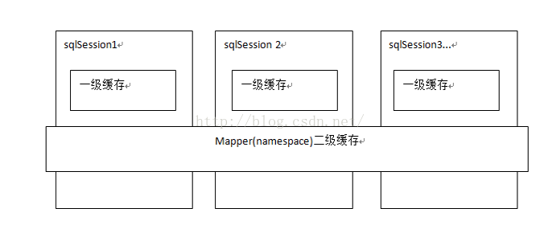

# MyBatis

优点 半ORM  灵活 SQL可控

* 采用MapperScannerConfigurer，它将会查找类路径下的映射器并自动将它们创建成MapperFactoryBean。
* #{} 和 ${} 的区别

!> \#{}是预编译处理，${}是字符串替换   表名、order by的排序字段作为变量时，使用${}。

* resultMap 映射 实体类和 表 resultType  parameterType
* select LAST_INSERT_ID() 
* 缓存



* MyBatis编程步骤

  1. 创建SqlSessionFactory
  2. 通过SqlSessionFactory获取SqlSession
  3. 通过SqlSession执行数据库操作
  4. 提交事务
  5. 关闭会话

* 多数据源 多个sqlSessionFactory  采用注解 区分 sqlSessionFactory

* MyBatis和Hibernate的区别

  1. Hibernate完整的实现了对象到数据库结构的映射 帮助我们生产sql，Mybatis仅仅是对结果集映射成了对象 sql要自己写
  2. hibernate 性能优化比较困难

* Mybatis like

  1. 

  ```sql
  <select id="getUsersByName" parameterType="string" resultType="com.buaa.mybatis.po.User">
  SELECT * FROM USER WHERE username LIKE "%"#{name}"%"
  </select>
  ```

  2. MySQL内置函数CONCAT()
  3. Java代码中拼接好 %%

* Mybatis 分页

自带的分页是使用RowBounds对象进行分页 内存分页 不推荐使用
可以使用 直接sql limit 或者 分页插件进行物理分页


# 