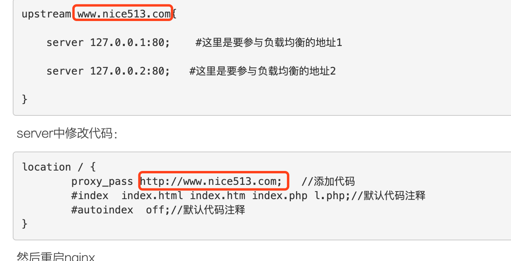

# nginx

## 是什么 能干什么

Nginx是一款轻量级的Web服务器/反向代理服务器及电子邮件（IMAP/POP3）代理服务器

## 和其他同类相比优点

Nginx 相对于 Apache 优点：
1) 高并发响应性能非常好，官方 Nginx 处理静态文件并发 5w/s
2) 反向代理性能非常强。（可用于负载均衡）
3) 内存和 cpu 占用率低。（为 Apache 的 1/5-1/10）
4) 对后端服务有健康检查功能。
5) 支持 PHP cgi 方式和 fastcgi 方式。
6) 配置代码简洁且容易上手。 

## 常用命令

```shell
#启动
./nginx 
#检查 nginx.conf配置文件
./nginx -t
#重启
./nginx -s reload
#停止
./nginx -s stop


```

## 配置

默认root 目录  `/usr/share/nginx/html`

```shell
# 全局块
...              
# events块
events {         
   ...
}
# http块
http      
{
    # http全局块
    ...   
    # 虚拟主机server块
    server        
    { 
        # server全局块
        ...       
        # location块
        location [PATTERN]   
        {
            ...
        }
        location [PATTERN] 
        {
            ...
        }
    }
    server
    {
      ...
    }
    # http全局块
    ...     
}


```

1、全局块：配置影响nginx全局的指令。一般有运行nginx服务器的用户组，nginx进程pid存放路径，日志存放路径，配置文件引入，允许生成worker process数等。
2、events块：配置影响nginx服务器或与用户的网络连接。有每个进程的最大连接数，选取哪种事件驱动模型处理连接请求，是否允许同时接受多个网路连接，开启多个网络连接序列化等。

3、http块：可以嵌套多个server，配置代理，缓存，日志定义等绝大多数功能和第三方模块的配置。如文件引入，mime-type定义，日志自定义，是否使用sendfile传输文件，连接超时时间，单连接请求数等。

4、server块：配置虚拟主机的相关参数，一个http中可以有多个server。

5、location块：配置请求的路由，以及各种页面的处理情况。

```shell
########### 每个指令必须有分号结束。#################
#user administrator administrators;  #配置用户或者组，默认为nobody nobody。
#worker_processes 2;  #允许生成的进程数，默认为1
#pid /nginx/pid/nginx.pid;   #指定nginx进程运行文件存放地址
error_log log/error.log debug;  #制定日志路径，级别。这个设置可以放入全局块，http块，server块，级别以此为：debug|info|notice|warn|error|crit|alert|emerg
events {
    accept_mutex on;   #设置网路连接序列化，防止惊群现象发生，默认为on
    multi_accept on;  #设置一个进程是否同时接受多个网络连接，默认为off
    #use epoll;      #事件驱动模型，select|poll|kqueue|epoll|resig|/dev/poll|eventport
    worker_connections  1024;    #最大连接数，默认为512
}
http {
    include       mime.types;   #文件扩展名与文件类型映射表
    default_type  application/octet-stream; #默认文件类型，默认为text/plain
    #access_log off; #取消服务日志    
    log_format myFormat '$remote_addr–$remote_user [$time_local] $request $status $body_bytes_sent $http_referer $http_user_agent $http_x_forwarded_for'; #自定义格式
    access_log log/access.log myFormat;  #combined为日志格式的默认值
    sendfile on;   #允许sendfile方式传输文件，默认为off，可以在http块，server块，location块。
    sendfile_max_chunk 100k;  #每个进程每次调用传输数量不能大于设定的值，默认为0，即不设上限。
    keepalive_timeout 65;  #连接超时时间，默认为75s，可以在http，server，location块。

    # 定义常量
    upstream mysvr {   
      server 127.0.0.1:7878;
      server 192.168.10.121:3333 backup;  #热备
    }
    error_page 404 https://www.baidu.com; #错误页 

    #定义某个负载均衡服务器   
    server {
        keepalive_requests 120; #单连接请求上限次数。
        listen       4545;   #监听端口
        server_name  127.0.0.1;   #监听地址       
        location  ~*^.+$ {       #请求的url过滤，正则匹配，~为区分大小写，~*为不区分大小写。
           #root path;  #根目录
           #index vv.txt;  #设置默认页
           proxy_pass  http://mysvr;  #请求转向mysvr 定义的服务器列表
           deny 127.0.0.1;  #拒绝的ip
           allow 172.18.5.54; #允许的ip           
        } 
    }
} 


```

## 正向代理

正向代理 是一个位于客户端和原始服务器(origin server)之间的服务器，为了从原始服务器取得内容，客户端向代理发送一个请求并指定目标(原始服务器)，然后代理向原始服务器转交请求并将获得的内容返回给客户端。客户端必须要进行一些特别的设置才能使用正向代理。
**用途**
（1）访问原来无法访问的资源，如google
（2）可以做缓存，加速访问资源
（3）对客户端访问授权，上网进行认证
（4）代理可以记录用户访问记录（上网行为管理），对外隐藏

## 反向代理

反向代理（Reverse Proxy）实际运行方式是指以代理服务器来接受internet上的连接请求，然后将**请求转发给内部网络上的服务器**，并将从服务器上得到的结果返回给internet上请求连接的客户端，此时代理服务器对外就表现为一个服务器。
**用途** 
（1）保证内网的安全，可以使用反向代理提供WAF功能，阻止web攻击
（2）负载均衡，通过反向代理服务器来优化网站的负载


## 负载均衡

负载均衡原理及实现
原理：负载均衡是高可用网络基础架构的关键组件，通常用于将工作负载分布到多个服务器来提高网站、应用、数据库或其他服务的性能和可靠性。
一台服务器来做请求处理，把访问到的请求分发到其他几台服务器上，达到服务器减压的效果。（域名只需要指向Nginx服务器IP就可以了）



**5种方式**

* 1、轮询（默认）
  每个请求按时间顺序逐一分配到不同的后端服务器，如果后端服务器down掉，能自动剔除。
* 2、weight
  指定轮询几率，weight和访问比率成正比，用于后端服务器性能不均的情况。

```shell
upstream servername {
    server 192.168.0.14 weight=10;
    server 192.168.0.15 weight=10;
}
```

* 3、ip_hash
  每个请求按访问ip的hash结果分配，这样每个访客固定访问一个后端服务器，可以解决session的问题。

```shell
upstream servername {
    ip_hash;
    server 192.168.0.14:88;
    server 192.168.0.15:80;
}
```

* 4、url_hash      
  按访问url的hash结果来分配请求，使每个url定向到同一个后端服务器，后端服务器为缓存时比较有效。
  例：在upstream中加入hash语句，server语句中不能写入weight等其他的参数，hash_method是使用的hash算法         

```shell
 upstream servername {
    server server1;
    server server2;
    hash $request_uri;
    hash_method crc32;
}
```

* 5、fair 第三方插件
  按后端服务器的响应时间来分配请求，响应时间短的优先分配。

```shell
upstream servername {
    server server1;
    server server2;
    fair;
}
```

## 健康检查 检查后端服务是否可用

* 自带方式  `max_fails`  `fail_timeout`

```shell
upstream springboot {
    server 10.3.73.223:8080 max_fails=2 fail_timeout=30s;
    server 10.3.73.223:8090 max_fails=2 fail_timeout=30s;
}
```

* 商用模块 ngx_http_upstream_hc_module `health_check`

```shell
 #Nginx每5s（默认值）就会向dynamic中的每一个服务器发送“/”请求
 location / {
            proxy_pass http://dynamic;
            health_check match=welcome;
        }

```

