# Redis

基于内存的高性能数据库  广泛应用于 计数器 缓存 分布式锁

- **异常快** - Redis 非常快，每秒可执行大约 110000 次的设置(SET)操作，每秒大约可执行 81000 次的读取/获取(GET)操作。
- **支持丰富的数据类型** - Redis 支持开发人员常用的大多数数据类型，例如列表，集合，排序集和散列等等。这使得 Redis 很容易被用来解决各种问题，因为我们知道哪些问题可以更好使用地哪些数据类型来处理解决。
- **操作具有原子性** - 所有 Redis 操作都是原子操作，这确保如果两个客户端并发访问，Redis 服务器能接收更新的值。
- **多实用工具** - Redis 是一个多实用工具，可用于多种用例，如：缓存，消息队列(Redis 本地支持发布/订阅)，应用程序中的任何短期数据，例如，web应用程序中的会话，网页命中计数等。

## 数据结构

[Redis 数据结构和对象系统，记住这 12 张图就够啦！](https://mp.weixin.qq.com/s/fO0yoHGqtFH5lpu6688h2w)

### 简单动态字符串SDS

Redis 使用动态字符串 SDS 来表示字符串值。下图展示了一个值为 Redis 的 SDS结构 :

- len: 表示字符串的真正长度（不包含NULL结束符在内）。
- alloc: 表示字符串的最大容量（不包含最后多余的那个字节）。
- flags: 总是占用一个字节。其中的最低3个bit用来表示header的类型。
- buf: 字符数组。

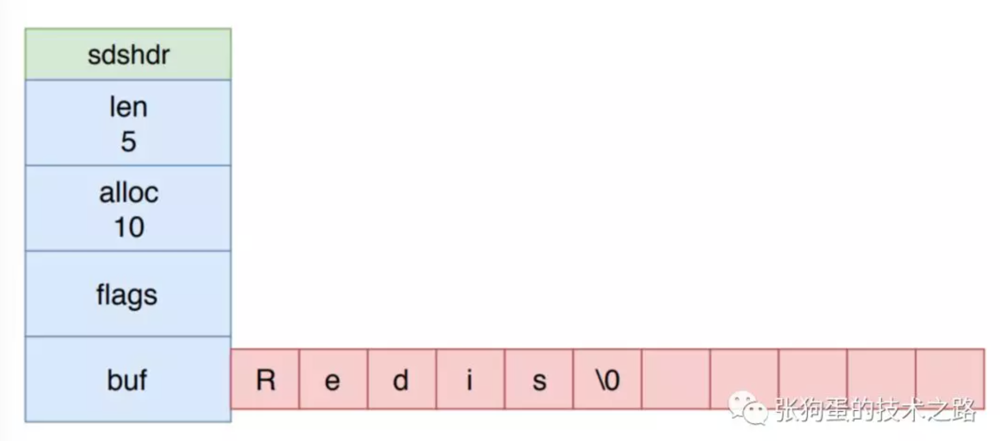

SDS 的结构可以减少修改字符串时带来的内存重分配的次数，这依赖于内存预分配和惰性空间释放两大机制。

当 SDS 需要被修改，并且要对 SDS 进行空间扩展时，Redis 不仅会为 SDS 分配修改所必须要的空间，还会为 SDS 分配**额外的未使用的空间**。

- 如果修改后， SDS 的长度(也就是len属性的值)将小于 1MB ，那么 Redis 预分配和 len 属性相同大小的未使用空间。
- 如果修改后， SDS 的长度将大于 1MB ，那么 Redis 会分配 1MB 的未使用空间。

比如说，进行修改后 SDS 的 len 长度为20字节，小于 1MB，那么 Redis 会预先再分配 20 字节的空间， SDS 的 buf数组的实际长度(除去最后一字节)变为 20 + 20 = 40 字节。当 SDS的 len 长度大于 1MB时，则只会再多分配 1MB的空间。

类似的，当 SDS 缩短其保存的字符串长度时，并不会立即释放多出来的字节，而是等待之后使用。

##### SDS 与 C 字符串的区别 

**因为C语言的字符串有两个缺点：**

1.不是二进制安全的（因为字符串以空字符作为结束的标志，字符串中间不能有空字符)。

2.频繁修改一个字符串时，会涉及到内存的重分配，比较消耗性能。（Redis中的简单动态字符串会有内存预分配和惰性空间释放）。

所以Redis中的简单动态字符串结构，除了包含一个字符数组的属性，还包含数组的长度，数组的实际使用长度等属性，通过增加长度属性，可以保证字符串是二进制安全的，从而可以保存任意类型的数据，例如一张图片，对象序列化后的数据等等。

### 链表

链表在 Redis 中的应用非常广泛，比如列表对象的底层实现之一就是链表。除了链表对象外，发布和订阅、慢查询、监视器等功能也用到了链表。

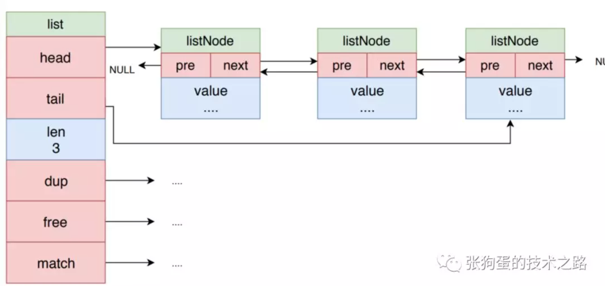

Redis 的链表是双向链表，示意图如上图所示。链表是最为常见的数据结构，这里就不在细说。

Redis 的链表结构的dup 、 free 和 match 成员属性是用于实现多态链表所需的类型特定函数：

- dup 函数用于复制链表节点所保存的值，用于深度拷贝。
- free 函数用于释放链表节点所保存的值。
- match 函数则用于对比链表节点所保存的值和另一个输入值是否相等。

### 字典

字典被广泛用于实现 Redis 的各种功能，包括键空间和哈希对象。其示意图如下所示。

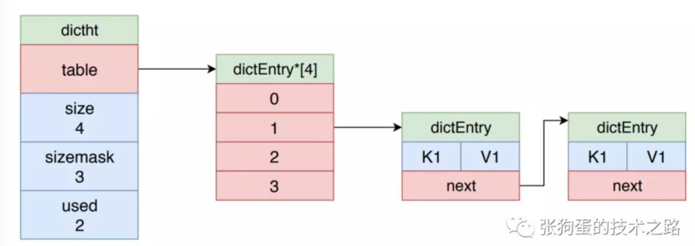

Redis 使用 MurmurHash2 算法来计算键的哈希值，并且使用链地址法来解决键冲突，被分配到同一个索引的多个键值对会连接成一个单向链表。

### 跳跃表

Redis 使用跳跃表作为有序集合对象的底层实现之一。它以有序的方式在层次化的链表中保存元素， 效率和平衡树媲美 —— 查找、删除、添加等操作都可以在对数期望时间下完成， 并且比起平衡树来说， 跳跃表的实现要简单直观得多。

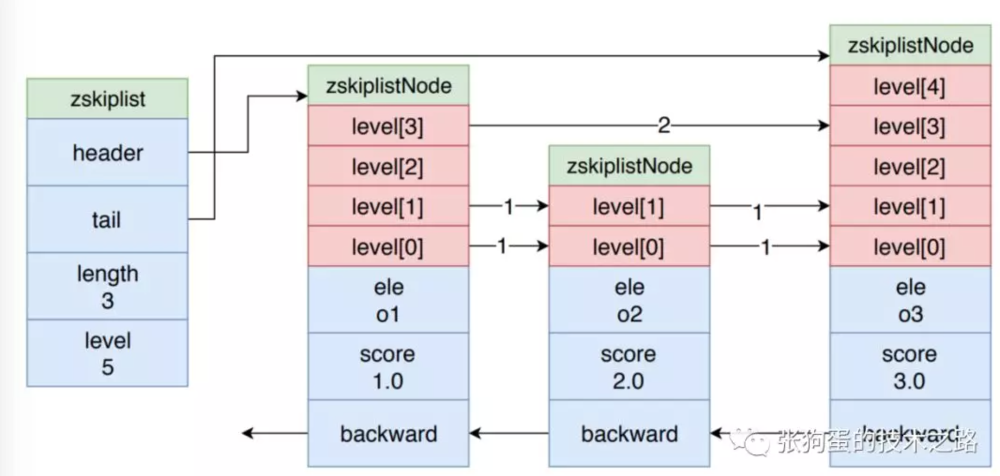

跳表的示意图如上图所示，这里只简单说一下它的核心思想，并不进行详细的解释。

如示意图所示，zskiplistNode 是跳跃表的节点，其 ele 是保持的元素值，score 是分值，节点按照其 score 值进行有序排列，而 level 数组就是其所谓的层次化链表的体现。

每个 node 的 level 数组大小都不同， level 数组中的值是指向下一个 node 的指针和 跨度值 (span)，跨度值是两个节点的score的差值。越高层的 level 数组值的跨度值就越大，底层的 level 数组值的跨度值越小。

level 数组就像是不同刻度的尺子。度量长度时，先用大刻度估计范围，再不断地用缩小刻度，进行精确逼近。

当在跳跃表中查询一个元素值时，都先从第一个节点的最顶层的 level 开始。比如说，在上图的跳表中查询 o2 元素时，先从o1 的节点开始，因为 zskiplist 的 header 指针指向它。

先从其 level[3] 开始查询，发现其跨度是 2，o1 节点的 score 是1.0，所以加起来为 3.0，大于 o2 的 score 值2.0。所以，我们可以知道 o2 节点在 o1 和 o3 节点之间。这时，就改用小刻度的尺子了。就用level[1]的指针，顺利找到 o2 节点。

### 整数集合

整数集合 intset 是集合对象的底层实现之一，当一个集合只包含整数值元素，并且这个集合的元素数量不多时， Redis 就会使用整数集合作为集合对象的底层实现。

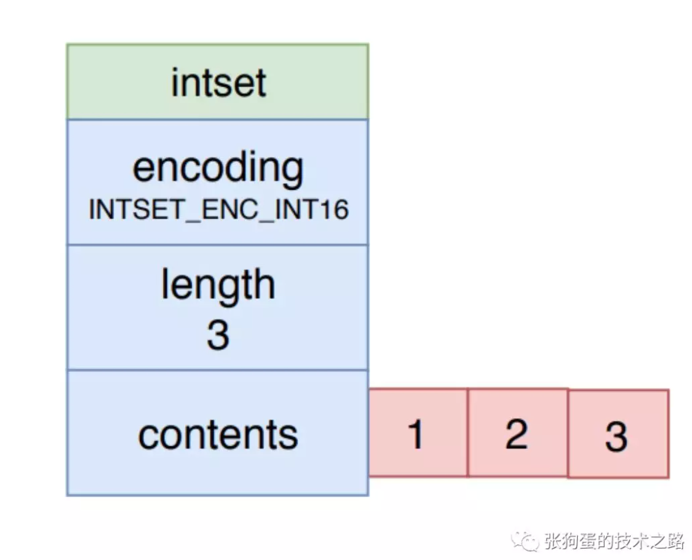

如上图所示，整数集合的 encoding 表示它的类型，有int16t，int32t 或者int64_t。其每个元素都是 contents 数组的一个数组项，各个项在数组中按值的大小从小到大有序的排列，并且数组中不包含任何重复项。length 属性就是整数集合包含的元素数量。

### 压缩列表

压缩队列 ziplist 是列表对象和哈希对象的底层实现之一。当满足一定条件时，列表对象和哈希对象都会以压缩队列为底层实现。

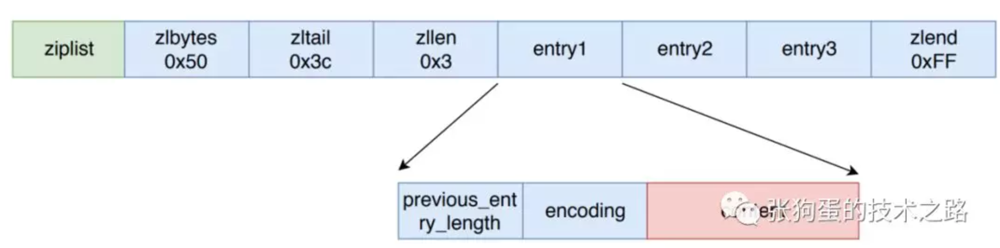

压缩队列是 Redis 为了节约内存而开发的，是由一系列特殊编码的连续内存块组成的顺序型数据结构。它的属性值有：

- zlbytes : 长度为 4 字节，记录整个压缩数组的内存字节数。
- zltail : 长度为 4 字节，记录压缩队列表尾节点距离压缩队列的起始地址有多少字节，通过该属性可以直接确定尾节点的地址。
- zllen : 长度为 2 字节，包含的节点数。当属性值小于 INT16_MAX时，该值就是节点总数，否则需要遍历整个队列才能确定总数。
- zlend : 长度为 1 字节，特殊值，用于标记压缩队列的末端。

中间每个节点 entry 由三部分组成：

- previous_entry_length : 压缩列表中前一个节点的长度，和当前的地址进行指针运算，计算出前一个节点的起始地址。
- encoding： 节点保存数据的类型和长度
- content ：节点值，可以为一个字节数组或者整数。

### 对象

上面介绍了 6 种底层数据结构，Redis 并没有直接使用这些数据结构来实现键值数据库，而是基于这些数据结构创建了一个对象系统.

这个系统包含字符串对象、列表对象、哈希对象、集合对象和有序集合这五种类型的对象，每个对象都使用到了至少一种前边讲的底层数据结构。

## 数据类型

| 数据类型 | 可以存储的值                                                 |
| -------- | ------------------------------------------------------------ |
| String   | 字符串 整数 浮点数                                           |
| List     | Redis列表是简单的字符串列表 ，  <br />按照插入顺序排序。你可以添加一个元素到列表的头部（左边）或者尾部（右边） |
| Set      | 无序集合                                                     |
| Zset     | 有序集合                                                     |
| Hash     | hash 是一个 string 类型的 field 和 value 的映射表   <br />hash 特别适合用于存储对象。 |

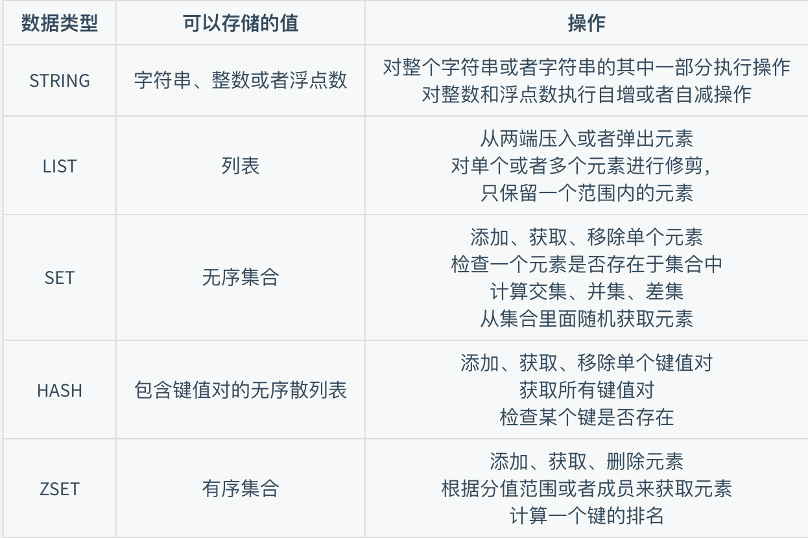

### String

```shell
> set hello world
OK
> get hello
"world"
> del hello
(integer) 1
> get hello
(nil)
```

*  set a value [EX seconds|PX milliseconds] [NX|XX] [KEEPTTL]
* get
* del
*  incr  incrby

### List

Redis 的列表相当于 Java 语言中的 **LinkedList**，注意它是链表而不是数组。这意味着 list 的插入和删除操作非常快，时间复杂度为 O(1)，但是索引定位很慢，时间复杂度为 O(n)。

比如可以通过 list 存储一些列表型的数据结构，类似粉丝列表、文章的评论列表之类的东西。

- `LPUSH` 和 `RPUSH` 分别可以向 list 的左边（头部）和右边（尾部）添加一个新元素；
- `LRANGE` 命令可以从 list 中取出一定范围的元素；
- `LINDEX` 命令可以从 list 中取出指定下表的元素，相当于 Java 链表操作中的 `get(int index)` 操作；

```shell
$ redis-cli
127.0.0.1:6379> clear
127.0.0.1:6379> rpush zm  a
(integer) 1
127.0.0.1:6379> rpush zm b
(integer) 2
127.0.0.1:6379> lrange zm 0 10
1) "a"
2) "b"
127.0.0.1:6379> lindex zm 1
"b"
```

#### list 实现队列

队列是先进先出的数据结构，常用于消息排队和异步逻辑处理，它会确保元素的访问顺序：

```console
> RPUSH books python java golang
(integer) 3
> LPOP books
"python"
> LPOP books
"java"
> LPOP books
"golang"
> LPOP books
(nil)Copy to clipboardErrorCopied
```

#### list 实现栈

栈是先进后出的数据结构，跟队列正好相反：

```console
> RPUSH books python java golang
> RPOP books
"golang"
> RPOP books
"java"
> RPOP books
"python"
> RPOP books
(nil)
```

### Hash

Redis 中的字典相当于 Java 中的 **HashMap**，内部实现也差不多类似，都是通过 **"数组 + 链表"** 的链地址法来解决部分 **哈希冲突**，同时这样的结构也吸收了两种不同数据结构的优点。

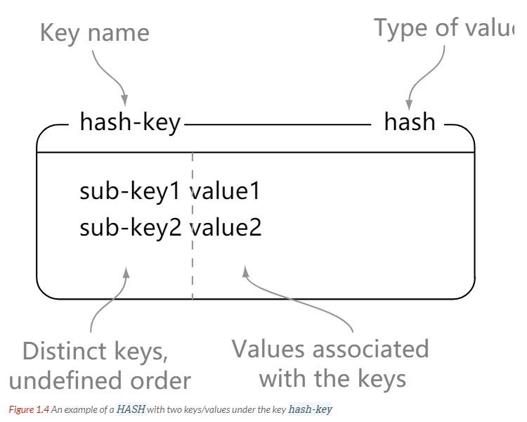

```shell
127.0.0.1:6379> hset person name zhangsan
(integer) 1
127.0.0.1:6379> hset person age 20
(integer) 1
127.0.0.1:6379> hgetall person
1) "name"
2) "zhangsan"
3) "age"
4) "20"
127.0.0.1:6379> hget person name
"zhangsan"
127.0.0.1:6379> hmget person name age
1) "zhangsan"
2) "20"
```

### Set

Redis 的集合相当于 Java 语言中的 **HashSet**，它内部的键值对是无序、唯一的。它的内部实现相当于一个特殊的字典，字典中所有的 value 都是一个值 NULL。


直接基于 set 将系统里需要去重的数据扔进去，自动就给去重了，如果你需要对一些数据进行快速的全局去重，你当然也可以基于 jvm 内存里的 HashSet 进行去重，但是如果你的某个系统部署在多台机器上呢？得基于 Redis 进行全局的 set 去重。

可以基于 set 玩儿交集、并集、差集的操作，比如交集吧，可以把两个人的粉丝列表整一个交集，看看俩人的共同好友是谁？对吧。

把两个大 V 的粉丝都放在两个 set 中，对两个 set 做交集。

```shell
127.0.0.1:6379> sadd books a  #添加
(integer) 1
127.0.0.1:6379> sadd books b
(integer) 1
127.0.0.1:6379> sadd books c  
(integer) 1
127.0.0.1:6379> smembers books # 所有成员 （无序的）
1) "a"
2) "c"
3) "b"
127.0.0.1:6379> sismember books a # 判断是否存在
(integer) 1
127.0.0.1:6379> srem books c #移除
(integer) 1
127.0.0.1:6379> smembers books
1) "a"
2) "b"
127.0.0.1:6379> scard books
(integer) 2
127.0.0.1:6379> spop books  #随机弹出一个元素
"a"
127.0.0.1:6379> scard books # 查询长度
(integer) 1
```

### Zset

这可能使 Redis 最具特色的一个数据结构了，它类似于 Java 中 **SortedSet** 和 **HashMap** 的结合体，一方面它是一个 set，保证了内部 value 的唯一性，另一方面它可以为每个 value 赋予一个 **score 值，用来代表排序的权重**。


它的内部实现用的是一种叫做 **「跳跃表」** 的数据结构，由于比较复杂，所以在这里简单提一下原理就好了：

想象你是一家创业公司的老板，刚开始只有几个人，大家都平起平坐。后来随着公司的发展，人数越来越多，团队沟通成本逐渐增加，渐渐地引入了组长制，对团队进行划分，于是有一些人**又是员工又有组长的身份**。

再后来，公司规模进一步扩大，公司需要再进入一个层级：部门。于是每个部门又会从组长中推举一位选出部长。

跳跃表就类似于这样的机制，最下面一层所有的元素都会串起来，都是员工，然后每隔几个元素就会挑选出一个代表，再把这几个代表使用另外一级指针串起来。然后再在这些代表里面挑出二级代表，再串起来。**最终形成了一个金字塔的结构。**

想一下你目前所在的地理位置：亚洲 > 中国 > 某省 > 某市 > ....，**就是这样一个结构！**


```shell
127.0.0.1:6379> zadd bk1 1 a
(integer) 1
127.0.0.1:6379> zadd bk1 2 b
(integer) 1
127.0.0.1:6379> zrange bk1 0 11
1) "a"
2) "b"
127.0.0.1:6379> zrange bk1 0 11 withscores #通过索引区间返回有序集合指定区间内的成员 
1) "a"
2) "1"
3) "b"
4) "2"
127.0.0.1:6379> zrangebyscore bk1 0 11   #通过分数返回有序集合指定区间内的成员
1) "a"
2) "b"
```


有序集合类型在某些方面和列表类型有些相似。
（1）二者都是有序的。
（2）二者都可以获得某一范围的元素。
但是二者有着很大的区别，这使得它们的应用场景也是不同的。
（1）列表类型是通过链表实现的，获取靠近两端的数据速度极快，而当元素增多后，访问中间数据的速度会较慢，所以它更加适合实现如“新鲜事”或“日志”这样很少访问中间元素的应用。
（2）有序集合类型是使用散列表和跳跃表（Skip list）实现的，所以即使读取位于中间部分的数据速度也很快（时间复杂度是O(log(N))）。
（3）列表中不能简单地调整某个元素的位置，但是有序集合可以（通过更改这个元素的分数）。
（4）有序集合要比列表类型更耗费内存。有序集合类型算得上是 Redis的5种数据类型中最高级的类型了，在学习时可以与列表类
型和集合类型对照理解。

​	(5) 集合里数据不能重复 有唯一性


## Redis为什么是单线程的？

Redis官方FAQ回答:

Redis是基于内存的操作，CPU不会成为瓶颈所在，Redis的瓶颈最有可能是机器内存的大小或者网络带宽。既然单线程容易实现，而且CPU不会成为瓶颈，那就顺理成章地采用单线程的方案了。 （这里的单线程指的是处理网络请求的模块是单线程，其他模块不一定是单线程的）

##### Redis采用单线程的优势:

1.Redis项目的代码会更加清晰，处理逻辑会更加简单。

2.不用考虑多个线程修改数据的情况，修改数据时不用加锁，解锁，也不会出现死锁的问题，导致性能消耗。

3.不存在多进程或者多线程导致的切换而造成的一些性能消耗。

##### Redis采用单线程的劣势:

1.无法充分发挥多核机器的优势，不过可以通过在机器上启动多个Redis实例来利用资源。

## Redis 为什么这么快

1、完全基于内存，绝大部分请求是纯粹的内存操作，非常快速。数据存在内存中，类似于HashMap，HashMap的优势就是查找和操作的时间复杂度都是O(1)；

2、数据结构简单，对数据操作也简单，Redis中的数据结构是专门进行设计的；

3、采用单线程，避免了不必要的上下文切换和竞争条件，也不存在多进程或者多线程导致的切换而消耗 CPU，不用去考虑各种锁的问题，不存在加锁释放锁操作，没有因为可能出现死锁而导致的性能消耗；

4、使用多路I/O复用模型，非阻塞IO；

5、使用底层模型不同，它们之间底层实现方式以及与客户端之间通信的应用协议不一样，Redis直接自己构建了VM 机制 ，因为一般的系统调用系统函数的话，会浪费一定的时间去移动和请求；

## 为什么要用缓存|为什么要用Redis

* 高性能
  假如用户第一次访问数据库中的某些数据。这个过程会比较慢，因为是从硬盘上读取的。将该用户访问的数据存在数缓存中，这样下一次再访问这些数据的时候就可以直接从缓存中获取了。操作缓存就是直接操作内存，所以速度相当快。如果数据库中的对应数据改变的之后，同步改变缓存中相应的数据即可！
* 高并发
  直接操作缓存能够承受的请求是远远大于直接访问数据库的，所以我们可以考虑把数据库中的部分数据转移到缓存中去，这样用户的一部分请求会直接到缓存这里而不用经过数据库。


## Redis 与Memmcached

两者都是非关系型内存键值数据库，主要有以下不同：

* 数据类型：Redis支持更丰富的数据类型、Memmcached只支持String
* 持久化: Redis支持数据持久化  快照 or AOF  记录命令
* 分布式: Redis有原生的集群模式、Memcached 不支持分布式
* Memcached是多线程非阻塞IO Redis是单线程非阻塞IO
* Redis 过期时间   定期删除 和惰性删除

为什么用Redis 而不是map\guava做缓存

​	因为Redis是分布式的

## Redis过期key是怎么样清理的？

redis 过期策略是：**定期删除+惰性删除**。

##### (1)定期删除

所谓**定期删除**，指的是 redis 默认是每隔 100ms 就随机抽取一些设置了过期时间的 key，检查其是否过期，如果过期就删除。

假设 redis 里放了 10w 个 key，都设置了过期时间，你每隔几百毫秒，就检查 10w 个 key，那 redis 基本上就死了，cpu 负载会很高的，消耗在你的检查过期 key 上了。

注意，这里可不是每隔 100ms 就遍历所有的设置过期时间的 key，那样就是一场性能上的**灾难**。

实际上 redis 是每隔 100ms **随机抽取**一些 key 来检查和删除的。

##### (2)惰性删除

这就是说，在你获取某个 key 的时候，redis 会检查一下 ，这个 key 如果设置了过期时间那么是否过期了？如果过期了此时就会删除，不会给你返回任何东西。

但是实际上这还是有问题的，如果定期删除漏掉了很多过期 key，然后你也没及时去查，也就没走惰性删除，此时会怎么样？

如果大量过期 key 堆积在内存里，导致 redis 内存块耗尽了，咋整？

答案是：**走内存淘汰机制**。

##### (3)内存淘汰机制**

当执行写入命令时，如果发现内存不够，那么就会按照配置的淘汰策略清理内存，淘汰策略一般有6种，Redis4.0版本后又增加了2种，主要由分为三类

- **第一类 不处理，等报错(默认的配置)**
- **第二类 从所有结果集中的key中挑选，进行淘汰**
- **第三类 从设置了过期时间的key中挑选，进行淘汰**

redis 内存淘汰机制有以下几个：

- noeviction: 当内存不足以容纳新写入数据时，新写入操作会报错，这个一般没人用吧，实在是太恶心了
- **allkeys-lru**：当内存不足以容纳新写入数据时，在**键空间**中，移除最近最少使用的 key（这个是**最常用**的）
- allkeys-random：当内存不足以容纳新写入数据时，在**键空间**中，随机移除某个 key，这个一般没人用吧，为啥要随机，肯定是把最近最少使用的 key 给干掉啊。
- volatile-lru：当内存不足以容纳新写入数据时，在**设置了过期时间的键空间**中，移除最近最少使用的 key（这个一般不太合适）
- volatile-random：当内存不足以容纳新写入数据时，在**设置了过期时间的键空间**中，**随机移除**某个 key
- volatile-ttl：当内存不足以容纳新写入数据时，在**设置了过期时间的键空间**中，有**更早过期时间**的 key 优先移除

##### LRU算法

LRU算法的设计原则是如果一个数据近期没有被访问到，那么之后一段时间都不会被访问到。所以当元素个数达到限制的值时，优先移除距离上次使用时间最久的元素。

可以使用双向链表Node+HashMap<String, Node>来实现，每次访问元素后，将元素移动到链表头部，当元素满了时，将链表尾部的元素移除，HashMap主要用于根据key获得Node以及添加时判断节点是否已存在和删除时快速找到节点。

##### LFU算法

LFU算法的设计原则时，如果一个数据在最近一段时间被访问的时次数越多，那么之后被访问的概率会越大，实现是每个数据 都有一个引用计数，每次数据被访问后，引用计数加1，需要淘汰数据时，淘汰引用计数最小的数据。在Redis的实现中， 每次key被访问后，引用计数是加一个介于0到1之间的数p，并且访问越频繁p值越大，而且在一定的时间间隔内， 如果key没有被访问，引用计数会减少。

> [缓存面试三连击——聊聊Redis过期策略？内存淘汰机制？再手写一个LRU 吧！](https://mp.weixin.qq.com/s/GYTyrp5vTVibVYI-3NHrNA)

## Redis高可用、高并发

### 主从

目的是数据复制 备份 但是切换时候需要手动将slave改成master

redis 实现**高并发**主要依靠**主从架构**，一主多从，一般来说，很多项目其实就足够了，单主用来写入数据，单机几万 QPS，多从用来查询数据，多个从实例可以提供每秒 10w 的 QPS。

单机的 Redis，能够承载的 QPS 大概就在上万到几万不等。对于缓存来说，一般都是用来支撑**读高并发**的。因此架构做成主从(master-slave)架构，一主多从，主负责写，并且将数据复制到其它的 slave 节点，从节点负责读。所有的**读请求全部走从节点**。这样也可以很轻松实现水平扩容，**支撑读高并发**。

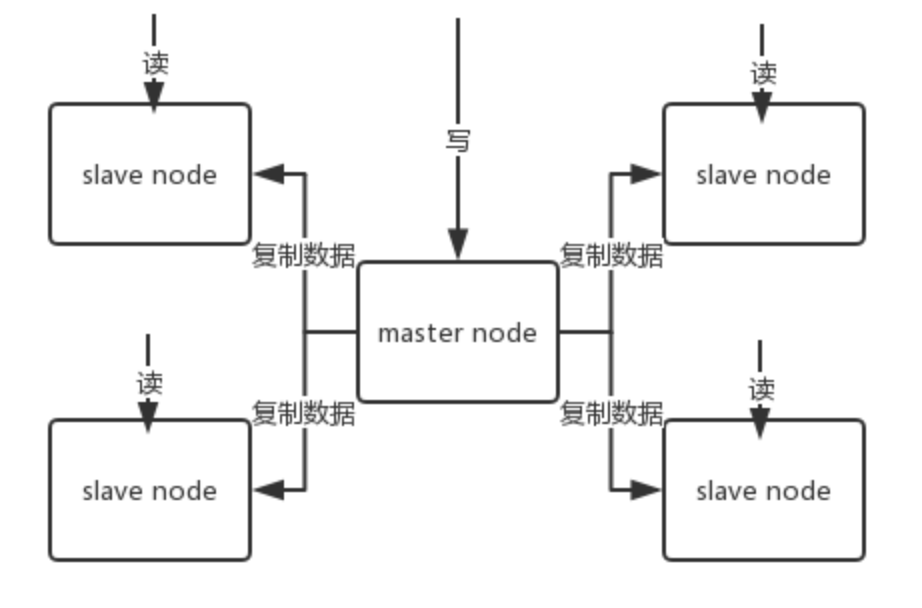

Redis 采用**异步方式**复制数据到 slave 节点

第一次同步时，主节点做一次bgsave，并同时将后续修改操作记录到内存buffer，待完成后将rdb文件全量同步到复制节点，复制节点接受完成后将rdb镜像加载到内存。

加载完成后，再通知主节点将期间修改的操作记录同步到复制节点进行重放就完成了同步过程。


**哨兵:**解决主从缺点 监听服务 master挂了自动切换成slave  

sentinel，中文名是哨兵。哨兵是 Redis 集群架构中非常重要的一个组件，主要有以下功能：

- 集群监控：负责监控 Redis master 和 slave 进程是否正常工作。
- 消息通知：如果某个 Redis 实例有故障，那么哨兵负责发送消息作为报警通知给管理员。
- 故障转移：如果 master node 挂掉了，会自动转移到 slave node 上。
- 配置中心：如果故障转移发生了，通知 client 客户端新的 master 地址。

哨兵用于实现 Redis 集群的高可用，本身也是分布式的，作为一个哨兵集群去运行，互相协同工作。

- 故障转移时，判断一个 master node 是否宕机了，需要大部分的哨兵都同意才行，涉及到了分布式选举的问题。
- 即使部分哨兵节点挂掉了，哨兵集群还是能正常工作的，因为如果一个作为高可用机制重要组成部分的故障转移系统本身是单点的，那就很坑爹了。
- 哨兵至少需要 3 个实例，来保证自己的健壮性。
- 哨兵 + Redis 主从的部署架构，是**不保证数据零丢失**的，只能保证 Redis 集群的高可用性。

##### 进行领导者哨兵选举

每次一个哨兵要做主备切换，首先需要 quorum 数量的哨兵认为 odown，然后选举出一个哨兵来做切换，这个哨兵还需要得到 majority 哨兵的授权，才能正式执行切换。

如果 quorum < majority，比如 5 个哨兵，majority 就是 3，quorum 设置为 2，那么就 3 个哨兵授权就可以执行切换。

但是如果 quorum >= majority，那么必须 quorum 数量的哨兵都授权，比如 5 个哨兵，quorum 是 5，那么必须 5 个哨兵都同意授权，才能执行切换。

选举使用的是Raft算法，基本思路是所有哨兵节点A会先其他哨兵节点，发送命令，申请成为该哨兵节点B的领导者，如果B还没有同意过其他哨兵节点，那么就同意A成为领导者，最终得票超过半数以上的哨兵节点会赢得选举，如果本次投票，没有选举出领导者哨兵，那么就开始新一轮的选举，直到选举出哨兵节点（实际开发中，最先判定主节点客观下线的哨兵节点，一般就能成为领导者。）

**选取新的Master**

1. 领导者哨兵节点首先会从从节点中选出一个节点作为新的主节点。选择的规则是：

   - 1.首先排除一些不健康的节点。（下线的，断线的，最近5s没有回复哨兵节点的INFO命令的，与旧的主服务器断开连接时间较长的）
   - 2.然后根据优先级，复制偏移量（哪个 slave 复制了越多的数据，offset 越靠后，优先级就越高。），runid最小，来选出一个从节点作为主节点。

   向这个从节点发送slaveof no one命令，让其成为主节点，通过slaveof 命令让其他从节点成为它的从节点，将已下线的主节点更新为新的主节点的从节点。

**集群：**目的：解决单机容量不足问题 关键词 分片

***Redis Sentinal着眼于高可用，在master宕机时会自动将slave提升为master，继续提供服务。***

***Redis Cluster着眼于扩展性，在单个redis内存不足时，使用Cluster进行分片存储。***

## 缓存穿透

### 什么是缓存穿透

正常情况下，我们去查询数据都是存在。

那么请求去查询一条压根儿数据库中根本就不存在的数据，也就是缓存和数据库都查询不到这条数据，但是请求每次都会打到数据库上面去。

**这种查询不存在数据的现象我们称为缓存穿透。**


### 穿透带来的问题

试想一下，如果有黑客会对你的系统进行攻击，拿一个不存在的id 去查询数据，会产生大量的请求到数据库去查询。可能会导致你的数据库由于压力过大而宕掉

### 解决办法

#### 1. 缓存空值

之所以会发生穿透，就是因为缓存中没有存储这些空数据的key。从而导致每次查询都到数据库去了。

那么我们就可以为这些key对应的值设置为null 丢到缓存里面去。后面再出现查询这个key 的请求的时候，直接返回null 。

这样，就不用在到数据库中去走一圈了，但是别忘了设置过期时间

#### 2. 布隆过滤器 BloomFilter

BloomFilter 类似于一个hbase set 用来判断某个元素（key）是否存在于某个集合中。

这种方式在大数据场景应用比较多，比如 Hbase 中使用它去判断数据是否在磁盘上。还有在爬虫场景判断url 是否已经被爬取过。

这种方案可以加在第一种方案中，在缓存之前在加一层 BloomFilter ，在查询的时候先去 BloomFilter 去查询 key 是否存在，如果不存在就直接返回，存在再走查缓存 -> 查 DB。

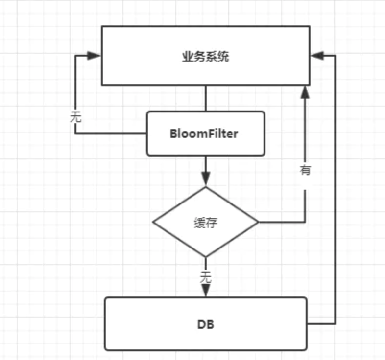

### 如何选择

针对于一些恶意攻击，攻击带过来的大量key 是不存在的，那么我们采用第一种方案就会缓存大量不存在key的数据。

此时我们采用第一种方案就不合适了，我们完全可以先对使用第二种方案进行过滤掉这些key。

针对这种key异常多、请求重复率比较低的数据，我们就没有必要进行缓存，使用第二种方案直接过滤掉。

而对于空数据的key有限的，重复率比较高的，我们则可以采用第一种方式进行缓存。


## 缓存击穿

### 什么是击穿

在平常高并发的系统中，**大量的请求同时查询一个 key 时，此时这个key正好失效了**，就会导致大量的请求都打到数据库上面去。这种现象我们称为**缓存击穿**。

### 会带来什么问题

会造成某一时刻数据库请求量过大，压力剧增。

### 如何解决

上面的现象是多个线程同时去查询数据库的这条数据，那么我们可以在第一个查询数据的请求上使用一个 互斥锁来锁住它。

其他的线程走到这一步拿不到锁就等着，等第一个线程查询到了数据，然后做缓存。后面的线程进来发现已经有缓存了，就直接走缓存。

## 缓存雪崩

### 什么是缓存雪崩

缓存雪崩的情况是说，当某一时刻发生大规模的缓存失效的情况，比如你的缓存服务宕机了，会有大量的请求进来直接打到DB上面。结果就是DB 称不住，挂掉。

缓存雪崩是指缓存中数据大批量到过期时间，而查询数据量巨大，引起数据库压力过大甚至down机。和缓存击穿不同的是:**缓存击穿指并发查同一条数据，缓存雪崩是不同数据都过期了，很多数据都查不到从而查数据库。**

### 解决办法

* 事前 使用集群缓存，保证缓存服务的高可用

  这种方案就是在发生雪崩前对缓存集群实现高可用，如果是使用 Redis，可以使用 主从+哨兵 ，Redis Cluster 来避免 Redis 全盘崩溃的情况。

* 事中：ehcache本地缓存 + Hystrix**限流**&降级,避免MySQL被打死

  使用 ehcache 本地缓存的目的也是考虑在 Redis Cluster 完全不可用的时候，ehcache 本地缓存还能够支撑一阵。

  使用 Hystrix进行限流 & 降级 ，比如一秒来了5000个请求，我们可以设置假设只能有一秒 2000个请求能通过这个组件，那么其他剩余的 3000 请求就会走限流逻辑。

  然后去调用我们自己开发的降级组件（降级），比如设置的一些默认值呀之类的。以此来保护最后的 MySQL 不会被大量的请求给打死。

* 事后：开启Redis持久化机制，尽快恢复缓存集群


## 解决热点数据集中失效问题

我们在设置缓存的时候，一般会给缓存设置一个失效时间，过了这个时间，缓存就失效了。

对于一些热点的数据来说，当缓存失效以后会存在大量的请求过来，然后打到数据库去，从而可能导致数据库崩溃的情况。

类似与缓存击穿

**解决办法**

* 设置不同的失效时间

  为了避免这些热点的数据集中失效，那么我们在设置缓存过期时间的时候，我们让他们失效的时间错开。

  比如在一个基础的时间上加上或者减去一个范围内的随机值。

* 互斥锁

  结合上面的击穿的情况，在第一个请求去查询数据库的时候对他加一个互斥锁，其余的查询请求都会被阻塞住，直到锁被释放，从而保护数据库。

  但是也是由于它会阻塞其他的线程，此时系统吞吐量会下降。需要结合实际的业务去考虑是否要这么做。

## JAVA Redis client

 Jedis  lettuce  Redisson

## Redis持久化

### 1.Redis持久化是什么？

因为Redis是一个内存数据库，数据保存在内存中，一旦发生关机或者重启，内存中的数据都会丢失，所以为了能够重启时恢复数据，Redis提供了持久化的机制，正常运行期间根据策略生成持久化文件。在机器重启后，可以根据根据持久化文件恢复内存中的数据。Redis还为我们提供了持久化的机制。（虽然有主从同步，主机挂掉之后，可以让从节点成为主节点，但是如果整个机房都发生停电，那么主节点和从节点内存中的数据都会丢失，所以这也是持久化存在的意义。）

### 2.Redis持久化有哪些策略？

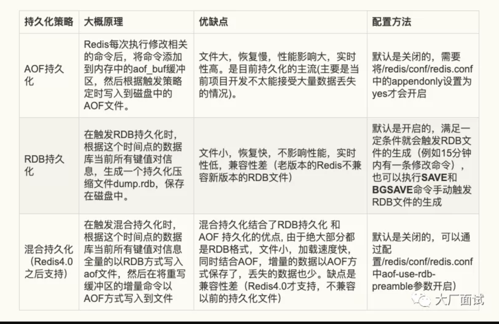


* AOF 持久化

  记录写命令 类似于Mysql 的binlog, 

  AOF持久化主要是Redis在修改相关的命令后，将命令添加到aof_buf缓存区的末尾，然后在每次事件循环结束时，

  有几种同步方法 

  1. `appendfsync = always ` 执行一个写命令同步一次  最多只会丢失当前正在写入的命令
  2. `appendfsync = everysec` 每秒写一次 最多流失1秒数据 **常用**
  3. `appendfsync = no ` 由操作系统来觉得 一般是30S

* RDB 持久化  **fork cow**

  快照
  
  操作系统多进程 **COW(Copy On Write) 机制** 拯救了我们。**Redis** 在持久化时会调用 `glibc` 的函数 `fork` 产生一个子进程，简单理解也就是基于当前进程 **复制** 了一个进程，主进程和子进程会共享内存里面的代码块和数据段：
  
  所以 **快照持久化** 可以完全交给 **子进程** 来处理，**父进程** 则继续 **处理客户端请求**。**子进程** 做数据持久化，它 **不会修改现有的内存数据结构**，它只是对数据结构进行遍历读取，然后序列化写到磁盘中。但是 **父进程** 不一样，它必须持续服务客户端请求，然后对 **内存数据结构进行不间断的修改**。
  
  这个时候就会使用操作系统的 COW 机制来进行 **数据段页面** 的分离。数据段是由很多操作系统的页面组合而成，当父进程对其中一个页面的数据进行修改时，会将被共享的页面复 制一份分离出来，然后 **对这个复制的页面进行修改**。这时 **子进程** 相应的页面是 **没有变化的**，还是进程产生时那一瞬间的数据。
  
  子进程因为数据没有变化，它能看到的内存里的数据在进程产生的一瞬间就凝固了，再也不会改变，这也是为什么 **Redis** 的持久化 **叫「快照」的原因**。接下来子进程就可以非常安心的遍历数据了进行序列化写磁盘了。


### 3.Redis的数据恢复策略是怎么样的？

1.如果配置了混合持久化，那么根据混合持久化文件进行恢复数据。（Redis4.0+）

2.只配置 AOF ，重启时加载 AOF 文件恢复数据。

3.同时配置了 RDB 和 AOF ，启动时只加载 AOF文件恢复数据，如果AOF文件损坏，那么根据RDB文件恢复数据。

4.只配置 RDB，启动时加载RDB持久化文件恢复数据。

### 4.Redis持久化策略该如何进行选择？

（因为混合持久化是Redis 4.0之后支持的，目前一般生成环境使用的Redis版本可能都还较低，所以这里的策略选择主要是针对AOF持久和RDB持久化进行技术选型。）

以下是几种持久化方案选择的场景：

#### 1.不需要考虑数据丢失的情况

那么不需要考虑持久化。

#### 2.单机实例情况下

可以接受丢失十几分钟及更长时间的数据，可以选择RDB持久化，对性能影响小，如果只能接受秒级的数据丢失，只能选择AOF持久化。

#### 3.在主从环境下

因为主服务器在执行修改命令后，会将命令发送给从服务器，从服务进行执行后，与主服务器保持数据同步，实现数据热备份，在master宕掉后继续提供服务。同时也可以进行读写分离，分担Redis的读请求。

##### 那么在从服务器进行数据热备份的情况下，是否还需要持久化呢？

需要持久化，因为不进行持久化，主服务器，从服务器同时出现故障时，会导致数据丢失。（例如：机房全部机器断电）。如果系统中有自动拉起机制（即检测到服务停止后重启该服务）将master自动重启，由于没有持久化文件，那么master重启后数据是空的，slave同步数据也变成了空的。应尽量避免“自动拉起机制”和“不做持久化”同时出现。


**所以一般可以采用以下方案：**

**主服务器不开启持久化，使得主服务器性能更好。**

**从服务器开启AOF持久化，关闭RDB持久化，并且定时对AOF文件进行备份，以及在凌晨执行bgaofrewrite命令来进行AOF文件重写，减小AOF文件大小。（当然如果对数据丢失容忍度高也可以开启RDB持久化，关闭AOF持久化）**


##### 4.异地灾备

一般性的故障（停电，关机）不会影响到磁盘，但是一些灾难性的故障（地震，洪水）会影响到磁盘，所以需要定时把单机上或从服务器上的AOF文件，RDB文件备份到其他地区的机房。


>[谈一谈你对Redis持久化的理解](https://mp.weixin.qq.com/s/nff4fd5TnM-CMWb1hQIT9Q)
>
>[一文看懂Redis的持久化原理](https://juejin.im/post/5b70dfcf518825610f1f5c16)


## Redis 锁


### setnx || set key value + 过期时间  + NX

特性 只有值不存在才能set成功

set key value + 过期时间  + NX  （2013年之后 set 支持 了 nx 参数  官网也说明 之后setnx 会删除 因为setnx 不能设置过期时间 需要两条命令 就不是原子性了）


* 第一种

```shell
tryLock(){  
    SETNX Key 1
    EXPIRE Key Seconds
}
release(){  
  DELETE Key
}

```

缺点： 

两条命令不是原子性 如果执行完第一条命令后应用异常或者重启，锁将无法过期。  可以使用Lua脚本（包含SETNX和EXPIRE两条命令），但是如果Redis仅执行了一条命令后crash或者发生主从切换，依然会出现锁没有过期时间，最终导致无法释放。

还有一个问题就是 在释放分布式锁的过程中，无论锁是否获取成功，都在finally中释放锁，这样是一个锁的错误使用，

* 第二种
  **Redis 2.6.12版本后SETNX增加过期时间参数，这样就解决了两条命令无法保证原子性的问题** 

```shell
tryLock(){  
    SETNX Key 1 Seconds
}
release(){  
  DELETE Key
}
```

* 第三种

基于GETSET 和SETNX  过期时间自己判断

1. SETNX(Key,ExpireTime)获取锁

2. 如果获取锁失败，通过GET(Key)返回的时间戳检查锁是否已经过期

3. GETSET(Key,ExpireTime)修改Value为NewExpireTime

4. 检查GETSET返回的旧值，如果等于GET返回的值，则认为获取锁成功

!> 注意：这个版本去掉了EXPIRE命令，改为通过Value时间戳值来判断过期


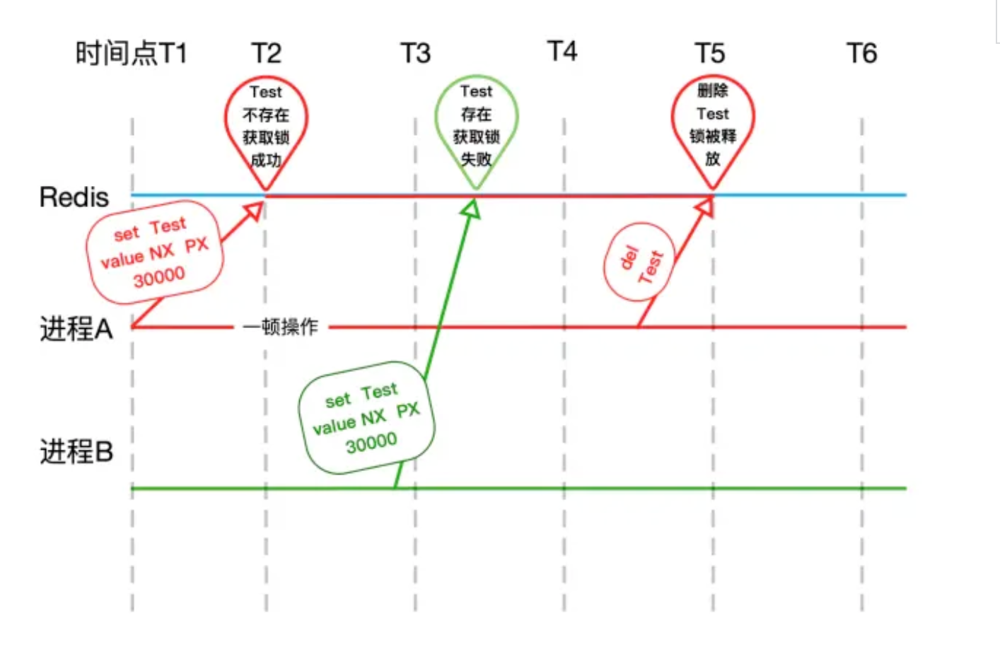

加锁流程  进程A set nx 加锁 因为不存在值 所以加锁成功

进程B 进行加锁 因为有值 所以加锁失败

解锁流程

​		最初版本是 过期时间到了就解锁 但是这样可能进程A还没有执行完成

​		这时候进程B拿到了锁 之后进程A又删除了B的锁。。。。 导致问题。

​		所以我们要利用value值。规定谁加锁 谁解锁

lua脚本如下:

```java
if redis.call("get",KEYS[1]) == ARGV[1] then    return redis.call("del",KEYS[1])else    return 0end
```


**缺点**：

1. Setnx不是原子性的。如果在EXPIRE命令之前宕机 就是造成死锁。推荐使用set key value  nx  或者使用lua脚本

2. 某线程A获取了锁并且设置了过期时间为10s，然后在执行业务逻辑的时候耗费了15s，此时线程A获取的锁早已被Redis的过期机制自动释放了。

   在线程A获取锁并经过10s之后，改锁可能已经被其它线程获取到了。当线程A执行完业务逻辑准备解锁（DEL key）的时候，有可能删除掉的是其它线程已经获取到的锁。

   所以最好的方式是在解锁时判断锁是否是自己的，我们可以在设置key的时候将value设置为一个唯一值uniqueValue（可以是随机值、UUID、或者机器号+线程号的组合、签名等）。

3. 如果Redis的master节点宕机   因为Redis的复制是异步的。

   举例来说：

   1. 线程A在master节点拿到了锁。

      

   2. master节点在把A创建的key写入slave之前宕机了。

      

   3. slave变成了master节点。

      

   4. 线程B也得到了和A还持有的相同的锁。（因为原来的slave里面还没有A持有锁的信息）


### redisson


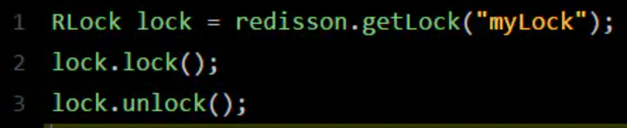

**底层原理**

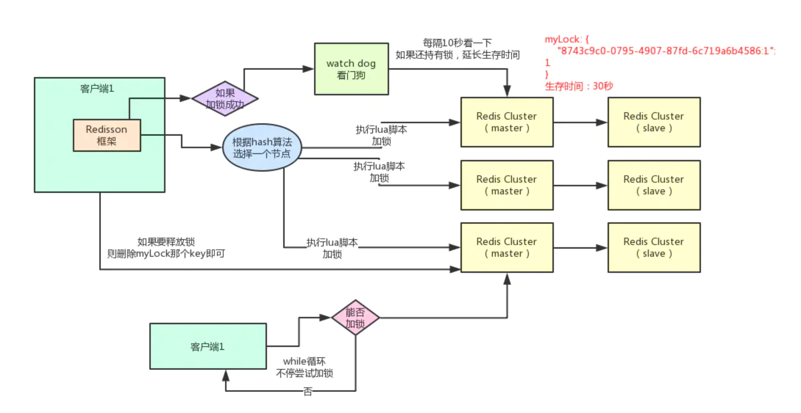


​     redisson 的加锁 采用了传统的setnx +lua脚本 是因为他在脚本还做了其他的一些操作 比如实现了可重入锁

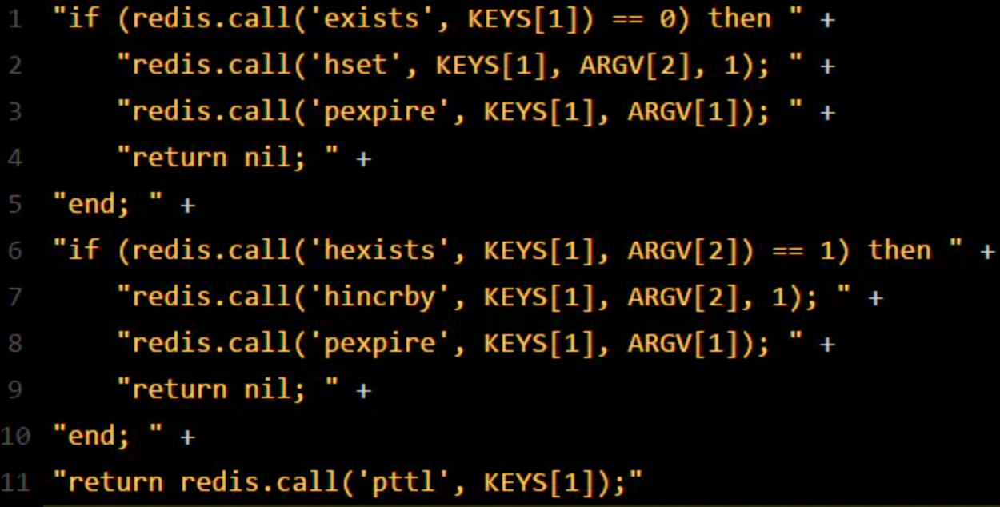

**加锁：** 数据结构 HSET  key  客户端ID 次数(可重入加锁机制)

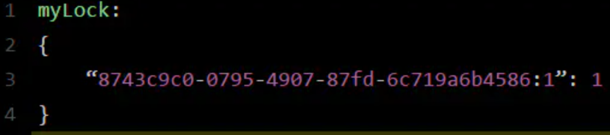


接着会执行“**pexpire myLock 30000**”命令，设置myLock这个锁key的**生存时间是30秒**。好了，到此为止，ok，加锁完成了。

**watch dog自动延期机制:**

客户端1加锁的锁key默认生存时间才30秒，如果超过了30秒，客户端1还想一直持有这把锁，怎么办呢？

简单！只要客户端1一旦加锁成功，就会启动一个watch dog看门狗，**他是一个后台线程，会每隔10秒检查一下**，如果客户端1还持有锁key，那么就会不断的延长锁key的生存时间。

**释放锁：**每次都对myLock数据结构中的那个加锁次数减1。如果发现加锁次数是0了，说明这个客户端已经不再持有锁了，此时就会用：**“del myLock”命令**，从redis里删除这个key。


**缺点：**

其实上面那种方案最大的问题，就是如果你对某个redis master实例，写入了myLock这种锁key的value，此时会异步复制给对应的master slave实例。但是这个过程中一旦发生redis master宕机，主备切换，redis slave变为了redis master。

接着就会导致，客户端2来尝试加锁的时候，在新的redis master上完成了加锁，而客户端1也以为自己成功加了锁。此时就会导致多个客户端对一个分布式锁完成了加锁。这时系统在业务语义上一定会出现问题，**导致各种脏数据的产生**。

所以这个就是redis cluster，或者是redis master-slave架构的主从异步复制导致的redis分布式锁的最大缺陷：**在redis master实例宕机的时候，可能导致多个客户端同时完成加锁**。

Redlock 可以解决这个问题 但是也带来了新的问题。。。。


### Redlock 

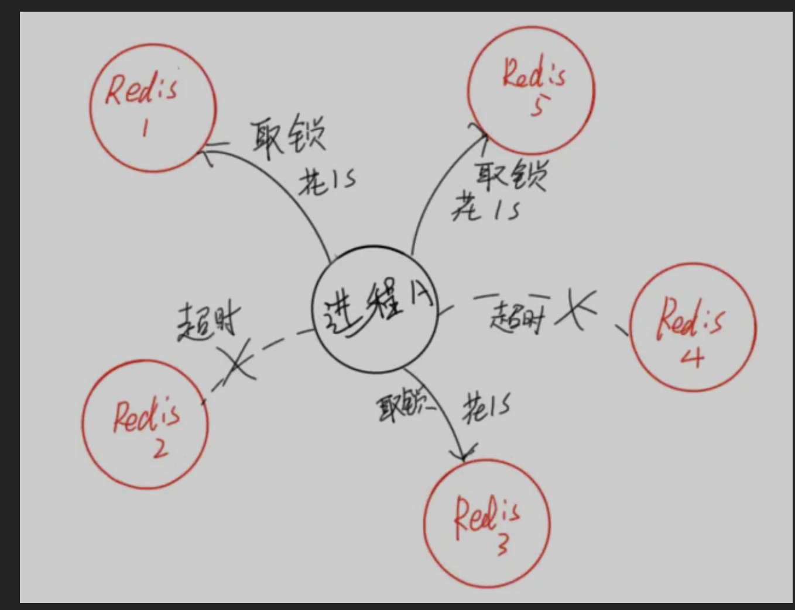
* **顺序向五个节点请求加锁**

* **根据一定的超时时间来推断是不是跳过该节点**

* **三个节点加锁成功并且花费时间小于锁的有效期**

* **认定加锁成功**

  
  

**缺点：**

1. 对于提升效率的场景下，RedLock 太重。

2. 对于对正确性要求极高的场景下，RedLock 并不能保证正确性。

3. Redlock算法对时钟依赖性太强，若Ｎ个节点中的某个节点发生**时间跳跃**，也可能会引此而引发锁安全性问题

4. 要求苛刻  Redis本身有几种部署模式：单机模式、主从模式、哨兵模式、集群模式。

   比如采用集群模式部署，如果需要5个节点，那么就需要部署5个Redis Cluster集群。

   很显然，这种要求每个master节点都独立的Redlock算法条件有点苛刻，使用它所需要耗费的资源比较多，而且对每个节点都请求一次锁所带来的额外开销也不可忽视。除非有实实在在的业务应用需求，或者有资源可以复用。

使用Redis分布式锁并不能做到万无一失。一般而言，Redis分布式锁的优势在于性能，而如果要考虑到可靠性，那么Zookeeper、etcd这类的组件会比Redis要高。

当然，在合适的环境下使用基于数据库实现的分布式锁会更合适

不过就以可靠性而言，没有任何组件是完全可靠的，程序员的价值不仅仅在于表象地如何灵活运用这些组件，而在于如何基于这些不可靠的组件构建一个可靠的系统。

还是那句老话，选择何种方案，合适最重要。


>  [面试被问Redis锁的缺点，被打击的扎心了](https://www.shangyexinzhi.com/article/1976926.html)
>
>  [面试请不要再问我Redis分布式锁的实现原理](https://juejin.im/post/5bf3f15851882526a643e207)
>
>  [大家所推崇的 Redis 分布式锁，真的万无一失吗？](https://juejin.im/post/5d41c94bf265da03a715b18f)
>
>  [Redis RedLock 完美的分布式锁么？](https://juejin.im/post/59f592c65188255f5c5142d2)


### 总结

不论是基于SETNX版本的Redis单实例分布式锁，还是Redlock分布式锁，都是为了保证下特性

1. 安全性：在同一时间不允许多个Client同时持有锁

2. 活性

   - 死锁：锁最终应该能够被释放，即使Client端crash或者出现网络分区（通常基于超时机制）
   - 容错性：只要超过半数Redis节点可用，锁都能被正确获取和释放

   

> [CAP 理论](https://blog.csdn.net/u013058742/article/details/83541905)


CAP理论提出就是针对分布式数据库环境的

P就是在分布式环境中，由于网络的问题可能导致某个节点和其它节点失去联系，这时候就形成了P(partition)，也就是由于网络问题，将系统的成员隔离成了2个区域，互相无法知道对方的状态，这在分布式环境下是非常常见的。

因为P是必须的，那么我们需要选择的就是A和C。


可用性 A(Availability)，此时，那个失去联系的节点依然可以向系统提供服务，不过它的数据就不能保证是同步的了（失去了C属性）。


选择一致性C(Consistency)，为了保证数据库的一致性，我们必须等待失去联系的节点恢复过来，在这个过程中，那个节点是不允许对外提供服务的，这时候系统处于不可用状态(失去了A属性)。


Redis AP模式

ZK  CP模式


分布式的CAP理论告诉我们，任何一个[分布式系统](https://youzhixueyuan.com/tag/分布式系统)都无法同时满足一致性（Consistency）、可用性（Availability）和分区容错性（Partition tolerance），最多只能同时满足两项。

所以，很多系统在设计之初就要对这三者做出取舍。在互联网领域的绝大多数的场景中，都需要牺牲强一致性来换取系统的高可用性，系统往往只需要保证“最终一致性”，只要这个最终时间是在用户可以接受的范围内即可。


### [同步与异步的区别是什么？](http://notfound9.github.io/interviewGuide/#/docs/RedisBasic?id=同步与异步的区别是什么？)

同步与异步的区别在于调用结果的通知方式上。 同步执行一个方法后，需要等待结果返回，然后继续执行下去。 异步执行一个方法后，不会等待结果的返回，调用方定时主动去轮询调用结果或者被调用方在执行完成后通过回调来通知调用方。

### [阻塞与非阻塞的区别是什么？](http://notfound9.github.io/interviewGuide/#/docs/RedisBasic?id=阻塞与非阻塞的区别是什么？)

阻塞与非阻塞的区别在于进程/线程在等待消息时，进程/线程是否是挂起状态。

##### [阻塞调用](http://notfound9.github.io/interviewGuide/#/docs/RedisBasic?id=阻塞调用)

在消息发出去后，消息返回之前，当前进程/线程会被挂起，直到有消息返回，当前进/线程才会被激活。

##### [非阻塞调用](http://notfound9.github.io/interviewGuide/#/docs/RedisBasic?id=非阻塞调用)

在消息发出去后，不会阻塞当前进/线程，而会立即返回，可以去执行其他任务。


## 如何解决 Redis 的并发竞争 Key 问题

所谓 Redis 的并发竞争 Key 的问题也就是多个系统同时对一个 key 进行操作，但是最后执行的顺序和我们期望的顺序不同，这样也就导致了结果的不同！

推荐一种方案：分布式锁（zookeeper 和 redis 都可以实现分布式锁）。（如果不存在 Redis 的并发竞争 Key 问题，不要使用分布式锁，这样会影响性能）

基于 zookeeper 临时有序节点可以实现的分布式锁。大致思想为：每个客户端对某个方法加锁时，在 zookeeper 上的与该方法对应的指定节点的目录下，生成一个唯一的瞬时有序节点。 判断是否获取锁的方式很简单，只需要判断有序节点中序号最小的一个。 当释放锁的时候，只需将这个瞬时节点删除即可。同时，其可以避免服务宕机导致的锁无法释放，而产生的死锁问题。完成业务流程后，删除对应的子节点释放锁。

在实践中，当然是从以可靠性为主。所以首推 Zookeeper。


## 如何保证缓存与数据库双写时的数据一致性?

[【大厂面试01期】高并发场景下，如何保证缓存与数据库一致性？](https://mp.weixin.qq.com/s/hwMpAVZ1_p8gLfPAzA8X9w)

你只要用缓存，就可能会涉及到缓存与数据库双存储双写，你只要是双写，就一定会有数据一致性的问题，那么你如何解决一致性问题？

一般来说，如果允许缓存可以稍微的跟数据库偶尔有不一致的情况，也就是说如果你的系统**不是严格要求** “缓存+数据库” 必须保持一致性的话，最好不要做这个方案，即：**读请求和写请求串行化**，串到一个**内存队列**里去。

串行化可以保证一定不会出现不一致的情况，但是它也会导致系统的吞吐量大幅度降低，用比正常情况下多几倍的机器去支撑线上的一个请求。


### Cache Aside Pattern

最经典的缓存+数据库读写的模式，就是 Cache Aside Pattern。

- 读的时候，先读缓存，缓存没有的话，就读数据库，然后取出数据后放入缓存，同时返回响应。
- 更新的时候，**先更新数据库，然后再删除缓存**。


### 最初级的缓存不一致问题

问题：先更新数据库，再删除缓存。如果删除缓存失败了，那么会导致数据库中是新数据，缓存中是旧数据，数据就出现了不一致。


解决思路：先删除缓存，再更新数据库。如果数据库更新失败了，那么数据库中是旧数据，缓存中是空的，那么数据不会不一致。因为读的时候缓存没有，所以去读了数据库中的旧数据，然后更新到缓存中。

### 比较复杂的数据不一致问题分析

数据发生了变更，先删除了缓存，然后要去修改数据库，此时还没修改。一个请求过来，去读缓存，发现缓存空了，去查询数据库，**查到了修改前的旧数据**，放到了缓存中。随后数据变更的程序完成了数据库的修改。完了，数据库和缓存中的数据不一样了...


双删除方案  ：  删除缓存 更新数据库  再删除缓存


### 方案1.写请求串行化

#### 写请求

1.写请求更新之前先获取分布式锁，获得之后才能去数据库更新这个数据，获取不到就进行等待，超时后就返回更新失败。

2.更新完之后去刷新缓存，如果刷新失败，放到内存队列中进行重试（重试时取数据库最新数据更新缓存）。

#### 读请求

读请求发现缓存中没有数据时，直接去读取数据库，读完更新缓存。

#### 总结

这种技术方案通过对写请求的实现串行化来保证数据一致性，但是会导致吞吐量变低。比较适合银行相关的业务，因为对于银行项目来说，保证数据一致性比可用性更加重要，就像是去存款机存钱，取钱时，为了保证账户安全，都是会让用户执行操作后，等待一段时间才能获得反馈，这段时间其实取款机是不可用的。

### 方案2.先更新数据库，异步删除缓存，删除失败后重试


## **假如Redis里面有1亿个key，其中有10w个key是以某个固定的已知的前缀开头的，如果将它们全部找出来？**

使用`keys`指令可以扫出指定模式的key列表。

对方接着追问：如果这个redis正在给线上的业务提供服务，那使用keys指令会有什么问题？

这个时候你要回答redis关键的一个特性：redis的单线程的。keys指令会导致线程阻塞一段时间，线上服务会停顿，直到指令执行完毕，服务才能恢复。

这个时候可以使用`scan`指令，scan指令可以无阻塞的提取出指定模式的key列表，但是会有一定的重复概率，在客户端做一次去重就可以了，但是整体所花费的时间会比直接用keys指令长。

