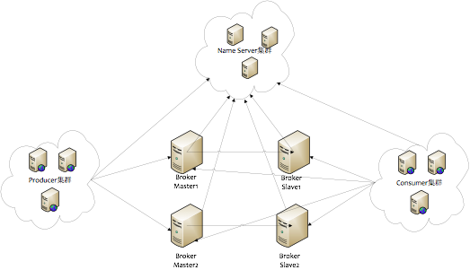

### RocketMQ

RocketMQ是阿里开源的消息中间件，它是纯Java开发，具有高吞吐量、高可用性、适合大规模分布式系统应用的特点。RocketMQ思路起源于Kafka，但并不是Kafka的一个Copy，它对消息的可靠传输及事务性做了优化，目前在阿里集团被广泛应用于交易、充值、流计算、消息推送、日志流式处理、binglog分发等场景。

**特点**

* 是一个队列模型的消息中间件，具有高性能、高可靠、高实时、分布式特点。
* Producer、Consumer、队列都可以分布式。
* Producer向一些队列轮流发送消息，队列集合称为Topic，Consumer如果做广播消费，则一个consumer实例消费这个Topic对应的所有队列，如果做集群消费，则多个Consumer实例平均消费这个* * * topic对应的队列集合。
* 能够保证严格的消息顺序
* 提供丰富的消息拉取模式
* 高效的订阅者水平扩展能力
* 实时的消息订阅机制
* 亿级消息堆积能力
* 较少的依赖

* Name Server是一个几乎无状态节点，可集群部署，节点之间无任何信息同步。 **路由**  用于给 Producer 和 Consumer 查找 Broker 信息
* Broker分为Master与Slave，一个Master可以对应多个Slave，但是一个Slave只能对应一个Master，每个Broker与Name Server集群中的所有节点建立长连接，定时注册Topic信息到所有Name Server。
* Producer与Name Server集群中的其中一个节点（随机选择）建立长连接，定期从Name Server取Topic路由信息，并向提供Topic服务的Master建立长连接，且定时向Master发送心跳。Producer完全无状态，可集群部署。
* Consumer与Name Server集群中的其中一个节点（随机选择）建立长连接，定期从Name Server取Topic路由信息，并向提供Topic服务的Master、Slave建立长连接，且定时向Master、Slave发送心跳。Consumer既可以从Master订阅消息，也可以从Slave订阅消息，订阅规则由Broker配置决定。
* 消息（Message）就是要传输的信息。一条消息必须有一个主题（Topic），主题可以看做是你的信件要邮寄的地址。一条消息也可以拥有一个可选的标签（Tag）和额处的键值对

**消息消费模式** 
消息消费模式有两种：集群消费（Clustering）和广播消费（Broadcasting）。默认情况下就是集群消费，该模式下一个消费者集群共同消费一个主题的多个队列，一个队列只会被一个消费者消费，如果某个消费者挂掉，分组内其它消费者会接替挂掉的消费者继续消费。而广播消费消息会发给消费者组中的每一个消费者进行消费。