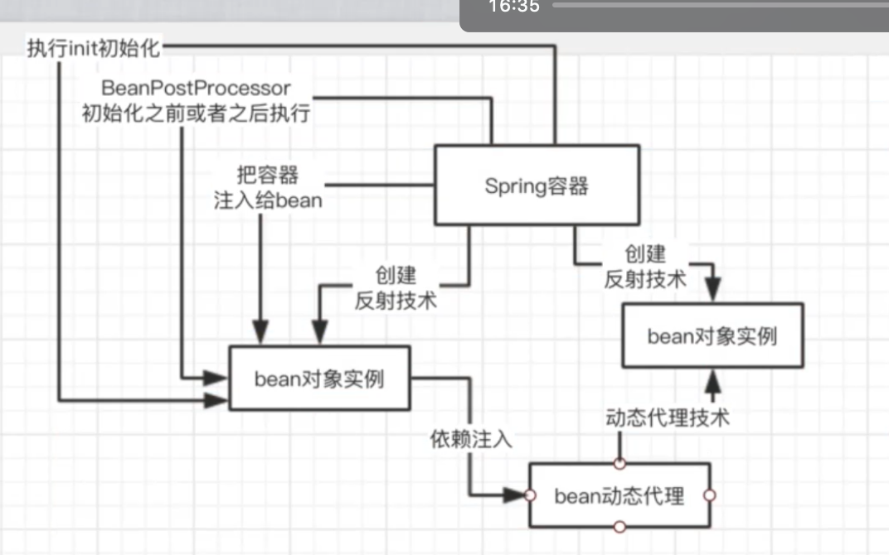
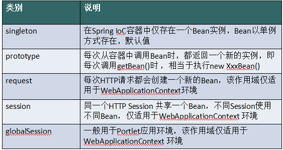
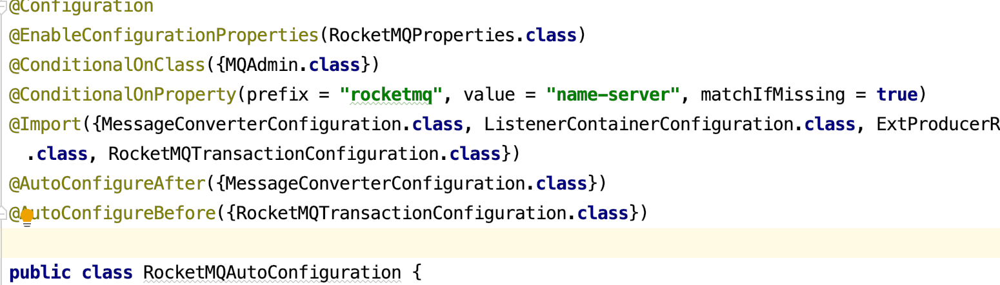
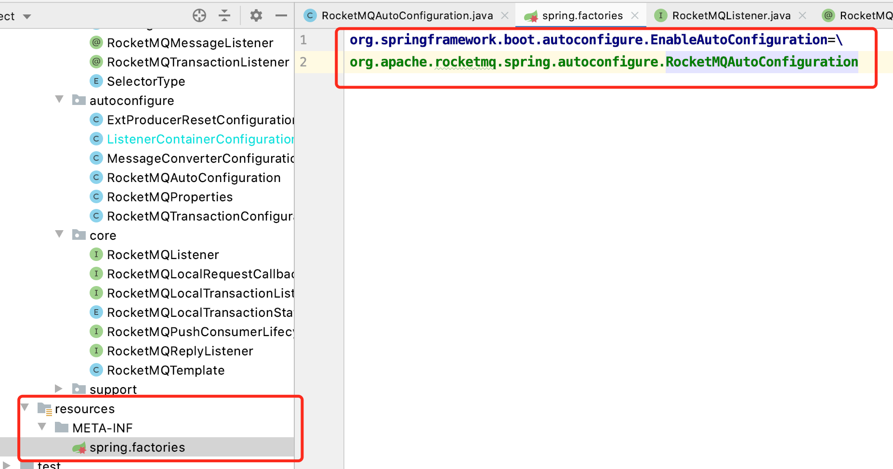

# Spring



## Spring IOE （Inversion of Control）

### 大白话

**Spring ioc 就是控制反转 将控制权交给Spring。Spring 容器根据xml配置或者注解来去实例化bean对象**

**并根据xml配置或者注解 去对bean对象之间的引用关系 进行依赖注入  管理Bean之前的依赖注入**

**spring ioc 解决了类与类之前 的耦合问题 维护代码的时候可以更加轻松**

依赖注入(Dependency Injection)和控制反转(IOC)是从不同的角度的描述的同一件事情，就是指通过引入IOC容器，利用依赖关系注入的方式，实现对象之间的解耦。

Spring IOC 负责创建对象，管理对象（通过依赖注入（DI），装配对象，配置对象，并且管理这些对象的整个生命周期。

所谓的依赖注入，则是，甲方开放接口，在它需要的时候，能够讲乙方传递进来(注入)
所谓的控制反转，甲乙双方不相互依赖，交易活动的进行不依赖于甲乙任何一方，整个活动的进行由第三方负责管理。

ioc的思想最核心的地方在于，**资源不由使用资源的双方管理，而由不使用资源的第三方管理**，这可以带来很多好处。
第一，资源集中管理，实现资源的可配置和易管理。  
第二，降低了使用资源双方的依赖程度，也就是我们说的耦合度。        
**Spring IOC的初始化过程**


读取XML资源，并解析，最终注册到Bean Factory中：

* SpringBean注入采用单例时, 跟静态有何分别
  * 可以对bean实现各种拦截(aop,以及通过aop实现的事务和各种操作)
  * 一，便于替换实现。
  * 二，便于单元测试。
  * 三，便于AOP实现。
  * 封装是一个基本特性，static并不满足封装的意义，它其实只是把函数放在一个类里面，并不属于任何一个对象
  * static调用用类名，失去了多态的优越性


反射技术是一种动态语言的技术，它可以动态的获取类以及类中的成员，并可以调用该类成员。

> Java 反射机制在程序**运行时**，对于任意一个类，都能够知道这个类的所有属性和方法；对于任意一个对象，都能够调用它的任意一个方法和属性。这种 **动态的获取信息** 以及 **动态调用对象的方法** 的功能称为 **java 的反射机制**。

> 反射机制很重要的一点就是“运行时”，其使得我们可以在程序运行时加载、探索以及使用编译期间完全未知的 `.class` 文件。换句话说，Java 程序可以加载一个运行时才得知名称的 `.class` 文件，然后获悉其完整构造，并生成其对象实体、或对其 fields（变量）设值、或调用其 methods（方法）。

 

底层技术：就是反射 根据类生成对象  Class.newInstance() 

## Spring Bean

* spring bean 作用域



默认作用域是单例模式 在容器已启动就会自动创建bean对象 有可以配置`lazy-init=”true”`
在第一个使用是创建bean


**Bean的生命周期 initialization 和 destroy**

* 方式一： 实现InitializingBean和DisposableBean接口

```java
public class GiraffeService implements InitializingBean,DisposableBean {
    @Override
    public void afterPropertiesSet() throws Exception {
        System.out.println("执行InitializingBean接口的afterPropertiesSet方法");
    }
    @Override
    public void destroy() throws Exception {
        System.out.println("执行DisposableBean接口的destroy方法");
    }
}
```

* 方式二： 使用@PostConstruct和@PreDestroy注解

这两个注解均在javax.annotation 包中

```java
public class GiraffeService {
    @PostConstruct
    public void initPostConstruct(){
        System.out.println("执行PostConstruct注解标注的方法");
    }
    @PreDestroy
    public void preDestroy(){
        System.out.println("执行preDestroy注解标注的方法");
    }
}
```

**实现*Aware接口 在Bean中使用Spring框架的一些对象**

```java
public class GiraffeService implements   ApplicationContextAware,
        ApplicationEventPublisherAware, BeanClassLoaderAware, BeanFactoryAware,
        BeanNameAware, EnvironmentAware, ImportAware, ResourceLoaderAware{
         @Override
    public void setBeanClassLoader(ClassLoader classLoader) {
        System.out.println("执行setBeanClassLoader,ClassLoader Name = " + classLoader.getClass().getName());
    }
    @Override
    public void setBeanFactory(BeanFactory beanFactory) throws BeansException {
        System.out.println("执行setBeanFactory,setBeanFactory:: giraffe bean singleton=" +  beanFactory.isSingleton("giraffeService"));
    }
    @Override
    public void setBeanName(String s) {
        System.out.println("执行setBeanName:: Bean Name defined in context="
                + s);
    }
    @Override
    public void setApplicationContext(ApplicationContext applicationContext) throws BeansException {
        System.out.println("执行setApplicationContext:: Bean Definition Names="
                + Arrays.toString(applicationContext.getBeanDefinitionNames()));
    }
    @Override
    public void setApplicationEventPublisher(ApplicationEventPublisher applicationEventPublisher) {
        System.out.println("执行setApplicationEventPublisher");
    }
    @Override
    public void setEnvironment(Environment environment) {
        System.out.println("执行setEnvironment");
    }
    @Override
    public void setResourceLoader(ResourceLoader resourceLoader) {
        Resource resource = resourceLoader.getResource("classpath:spring-beans.xml");
        System.out.println("执行setResourceLoader:: Resource File Name="
                + resource.getFilename());
    }
    @Override
    public void setImportMetadata(AnnotationMetadata annotationMetadata) {
        System.out.println("执行setImportMetadata");
    }
}
```

**BeanPostProcessor**
上面的*Aware接口是针对某个实现这些接口的Bean定制初始化的过程， Spring同样可以针对容器中的所有Bean，或者某些Bean定制初始化过程，只需提供一个实现BeanPostProcessor接口的类即可。 该接口中包含两个方法，postProcessBeforeInitialization和postProcessAfterInitialization。 postProcessBeforeInitialization方法会在容器中的Bean初始化之前执行， postProcessAfterInitialization方法在容器中的Bean初始化之后执行。

```java
public class CustomerBeanPostProcessor implements BeanPostProcessor {
    @Override
    public Object postProcessBeforeInitialization(Object bean, String beanName) throws BeansException {
        System.out.println("执行BeanPostProcessor的postProcessBeforeInitialization方法,beanName=" + beanName);
        return bean;
    }
    @Override
    public Object postProcessAfterInitialization(Object bean, String beanName) throws BeansException {
        System.out.println("执行BeanPostProcessor的postProcessAfterInitialization方法,beanName=" + beanName);
        return bean;
    }
}

```

**完整生命周期**

- Bean容器找到配置文件中 Spring Bean 的定义。
- Bean容器利用Java Reflection API创建一个Bean的实例。
- 如果涉及到一些属性值 利用set方法设置一些属性值。
- 如果Bean实现了BeanNameAware接口，调用setBeanName()方法，传入Bean的名字。
- 如果Bean实现了BeanClassLoaderAware接口，调用setBeanClassLoader()方法，传入ClassLoader对象的实例。
- 如果Bean实现了BeanFactoryAware接口，调用setBeanClassLoader()方法，传入ClassLoader对象的实例。
- 与上面的类似，如果实现了其他*Aware接口，就调用相应的方法。
- 如果有和加载这个Bean的Spring容器相关的BeanPostProcessor对象，执行- postProcessBeforeInitialization()方法
- 如果Bean实现了InitializingBean接口，执行afterPropertiesSet()方法。
- 如果Bean在配置文件中的定义包含init-method属性，执行指定的方法。
- 如果有和加载这个Bean的Spring容器相关的BeanPostProcessor对象，执行postProcessAfterInitialization()方法
- 当要销毁Bean的时候，如果Bean实现了DisposableBean接口，执行destroy()方法。
- 当要销毁Bean的时候，如果Bean在配置文件中的定义包含destroy-method属性，执行指定的方法。
  

**简单版生命周期**
默认情况下，Spring 在读取 xml 文件的时候，就会创建对象。在创建对象的时候先调用构造器，然后调用 init-method 属性值中所指定的方法。对象在被销毁的时候，会调用 destroy-method 属性值中所指定的方法（例如调用Container.destroy()方法的时候）

### Spring 的Bean是线程安全的吗？

不是： 如果在bean 里面定义了 成员变量  多线程调用 方法去修改 就可能有问题

不过 Java web系统,一般来说很少在 spring bean里放一些实例变量,一般来说他们都
是多个组件互相调用,最终去访问数据库的

## AOP 面向切面编程

## 大白话

**aop 就是面向切面编程 。比如我们有很多类有很多重复的代码 比如都要开事务 关事务。对于这样的代码** 

**我们就可以放到切面来做。 就想面包一样中间切一刀。  核心原理就是动态代理。注入切面代码  我生成 一个代理类 在代理类 开事务  然后调用被代理类的方法然后根据异常 决定是否提交或者回滚**

* 通知（Adivce）有5种类型：
  * Before在方法被调用之前调用
  * After在方法完成后调用通知，无论方法是否执行成功
  * After-returning 在方法成功执行之后调用通知
  * After-throwing在方法抛出异常后调用通知
  * Around通知了好、包含了被通知的方法，在被通知的方法调用之前后调用之后执行自定义的行为
* 注解方式 (只是使用的@Aspect 注解 底层还是动态代理的方式)

```java
@Aspect
@Component
public class RestTemplateAop {
    private final Logger logger = LoggerFactory.getLogger(getClass());
    // @Pointcut("@annotation(com.fqgj.common.api.annotations.ParamsValidate)")
    @Pointcut("execution(* org.springframework.web.client.RestTemplate.*(..))")
    private void externalPointCut() {
    }

    @Around("externalPointCut()")
    public Object readAround(ProceedingJoinPoint point) throws Throwable {
        Object[] args = point.getArgs();
        try {
            Object proceed = point.proceed(args);
    }
}
```

* Spring Aop （AOP为Aspect Oriented Programming）实现原理
  静态代理：AspectJ  编译时生成代理类 （静态性能好 但是需要特定的编译器）
  动态代理：JDK动态代理 （反射 以及必须实现接口（因为需要根据接口动态生成类）Proxy类和 InvocationHandler接口） 

  ​             	CGLIB动态代理 （没有实现接口 走这个方式 生成 需要代理类的子类来增强 被final标记的类不能使用此方法）

* JDK Proxy

```java
import java.lang.reflect.InvocationHandler;
import java.lang.reflect.Method;
import java.util.Date;

public class LogHandler implements InvocationHandler {
    Object target;  // 被代理的对象，实际的方法执行者

    public LogHandler(Object target) {
        this.target = target;
    }
    @Override
    public Object invoke(Object proxy, Method method, Object[] args) throws Throwable {
        before();
        Object result = method.invoke(target, args);  // 调用 target 的 method 方法
        after();
        return result;  // 返回方法的执行结果
    }
    // 调用invoke方法之前执行
    private void before() {
        System.out.println(String.format("log start time [%s] ", new Date()));
    }
    // 调用invoke方法之后执行
    private void after() {
        System.out.println(String.format("log end time [%s] ", new Date()));
    }
}

```

```java
import proxy.UserService;
import proxy.UserServiceImpl;
import java.lang.reflect.InvocationHandler;
import java.lang.reflect.Proxy;

public class Client2 {
    public static void main(String[] args) throws IllegalAccessException, InstantiationException {
        // 设置变量可以保存动态代理类，默认名称以 $Proxy0 格式命名
        // System.getProperties().setProperty("sun.misc.ProxyGenerator.saveGeneratedFiles", "true");
        // 1. 创建被代理的对象，UserService接口的实现类
        UserServiceImpl userServiceImpl = new UserServiceImpl();
        // 2. 获取对应的 ClassLoader
        ClassLoader classLoader = userServiceImpl.getClass().getClassLoader();
        // 3. 获取所有接口的Class，这里的UserServiceImpl只实现了一个接口UserService，
        Class[] interfaces = userServiceImpl.getClass().getInterfaces();
        // 4. 创建一个将传给代理类的调用请求处理器，处理所有的代理对象上的方法调用
        //     这里创建的是一个自定义的日志处理器，须传入实际的执行对象 userServiceImpl
        InvocationHandler logHandler = new LogHandler(userServiceImpl);
        /*
		   5.根据上面提供的信息，创建代理对象 在这个过程中，
               a.JDK会通过根据传入的参数信息动态地在内存中创建和.class 文件等同的字节码
               b.然后根据相应的字节码转换成对应的class，
               c.然后调用newInstance()创建代理实例
		 */
        UserService proxy = (UserService) Proxy.newProxyInstance(classLoader, interfaces, logHandler);
        // 调用代理的方法
        proxy.select();
        proxy.update();
        
        // 保存JDK动态代理生成的代理类，类名保存为 UserServiceProxy
        // ProxyUtils.generateClassFile(userServiceImpl.getClass(), "UserServiceProxy");
    }
}

```

## Spring 事务


* Spring支持两种方式管理事务
  * 编程式事务管理： 通过Transaction Template手动管理事务，实际应用中很少使用，
  * 配置声明式事务： 推荐使用（代码侵入性最小），实际是通过AOP实现  xml方式 或者 @Transactional 注解
* [ @Transactional](事务.md?id=spring-transactional)

## Spring Aop、拦截器、过滤器的区别

- Filter过滤器：拦截web访问url地址。 这个比拦截器范围广，过滤器是大集合，拦截器是大集合中的小集合。而且任何url是先经过过滤器后才进入拦截器的。
- Interceptor拦截器：拦截url以action结尾或者没有后缀的,没有后缀拦截器会认为是.action结尾。。 如：struts2拦截器、spring拦截器
- Spring AOP拦截器：只能拦截Spring管理Bean的访问（业务层Service），就是说执行某个bean容器中方法时进行拦截，而不是对url。

①拦截器是基于java的反射机制的，而过滤器是基于函数回调。    
②拦截器不依赖与servlet容器，过滤器依赖与servlet容器。       
③拦截器只能对action请求起作用，而过滤器则可以对几乎所有的请求起作用。      
④拦截器可以访问action上下文、值栈里的对象，而过滤器不能访问。        
⑤在action的生命周期中，拦截器可以多次被调用，而过滤器只能在容器初始化时被调用一次。         
⑥**拦截器可以获取IOC容器中的各个bean，而过滤器就不行，这点很重要，在拦截器里注入一个service，可以调用业务逻辑。**          
　
过滤器是在请求进入容器后，但请求进入servlet之前进行预处理的。请求结束返回也是，是在servlet处理完后，返回给前端之前。所以过滤器的doFilter(
ServletRequest request, ServletResponse response, FilterChain chain
)的入参是ServletRequest ，而不是httpservletrequest。

拦截器是被包裹在过滤器之中的
**过滤器配置**

```java
    @Order(1)
    @WebFilter(filterName = "testFilter1", urlPatterns = "/*")
    public class TestFilterFirst implements Filter {
        @Override
        public void init(FilterConfig filterConfig) throws ServletException {

        }

        @Override
        public void doFilter(ServletRequest servletRequest, ServletResponse servletResponse, FilterChain filterChain)
                throws IOException, ServletException {
            System.out.println("TestFilter1");
            filterChain.doFilter(servletRequest,servletResponse);
        }

        @Override
        public void destroy() {

        }
    }
```

```java
    SpringBootApplication(scanBasePackages = "com.cppba")
    @ServletComponentScan
    public class Application {
        public static void main(String[] args) throws UnknownHostException {
            SpringApplication app = new SpringApplication(Application.class);
            Environment environment = app.run(args).getEnvironment();
        }
    }
```

**拦截器配置**

```java
public class LogCostInterceptor implements HandlerInterceptor {
    long start = System.currentTimeMillis();
    @Override
    public boolean preHandle(HttpServletRequest httpServletRequest, HttpServletResponse httpServletResponse, Object o) throws Exception {
        start = System.currentTimeMillis();
        return true;
    }
 
    @Override  //渲染视图之前
    public void postHandle(HttpServletRequest httpServletRequest, HttpServletResponse httpServletResponse, Object o, ModelAndView modelAndView) throws Exception {
        System.out.println("Interceptor cost="+(System.currentTimeMillis()-start));
    }
 
    @Override //渲染视图之后 一般用于清理资源
    public void afterCompletion(HttpServletRequest httpServletRequest, HttpServletResponse httpServletResponse, Object o, Exception e) throws Exception {
    }
}

```

```java
@Configuration
public class InterceptorConfig extends WebMvcConfigurerAdapter {
 
    @Override
    public void addInterceptors(InterceptorRegistry registry) {
        registry.addInterceptor(new LogCostInterceptor()).addPathPatterns("/**");
        super.addInterceptors(registry);
    }
}
```

## Spring 设计模式

工厂 单例   代理模式

## Spring MVC

* 流程
  

（1）客户端（浏览器）发送请求，直接请求到 DispatcherServlet。

（2）DispatcherServlet 根据请求信息调用 HandlerMapping，解析请求对应的 Handler。

（3）解析到对应的 Handler（也就是我们平常说的 Controller 控制器）后，开始由 HandlerAdapter 适配器处理。

（4）HandlerAdapter 会根据 Handler 来调用真正的处理器开处理请求，并处理相应的业务逻辑。

（5）处理器处理完业务后，会返回一个 ModelAndView 对象，Model 是返回的数据对象，View 是个逻辑上的 View。

（6）ViewResolver 会根据逻辑 View 查找实际的 View。

（7）DispaterServlet 把返回的 Model 传给 View（视图渲染）。

（8）把 View 返回给请求者（浏览器）


(1) tomcat的工作线程将请求转交给 spring mvc框架的 Dispatcher+
(2) Dispatcher Servlet查找@ Controller注解的 controller,我们一般会给 controller加上你
@ RequestMapping的注解,标注说哪些 controller用来处理哪些请求,此时根据请求的uri
去定位到哪个 controller来进行处理
(3)根据@ RequestMapping去查找使用这个 controller内的哪个方法来进行请求的处理
对每个方法一般也会加@ RequestMapping的注解

(4)他会直接调用我们的 controller里面的某个方法来进行请求的处理

(5)我们的 controller的方法会有一个返回值,以前的时候,一般来说还是走jsp、模板技
术,我们会把前端页面放在后端的工程里面,返回一个页面模板的名字, spring mvc的框架
使用模板技术,对htm页面做一个渲染;     返回一个json串,前后端分离,可能前端发送一
个请求过来,我们只要返回json数据
(6)再把渲染以后的htm页面返回给浏览器去进行显示      ;前端负责把htm页面渲染给浏
览器就可以了


## Spring Boot

Spring Boot 是Spring开源组织的子项目，主要是简化了使用Spring的难度，省去了繁琐的xml配置，提供了各种启动器方便上手。内置容器

## **核心注解**

* 启动类上面的注解是*@SpringBootApplication，它也是 Spring Boot 的核心注解，主要组合包含了以下 3 个注解：
  1. @SpringBootConfiguration：组合了 @Configuration 注解，实现配置文件的功能。
  2. @EnableAutoConfiguration：打开自动配置的功能，也可以关闭某个自动配置的选项，如关闭数据源自动配置功能： @SpringBootApplication(exclude = { DataSourceAutoConfiguration.class })。
  3. @ComponentScan：Spring组件扫描。  
* @Import：用来导入其他配置类。@ImportResource：用来加载xml配置文件。
* 自动配置 替代原来的xml 配置别人的bean @EnableAutoConfiguration, @Configuration @Bean   @Primary 
* @Servcie @Controller  @Component  @Repository 生命自己的bean
* 装配Bean @Autowired 按类型 与@Resource 按名称 @Autowired @Qualifie 两个结合起来可以根据名字和类型注入
* @PropertySource,@Value,@Environment, @ConfigurationProperties 来绑定变量
* @RequestMapping @Controller @RequsetBody @ResponseBody @PathVariable
* @RestControllerAdvice @ExceptionHandler 全局异常处理
* 缓存 数据  查的时候 没有就缓存  更新 删除 都删除缓存 @EnableCaching @CacheConfig  @Cacheable  @CachePut

​	

### 你如何理解 Spring Boot 中的 Starters

Starters可以理解为启动器，它包含了一系列可以集成到应用里面的依赖包，你可以一站式集成 Spring 及其他技术，而不需要到处找示例代码和依赖包。如你想使用 Spring JPA 访问数据库，只要加入 spring-boot-starter-data-jpa 启动器依赖就能使用了。


引入 SpringBoot 自动化配置依赖：

```xml
<dependencies>
  <dependency>
    <groupId>org.springframework.boot</groupId>
    <artifactId>spring-boot-autoconfigure</artifactId>
    <version>1.5.9.RELEASE</version>
  </dependency>
</dependencies>
```





spring会扫描 meta-inf spring.factories 中定义的类 并进行注入

### CommandLineRunnner\ApplicationRunner启动时指定特定代码

### Spring Boot 如何定义多套不同环境配置？

```
applcation.properties

application-dev.properties

application-test.properties

application-prod.properties
```

### Spring Boot 2.0 新特性

配置变更
JDK 版本升级 JDK8
第三方类库升级
响应式 Spring 编程支持
HTTP/2 支持
配置属性绑定
更多改进与加强...

