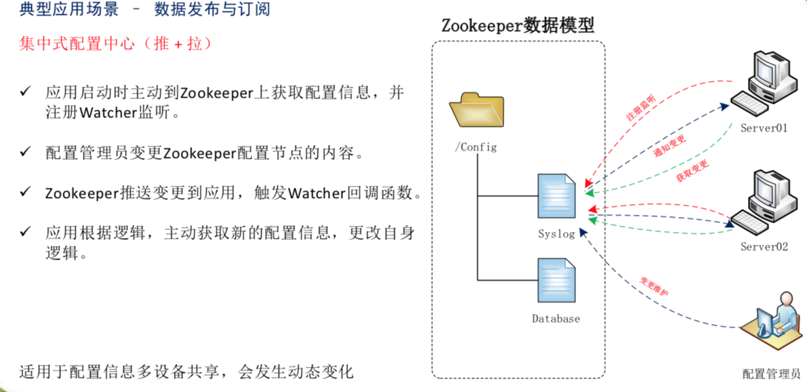
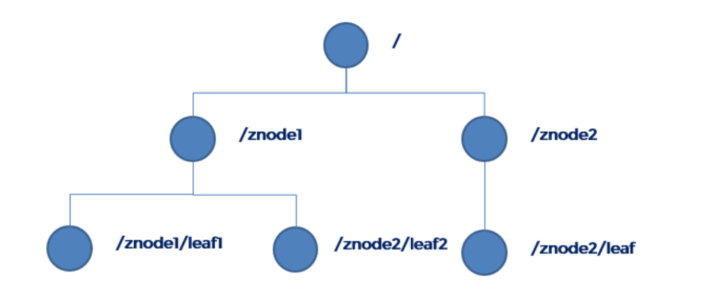
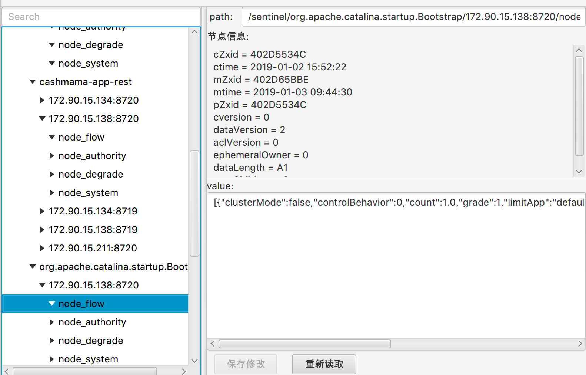
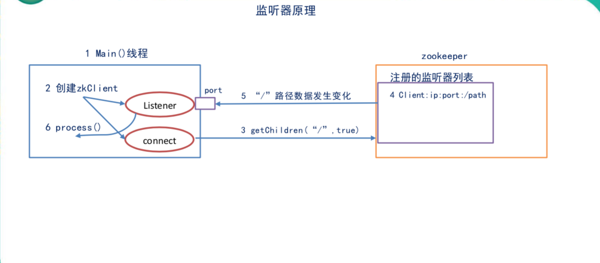
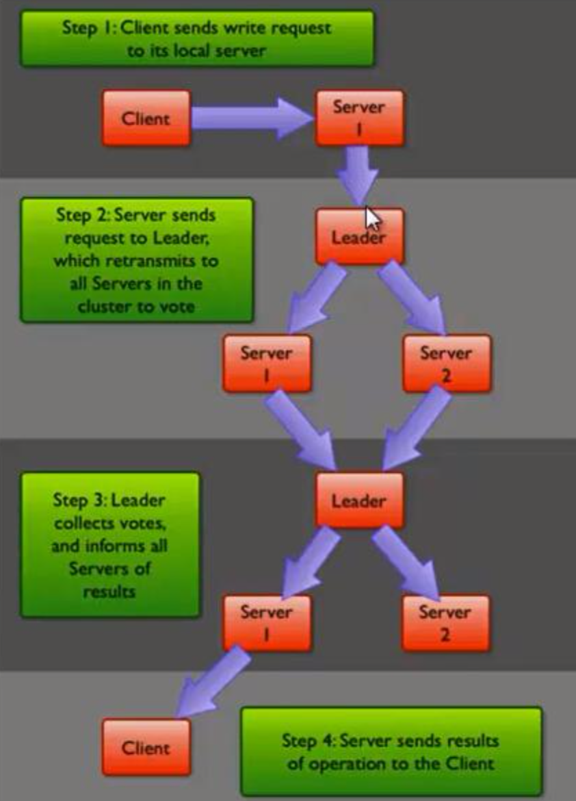

# zookeeper

## 是什么

* ZooKeeper是一个开源分布式协调框架 Zk=文件系统+通知机制

## 特点

* Zookeeper数据存在内存中
* ZooKeeper 提供了文件系统和通知机制
* 数据一致性。 每个server保存的都是同一份数据副本
* 更新请求顺序进行。
* 数据更新原子性，一次数据更新要么成功，要么失败
* 实时性。在一定时间范围之内，client能读到最新数据

## 能做什么

0.注册中心      
1.命名服务   
2.配置管理   
3.集群管理   
4.分布式锁  
5.队列管理       
6.服务器节点动态上下线         

7. 数据的发布订阅 watcher
   

## 数据结构

* 类似树
  
  
* 包含 临时 持久化  顺序 非顺序 Znode（1MB）

## 监听器原理



1. 两个线程 一个线程负责网络连接(connet),一个线程负责监听(listener)
2. 通过 connect 线程将注册的监听事件发送给 Zookeeper。
3. 在 Zookeeper 的注册监听器列表中将注册的监听事件添加到列表中。
4. Zookeeper 监听到有数据或路径变化，就会将这个消息发送给 listener 线程。
5. listener 线程内部调用了 process()方法。

**常见监听**

1. `get path  watch` 监听节点数据变化
2. `ls path  watch` 监听子节点增减变化

## 集群 

* 类似Master/Slave， 一个leader 多个follower，leader负责发起投票、进行决议已经更新系统状态。follower用于接收客户请求返回结果，参与投票。
* 半数以上节点存活 即可工作 >n/2 

## 选举  LeaderElection

目前有5台服务器，每台服务器均没有数据，它们的编号分别是1,2,3,4,5,按编号依次启动，它们的选择举过程如下：

* 服务器1启动，给自己投票，然后发投票信息，由于其它机器还没有启动所以它收不到反馈信息，服务器1的状态一直属于Looking。
* 服务器2启动，给自己投票，同时与之前启动的服务器1交换结果，由于服务器2的编号大所以服务器2胜出，但此时投票数没有大于半数，所以两个服务器的状态依然是LOOKING。
* 服务器3启动，给自己投票，同时与之前启动的服务器1,2交换信息，由于服务器3的编号最大所以服务器3胜出，此时投票数正好大于半数，所以服务器3成为领导者，服务器1,2成为小弟。
* 服务器4启动，给自己投票，同时与之前启动的服务器1,2,3交换信息，尽管服务器4的编号大，但之前服务器3已经胜出，所以服务器4只能成为小弟。
  服务器5启动，后面的逻辑同服务器4成为小弟。

## 写数据过程

收到请求发给leader 然后leader发给follower 多数 follower写成功就成功


* 命令 `create` `set` `get` `ls` `stat` `delete`

## 客户端

* zookeeper的常用客户端有3种，分别是：zookeeper原生的、Apache Curator、开源的zkclient

```Java
ZooKeeper zkClient = new ZooKeeper("192.168.110.100:2181,192.168.110.101:2181", sessionTimeout, new Watcher() { @Override
public void process(WatchedEvent event) {
// 收到事件通知后的回调函数(用户的业务逻辑) 
System.out.println(event.getType() + "--" + event.getPath());
// 再次启动监听 
    try {
        zkClient.getChildren("/", true);
    } catch (Exception e) {
    e.printStackTrace(); 
    }
}
 });

```

# 