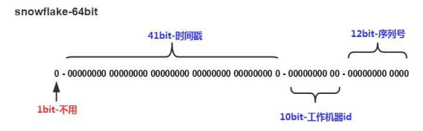

# ID生成器 |分布式发号器

**特性**

* 唯一性：确保生成的ID是全网唯一的。
* 有序递增性：确保生成的ID是对于某个用户或者业务是按一定的数字有序递增的。
* 高可用性：确保任何时候都能正确的生成ID。
* 带时间：ID里面包含时间，一眼扫过去就知道哪天的交易。

## 系统时间戳

毫秒数+业务属性+用户属性+随机数+...等参数组合形式来确保ID的唯一性， 缺点是ID的有序性难以保证

## UUID

缺点是它不包含时间、业务数据可读性太差了，而且也不能ID的有序递增。

## 数据库自增ID

这个方案很简单，但最主要的问题在于依赖数据库本身，这就无形增加了对数据库的访问压力和依赖，一旦对单库进行分库分表或者数据迁移就尴尬了。

## 批量生成ID

一次按需批量生成多个ID，每次生成都需要访问数据库，将数据库修改为最大的ID值，并在内存中记录当前值及最大值。

* 优点：避免了每次生成ID都要访问数据库并带来压力，提高性能
* 缺点：属于本地生成策略，存在单点故障，服务重启造成ID不连续

##  Redis生成ID

Redis的所有命令操作都是单线程的，本身提供像 incr 和 increby 这样的自增原子命令，所以能保证生成的 ID 肯定是唯一有序的。

* 优点：不依赖于数据库，灵活方便，且性能优于数据库；数字ID天然排序，对分页或者需要排序的结果很有帮助。
* 缺点：如果系统中没有Redis，还需要引入新的组件，增加系统复杂度；需要编码和配置的工作量比较大。

## Twitter的snowflake算法

* 41位的时间序列，精确到毫秒，可以使用69年
* 10位的机器标识，最多支持部署1024个节点
* 12位的序列号，支持每个节点每毫秒产生4096个ID序号，最高位是符号位始终为0。

这种方案性能好，在单机上是递增的，但是由于涉及到分布式环境，每台机器上的时钟不可能完全同步，也许有时候也会出现不是全局递增的情况。

## UidGenerator

UidGenerator是百度开源的分布式ID生成器，基于于snowflake算法的实现

## Leaf

Leaf是美团开源的分布式ID生成器，能保证全局唯一性、趋势递增、单调递增、信息安全，里面也提到了几种分布式方案的对比，但也需要依赖关系数据库、Zookeeper等中间件。