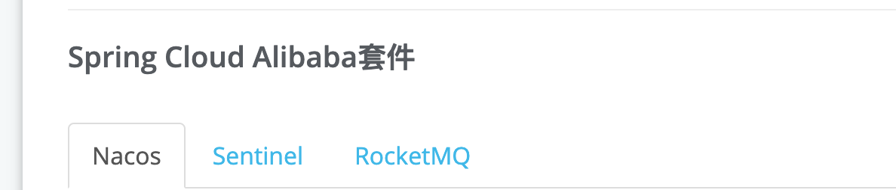
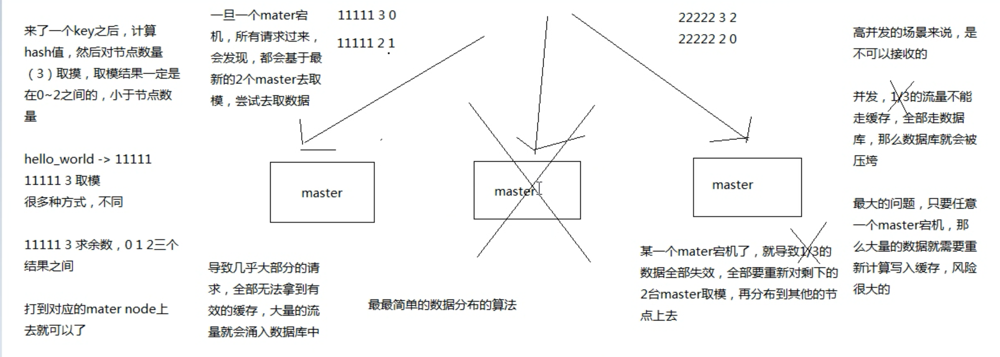
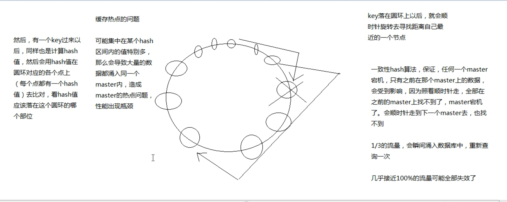
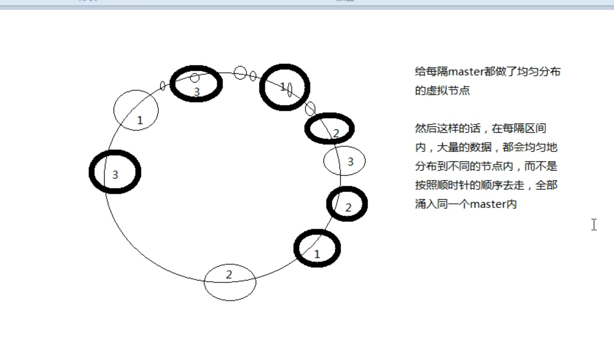
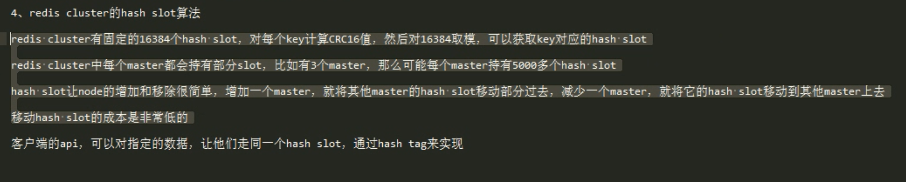
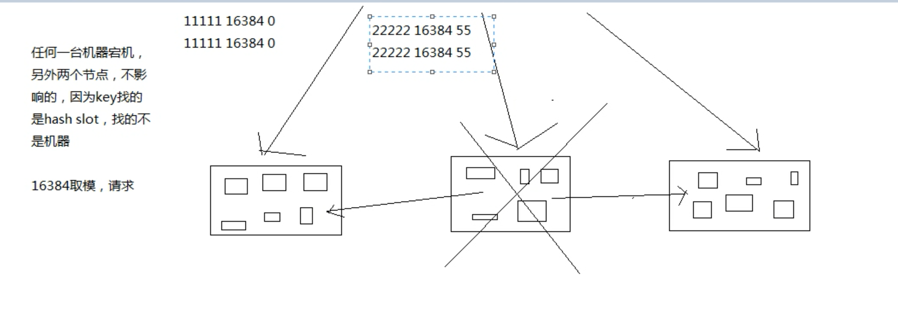

# 分布式系统

核心域：核心竞争力，核心业务 (需要投入最好的人力和资源)

支持子域： 没有，很糟糕; 有，也不足以脱颖而出(可以考虑外包)

通用子域：都有的东西, 比如认证, 发短信, 客服系统等(可以考虑购买商业解决方案或者采用开源方案)

# Spring Cloud

Spring Cloud 是规范 实现 有  Spring Cloud NetFlix and Spring Cloud Alibaba

## 注册中心  服务注册和发现

Nacos Discovery、Spring Cloud Netflix Eureka、ZooKeeper 和 Consul （原生）

## 服务消费者

rest （restTemplate）+ribbon 负载均衡 feign

## 配置中心 

Nacos Config 和 Spring Cloud Config  Apollo

## 断路器

Hystrix  Sentinel

## 网关

服务网关是微服务架构中一个不可或缺的部分。通过服务网关统一向外系统提供REST API的过程中，除了具备服务路由、均衡负载功能之外，它还具备了权限控制等功能
Zuul  Spring Cloud GateWay（原生）

## Hash一致性  Hash环

分布式数据库存储的核心算法。 数据分布的算法。

觉得数据如何分布到各个节点上。

### 最原始的Hash算法

hash算法   取模 -一般用在 数据库分库分表

###  一致性Hash算法

nginx:

哈希负载均衡原理
  ngx_http_upstream_hash_module支持普通的hash及一致性hash两种负载均衡算法，默认的是普通的hash来进行负载均衡。
  nginx 普通的hash算法支持配置http变量值作为hash值计算的key，通过hash计算得出的hash值和总权重的余数作为挑选server的依据；nginx的一致性hash(chash)算法则要复杂一些。这里会对一致性hash的机制原理作详细的说明。

一致性hash算法的原理

   一致性hash用于对hash算法的改进，后端服务器在配置的server的数量发生变化后，同一个upstream server接收到的请求会的数量和server数量变化之间会有变化。尤其是在负载均衡配置的upstream server数量发生增长后，造成产生的请求可能会在后端的upstream server中并不均匀，有的upstream server负载很低，有的upstream server负载较高，这样的负载均衡的效果比较差，可能对upstream server造成不良的影响。由此，产生了一致性hash算法来均衡。

改进 增加虚拟节点

### Redis Hash solt

