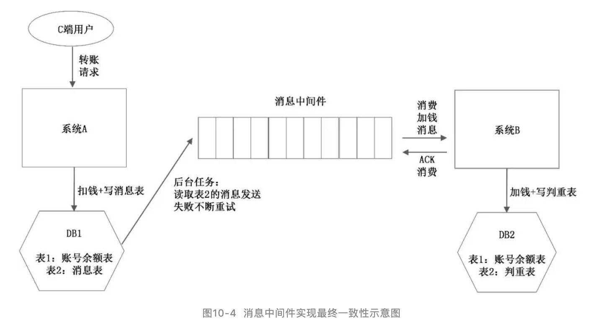
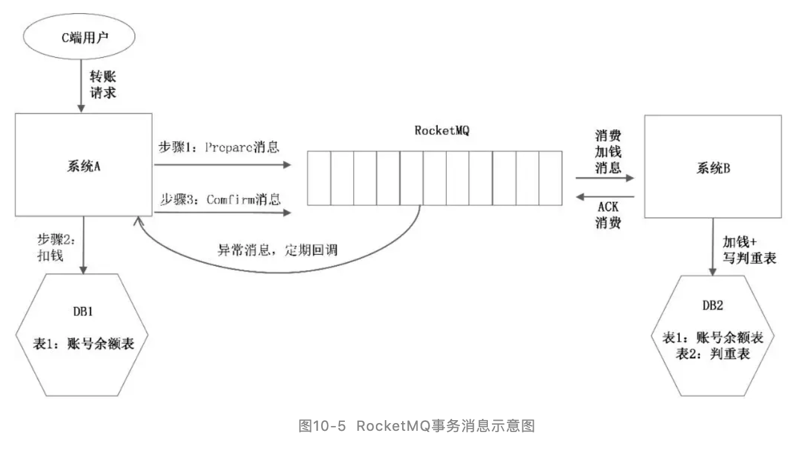
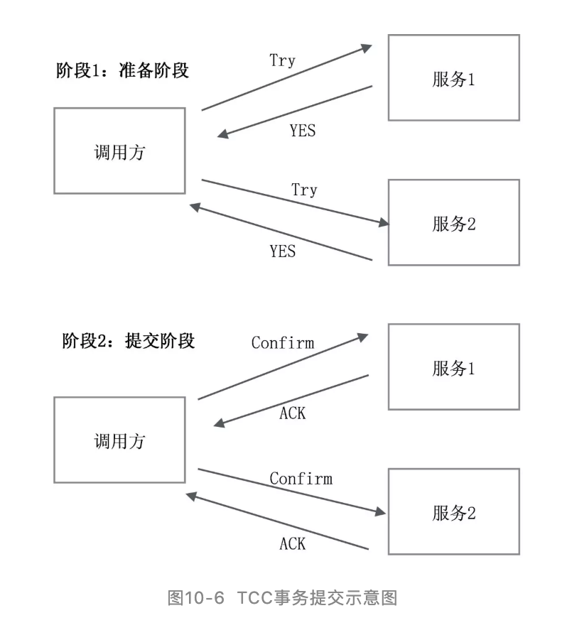

# 分布式事务

例如做一个服务，最初底下只有一个数据库，用数据库本身的事务来保证数据一致性。随着数据量增长到一定规模，进行了分库，这时数据库的事务就不管用了，如何保证多个库之间的数据一致性呢？

?> **7种解决方案**

## 2PC

2PC有两个角色：事务协调者和事务参与者。具体到数据库的实现来说，每一个数据库就是一个参与者，调用方也就是协调者。2PC是指事务的提交分为两个阶段，如图10-1所示。

* 阶段1：准备阶段。协调者向各个参与者发起询问，说要执行一个事务，各参与者可能回复YES、NO或超时。
* 阶段2：提交阶段。如果所有参与者都回复的是YES，则事务协调者向所有参与者发起事务提交操作，即Commit操作，所有参与者各自执行事务，然后发送ACK。

如果有一个参与者回复的是NO，或者超时了，则事务协调者向所有参与者发起事务回滚操作，所有参与者各自回滚事务，然后发送ACK，如图10-2所示。

!> 2PC除本身的算法局限外，还有一个使用上的限制，就是它主要用在两个数据库之间（数据库实现了XA协议）。但以支付宝的转账为例，是两个系统之间的转账，而不是底层两个数据库之间直接交互，所以没有办法使用2PC。

## 最终一致性(消息中间件)

!> 实现了消息在发送方的不丢失、在接收方的不重复，联合起来就是消息的不漏不重，严格实现了系统A和系统B的最终一致性。

* 业务方直接实现 +kafaka
  
* 基于RocketMQ事务消息
  
* 人工介入

## TCC

为了解决SOA系统中的分布式事务问题，支付宝提出了TCC。TCC是Try、Confirm、Cancel三个单词的缩写，其实是一个应用层面的2PC协议，Confirm对应2PC中的事务提交操作，Cancel对应2PC中的事务回滚操作，如图10-6所示。

*（1）准备阶段：调用方调用所有服务方提供的Try接口，该阶段各调用方做资源检查和资源锁定，为接下来的阶段2做准备。

*（2）提交阶段：如果所有服务方都返回YES，则进入提交阶段，调用方调用各服务方的Confirm接口，各服务方进行事务提交。如果有一个服务方在阶段1返回NO或者超时了，则调用方调用各服务方的Cancel接口，如图10-7所示。

## 事务状态表+调用方重试+接收方幂等

## 对账

## 妥协方案：弱一致性+基于状态的补偿

## 重试+回滚+报警+人工修复

