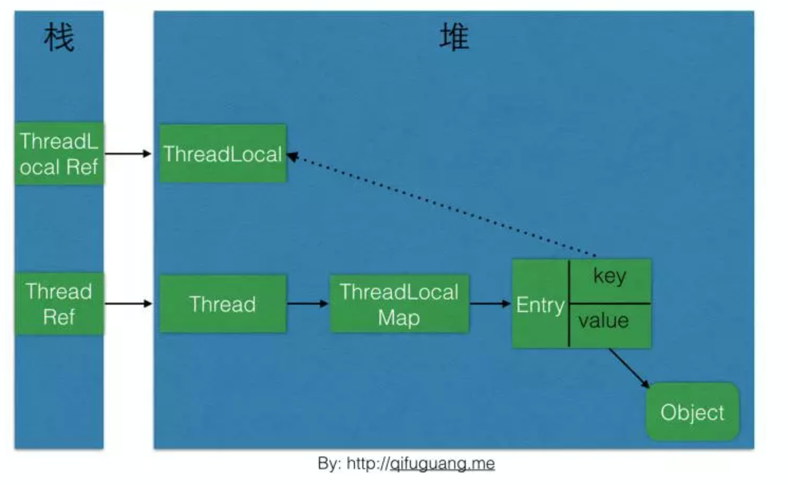
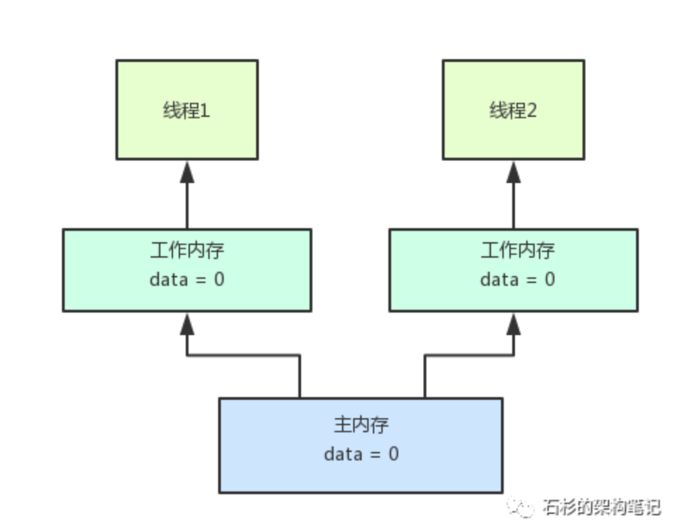
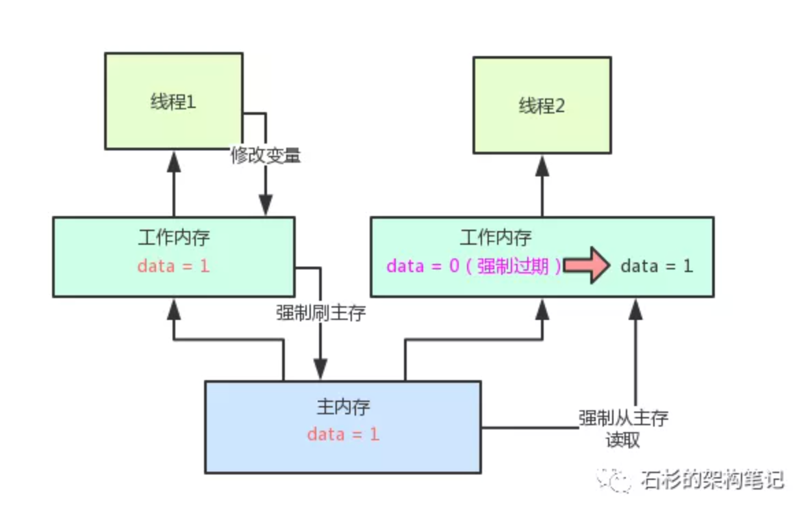
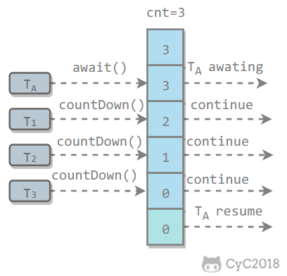

# 多线程与并发

## 线程

* 线程和进程的区别

一个进程可以产生多个线程。与进程不同的是 同类的多个线程可以共享同一块内存空间和同一组系统资源 。所以新建线程和线程切换 负担比进程小得多。

线程(Thread)是进程的一个实体，是CPU调度和分派的基本单位。

* 多线程分类
  用户线程（执行具体的任务） 守护线程 （eg:垃圾回收线程）
  Thread setDaemon(true) 为守护线程
* 高并发   指标  响应时间  吞吐量 每秒处理率 qps
* 创建线程的几种方式。
  继承Thread  实现Runnable接口 实现Callable接口 线程池
* 线程优先级具有继承特性比如A线程启动B线程，则B线程的优先级和A是一样的。线程优先级具有随机性也就是说线程优先级高的不一定每一次都先执行完。
  优先级 1 5  10  默认 5
* 线程的6种状态：  
  1. 初始(NEW)：新创建了一个线程对象，但还没有调用start()方法。
  2. 运行(RUNNABLE)：Java线程中将就绪（ready）和运行中（running）两种状态笼统的称为“运行”。
     线程对象创建后，其他线程(比如main线程）调用了该对象的start()方法。该状态的线程位于可运行线程池中，等待被线程调度选中，获取CPU的使用权，此时处于就绪状态（ready）。就绪状态的线程在获得CPU时间片后变为运行中状态（running）。
  3. 阻塞(BLOCKED)：表示线程阻塞于锁。
  4. 等待(WAITING)：进入该状态的线程需要等待其他线程做出一些特定动作（通知或中断）。
  5. 超时等待(TIMED_WAITING)：该状态不同于WAITING，它可以在指定的时间后自行返回。
  6. 终止(TERMINATED)：表示该线程已经执行完毕。

这6种状态定义在Thread类的State枚举中，可查看源码进行一一对应。

* 线程状态图
  


>    1. 初始状态

      实现Runnable接口和继承Thread可以得到一个线程类，new一个实例出来，线程就进入了初始状态。
    
    2.1. 就绪状态
    就绪状态只是说你资格运行，调度程序没有挑选到你，你就永远是就绪状态。
    调用线程的start()方法，此线程进入就绪状态。
    当前线程sleep()方法结束，其他线程join()结束，等待用户输入完毕，某个线程拿到对象锁，这些线程也将进入就绪状态。
    当前线程时间片用完了，调用当前线程的yield()方法，当前线程进入就绪状态。
    锁池里的线程拿到对象锁后，进入就绪状态。
    2.2. 运行中状态
    线程调度程序从可运行池中选择一个线程作为当前线程时线程所处的状态。这也是线程进入运行状态的唯一一种方式。
    
    3. 阻塞状态
    阻塞状态是线程等待进入synchronized关键字修饰的方法或代码块(获取锁)时的状态。
    
    4. 等待
    处于这种状态的线程不会被分配CPU执行时间，它们要等待被显式地唤醒，否则会处于无限期等待的状态。
    
    5. 超时等待
    处于这种状态的线程不会被分配CPU执行时间，不过无须无限期等待被其他线程显示地唤醒，在达到一定时间后它们会自动唤醒。
    
    6. 终止状态
    当线程的run()方法完成时，或者主线程的main()方法完成时，我们就认为它终止了。这个线程对象也许是活的，但是，它已经不是一个单独执行的线程。线程一旦终止了，就不能复生。
    在一个终止的线程上调用start()方法，会抛出java.lang.IllegalThreadStateException异常。


## Thread 的方法


* Thread.sleep(long millis)，一定是当前线程调用此方法，当前线程进入TIMED_WAITING状态，但不释放对象锁，millis后线程自动苏醒进入就绪状态。作用：给其它线程执行机会的最佳方式。
* Thread.yield()，一定是当前线程调用此方法，当前线程放弃获取的CPU时间片，但不释放锁资源，由运行状态变为就绪状态，让OS再次选择线程。作用：让相同优先级的线程轮流执行，但并不保证一定会轮流执行。实际中无法保证yield()达到让步目的，因为让步的线程还有可能被线程调度程序再次选中。Thread.yield()不会导致阻塞。该方法与sleep()类似，只是不能由用户指定暂停多长时间。

* thread.join()/thread.join(long millis)当前线程里调用其它线程t的join方法，当前线程进入WAITING/TIMED_WAITING状态，当前线程不会释放已经持有的对象锁。线程t执行完毕或者millis时间到，当前线程一般情况下进入RUNNABLE状态，也有可能进入BLOCKED状态（因为join是基于wait实现的）。

!> 是阻塞的 “等待该线程终止”，换句话说就是：”当前线程等待子线程的终止“
如果一个线程A执行了thread.join()语句，其含义是：当前线程A等待thread线程终止之后才从thread.join()返回。

* obj.wait()，当前线程调用对象的wait()方法，当前线程释放对象锁，进入等待队列。依靠notify()/notifyAll()唤醒或者wait(long timeout) timeout时间到自动唤醒。
* obj.notify()唤醒在此对象监视器上等待的单个线程，选择是任意性的。notifyAll()唤醒在此对象监视器上等待的所有线程。
* 等待队列里许许多多的线程都wait()在一个对象上，此时某一线程调用了对象的notify()方法，那唤醒的到底是哪个线程？随机？队列FIFO？or sth else？Java文档就简单的写了句：选择是任意性的（The choice is arbitrary and occurs at the discretion of the implementation）。
* sleep和 wait的对比

共同点： 都不会占用时间片 。

不同点：

1. sleep 不会释放锁
2. wait会释放锁 obj.wait()，当前线程调用对象的wait()方法，当前线程释放对象锁，进入等待队列。依靠notify()/notifyAll()((notify实际上该线程同步块运行结束后才会释放锁)唤醒或者wait(long timeout) timeout时间到自动唤醒。

## Object wait notify 通知机制

* Object wait notify


    wait()  使调用该方法的线程释放共享资源锁，然后从运行状态退出，进入等待队列。知道被再次唤醒
    notify() 随机唤醒等待队列中等待统一共享资源的“一个线程”，并使该线程退出等待队列，进入可运行状态。也就是notify()方法仅通知“一个线程”

* 通知等待的经典范式 

  (调用类的wait和notify方法，就要获取到类的锁。

  ```java
  synchronized(对象) {
    while(条件不满足) {
           对象.wait();
    }
    对应的处理逻辑
  }
  #----------------------
  synchronized(对象) {
   改变条件
   对象.notifyAll();
  }
  ```

* 当方法wait()被执行后，锁自动被释放，但执行完notify()方法后，锁不会自动释放。必须执行完notify()方法所在的synchronized代码块后才释放。

## 等待队列 与同步队列


同步队列里面放的都是想争夺对象锁的线程。
等待队列： 释放锁之后进入等待队列

o.wait  执行完此方法的线程进入等待队列
o.notifyAll() 将所有的等待队列中的线程 移入同步队列  竞争获取锁。 执行完代码块 此线程进入等待队列


* 管道输入输出通信流 主要用于线程之间的数据传输 且传输的媒介为内存
  * 面向字节 PipedOutputStream PipedInputStream
  * 面向字符 PipedWriter PipedReader

## ThreadLocal


   源码：





每个线程都维护了一个threadlocalMap  里面存储的是一个entry数组 。下标就是根据存入的每个threadlocal对象hash出来的。

值就是threadLocal里面的值。

!> Thread为每个线程维护了ThreadLocalMap这么一个Map，而ThreadLocalMap的key是LocalThread对象本身，value则是要存储的对象

!> 由于ThreadLocalMap的生命周期跟Thread一样长，如果没有手动删除对应key就会导致内存泄漏，而不是因为弱引用。

线程安全性问题存在于实例变量。 访问同一实例的变量 可能会产生线程安全问题

## 可见性  有序性  原子性

### Happens-before 原则

1、程序次序规则:一个线程内,按照代码顺序,书写在前面的操作先行发生于书写在后面
的操作e
2、锁定规则:一个 unLock操作先行发生于后面对同一个锁的lock操作,比如说在代码里有
先对一个 ock. lock), lock. unlock(), lock lock()
3、 volatile变量规则:对一个 volatile变量的写操作先行发生于后面对这个 volatile变量的读
操作, volatile变量写,再是读,必须保证是先写,再读←
4、传递规则:如果操作A先行发生于操作B,而操作B又先行发生于操作C,则可以得出
操作A先行发生于操作C←
5、线程启动规则: Thread对象的 start()方法先行发生于此线程的每个一个动作, thread. start(
thread interrupt()

6、线程中断规则:对线程 interrupt)方法的调用先行发生于被中断线程的代码检测到中断事
件的发生
7、线程终结规则:线程中所有的操作都先行发生于线程的终止检测,我们可以通过
Thread join()方法结束、 Thread isAlive(的返回值手段检测到线程已经终止执行
8、对象终结规则:一个对象的初始化完成先行发生于他的 finalize()方法的开始

上面这8条原则的意思很显而易见,就是程序中的代码如果满足这个条件,就一定会按照这
个规则来保证指令的顺序。


**规则制定了在一些特殊情况下,不允许编译器、指令器对你写的代码进行指令重排,必须保**
**证你的代码的有序性←**
但是如果没满足上面的规则,那么就可能会出现指令重排,就这个意思。这8条原则是避免
说出现乱七八糟扰乱秩序的指令重排,要求是这几个重要的场景下,比如是按照顺序来,但
是8条规则之外,可以随意重排指令。← 


比如这个例子,如果用 volatile来修饰fag变量,一定可以让 prepare)指令在fag=true之
前先执行,这就禁止了指令重排。因为 volatile要求的是, volatile前面的代码一定不能指令
重排到 volatile变量操作后面, volatile后面的代码也不能指令重排到 volatile前面。
指令重排> happens-before -> volatile i起到避免指令重排


## volatile

> [大白话聊聊Java并发面试问题之volatile到底是什么？【石杉的架构笔记】](https://mp.weixin.qq.com/s?__biz=MzU0OTk3ODQ3Ng==&mid=2247484058&idx=1&sn=d5c1533204ea655e65947ec57f924799&chksm=fba6ea99ccd1638f945c585cf3b2df6f4d4112b17ea3648730d50fdb5508555d5f30316f4186&scene=21#wechat_redirect)

### **主内存与工作内存（CPU级别的缓存）**

处理器上的寄存器的读写的速度比内存快几个数量级，为了解决这种速度矛盾，在它们之间加入了高速缓存。

加入高速缓存带来了一个新的问题：缓存一致性。如果多个缓存共享同一块主内存区域，那么多个缓存的数据可能会不一致，需要一些协议来解决这个问题。


所有的变量都存储在主内存中，每个线程还有自己的工作内存，工作内存存储在高速缓存或者寄存器中，保存了该线程使用的变量的主内存副本拷贝。

线程只能直接操作工作内存中的变量，不同线程之间的变量值传递需要通过主内存来完成。




每个线程有自己的工作内存，同时还有一个共享的主内存。比如说有两个线程，他们的代码里都需要读取data这个变量的值，那么他们都会从主内存里加载data变量的值到自己的工作内存，然后才可以使用那个值。

这样，在线程代码运行的过程中，对data的值都可以直接从工作内存里加载了，不需要再从主内存里加载了。

那问题来了，为啥一定要让每个线程用一个工作内存来存放变量的副本以供读取呢？我直接让线程每次都从主内存加载变量的值不行吗？

很简单！因为线程运行的代码对应的是一些指令，是由CPU执行的！但是CPU每次执行指令运算的时候，也就是执行我们写的那一大坨代码的时候，要是**每次需要一个变量的值，都从主内存加载，性能会比较差！**

带来的问题


我们来设想一下，假如说线程1修改了data变量的值为1，然后将这个修改写入自己的本地工作内存。那么此时，线程1的工作内存里的data值为1。

然而，主内存里的data值还是为0！线程2的工作内存里的data值还是0啊？！

这就导致，线程1和线程2其实都是在操作一个变量data，但是线程1修改了data变量的值之后，线程2是看不到的，一直都是看到自己本地工作内存中的一个旧的副本的值！

这就是所谓的**java并发编程中的可见性问题**：


那如果要解决这个问题怎么办呢？这时就轮到**volatile**闪亮登场了！你只要给data这个变量在定义的时候加一个volatile，就直接可以完美的解决这个可见性的问题。

一旦data变量定义的时候前面加了volatile来修饰的话，那么线程1只要修改data变量的值，就会在修改完自己本地工作内存的data变量值之后，强制将这个data变量最新的值刷回主内存，必须让主内存里的data变量值立马变成最新的值！

如果此时别的线程的工作内存中有这个data变量的本地缓存，也就是一个变量副本的话，那么会强制让其他线程的工作内存中的data变量缓存直接失效过期，不允许再次读取和使用了！

此时，他就必须重新从主内存中加载data变量最新的值！那么不就可以读取到data = 1这个最新的值了！整个过程，参见下图：



最后给大家提一嘴，**volatile主要作用是保证可见性以及有序性。**

有序性涉及到较为复杂的指令重排、内存屏障等概念，本文没提及，但是**volatile是不能保证原子性的**！

也就是说，volatile主要解决的是一个线程修改变量值之后，其他线程立马可以读到最新的值，是解决这个问题的，也就是可见性！

但是如果是多个线程同时修改一个变量的值，那还是可能出现多线程并发的安全问题，导致数据值修改错乱，volatile是不负责解决这个问题的，也就是不负责解决原子性问题！

原子性问题，得依赖synchronized、ReentrantLock等加锁机制来解决。


“观察加入volatile关键字和没有加入volatile关键字时所生成的汇编代码发现，加入volatile关键字时，会多出一个lock前缀指令”

　　lock前缀指令实际上相当于一个内存屏障（也成内存栅栏），内存屏障会提供3个功能：

　　1）它确保指令重排序时不会把其后面的指令排到内存屏障之前的位置，也不会把前面的指令排到内存屏障的后面；即在执行到内存屏障这句指令时，在它前面的操作已经全部完成；

　　2）它会强制将对缓存的修改操作立即写入主存；

　　3）如果是写操作，它会导致其他CPU中对应的缓存行无效。

### 使用场景

##### 读写锁

如果需要实现一个读写锁，每次只能一个线程去写数据，但是有多个线程来读数据，就synchronize同步锁来对set方法加锁，get方法不加锁， 使用volatile来修饰变量，保证内存可见性，不然多个线程可能会在变量修改后还读到一个旧值。

##### 状态位

用于做状态位标志，如果多个线程去需要根据一个状态位来执行一些操作，使用volatile修饰可以保证内存可见性。

用于单例模式用于保证内存可见性，以及防止指令重排序。

**双重自检锁单例**

volatile   保证了可见性 但是无法保证原子性  测试 一个count ++ 100次 主线程++ 新线程-- 最后结果可能不为0

```
取出来count 放入栈顶 0                
栈顶值+1                            取出来count 放入栈顶  0
结果返回给count    1                   栈顶值-1
                                 结果返回给count -1
```


### 底层原理

### 如何保证可见性的：

**lock指令**   

对 volatile修饰的变量,执行写操作的话,CPU会发送一条lock前缀指令给CPU,CPU在计
算完之后会立即将这个值写回主内存,同时因为有MES缓存一致性协议,所以各个CPU都
会对总线进行嗅探,自己本地缓存中的数据是否被别人修改

如果发现别人修改了某个缓存的数据,那么CPU就会将自己本地缓存的数据过期掉,然后
这个CPU上执行的线程在读取那个变量的时候,就会从主内存重新加载最新的数据了
**lock前缀指令+MESI缓存一致性协议**

### 如何防止指令重排：

**加入内存屏障 防止指令重排**


!> 连环炮  内存模型 （工作内存 主存）-> 可见性  有序性  原子性 ->volatile+可见性->volatile+有序性（指令重排+happens before）-> volatile 底层原理(内存屏障级别的原理)

## Sysnchronized

[【大厂面试07期】说一说你对synchronized锁的理解？](https://mp.weixin.qq.com/s/H8Cd2fj82qbdLZKBlo-6Dg)

就是可以让synchronized修饰的方法，代码块，每次只能有一个线程在执行，以此来实现数据的安全。

一般可以修饰同步代码块、实例方法、静态方法，加锁对象分别为同步代码块块括号内的对象、实例对象、类。

### **实现原理**

#### 修饰同步代码块

```java
public class SynchronizedDemo {
    public void method() {
        synchronized (this) {
            System.out.println("synchronized 代码块");
        }
    }
     public void methodB() {
        synchronized (SynchronizedDemo.class) {
            System.out.println("synchronized 代码块");
        }
    }
}
```


**synchronized 同步语句块的实现使用的是 monitorenter 和 monitorexit 指令，其中 monitorenter 指令指向同步代码块的开始位置，monitorexit 指令则指明同步代码块的结束位置。** 当执行 monitorenter 指令时，线程试图获取锁也就是获取 monitor(monitor对象存在于每个Java对象的对象头中，synchronized 锁便是通过这种方式获取锁的，也是为什么Java中任意对象可以作为锁的原因) 的持有权。当计数器为0则可以成功获取，获取后将锁计数器设为1也就是加1。相应的在执行 monitorexit 指令后，将锁计数器设为0，表明锁被释放。如果获取对象锁失败，那当前线程就要阻塞等待，直到锁被另外一个线程释放为止。

synchronized修饰同步代码块，javac在编译时，在synchronized同步块的进入的指令前和退出的指令后，会分别生成对应的monitorenter和monitorexit指令进行对应，代表尝试获取锁和释放锁。(为了保证抛异常的情况下也能释放锁，所以javac为同步代码块添加了一个隐式的try-finally，在finally中会调用monitorexit命令释放锁。)

#### 修饰静态方法、实例方法

```java
public class SynchronizedDemo2 {
    public synchronized void method() {
        System.out.println("synchronized 方法");
    }
}
```


synchronized修饰方法，javac为方法的flags属性添加了一个ACCSYNCHRONIZED关键字，在JVM进行方法调用时，发现调用的方法被ACCSYNCHRONIZED修饰，则会先尝试获得锁。

在JVM中，一个Java对象其实由**对象头**+**实例数据**+**对齐填充**三部分组成，而对象头主要包含**Mark Word**+指向对象所属的类的指针组成(如果是数组对象，还会包含长度)。像下图一样：


**Mark Word**：存储对象自身的运行时数据，例如hashCode，GC分代年龄，锁状态标志，线程持有的锁等等。在32位系统占4字节，在64位系统中占8字节，所以它能存储的数据量是有限的，所以主要通过设立**是否偏向锁的标志位**和**锁标志位**用于区分其他位数存储的数据是什么，具体请看下图：


锁信息都是存在锁对象的**Mark Word**中的，当对象状态为偏向锁时，**Mark Word**存储的是偏向的线程ID；当状态为轻量级锁时，**Mark Word**存储的是指向线程栈中 `LockRecord`的指针；当状态为重量级锁时，**Mark Word**为指向堆中的monitor对象的指针。

### 偏向锁

Hotspot的作者经过以往的研究发现大多数情况下**锁不仅不存在多线程竞争，而且总是由同一线程多次获得**，于是引入了偏向锁。

简单的来说，就是主要锁处于偏向锁状态时，会在Mark Word中存当前持有偏向锁的线程ID，如果获取锁的线程ID与它一致就说明是同一个线程，可以直接执行，不用像轻量级锁那样执行CAS操作来加锁和解锁。

**偏向锁升级的时机为**：**当一个线程获得了偏向锁，在执行时，只要有另一个线程尝试获得偏向锁，并且当前持有偏向锁的线程还在同步块中执行，则该偏向锁就会升级成轻量级锁。**


### 轻量级锁

重量级锁依赖于底层的操作系统的Mutex Lock来实现的，但是由于使用Mutex Lock需要将当前线程挂起并从用户态切换到内核态来执行，这种切换的代价是非常昂贵的，而在大部分时候可能并没有多线程竞争，只是这段时间是线程A执行同步块，另外一段时间是线程B来执行同步块，仅仅是多线程交替执行，并不是同时执行，也没有竞争，如果采用重量级锁效率比较低。以及在重量级锁中，没有获得锁的线程会阻塞，获得锁之后线程会被唤醒，阻塞和唤醒的操作是比较耗时间的，如果同步块的代码执行比较快，等待锁的线程可以进行先进行**自旋**操作（就是不释放CPU，执行一些空指令或者是几次for循环），等待获取锁，这样效率比较高。所以轻量级锁天然瞄准不存在锁竞争的场景，**如果存在锁竞争但不激烈，仍然可以用自旋锁优化，自旋失败后再升级为重量级锁。**


然后线程尝试**用CAS操作将锁的Mark Word替换为自己线程栈中拷贝的锁记录的指针**。如果成功，当前线程获得锁，如果失败，表示Mark Word已经被替换成了其他线程的锁记录，说明在与其它线程竞争锁，当前线程就尝试使用**自旋**来获取锁。

自旋：不断尝试去获取锁，一般用循环来实现。

自旋是需要消耗CPU的，如果一直获取不到锁的话，那该线程就一直处在自旋状态，白白浪费CPU资源。

JDK采用了适应性自旋，简单来说就是线程如果自旋成功了，则下次自旋的次数会更多，如果自旋失败了，则自旋的次数就会减少。

**轻量级锁升级过程:**自旋也不是一直进行下去的，如果自旋到一定程度（和JVM、操作系统相关），依然没有获取到锁，称为自旋失败，那么这个线程会阻塞。同时这个锁就会升级成重量级锁。


### 重量级锁


### 为什么说是轻量级，重量级锁是不公平的？

偏向锁由于不涉及到多个线程竞争，所以谈不上公平不公平，

轻量级锁获取锁的方式是多个线程进行自旋操作，然后使用**用CAS操作将锁的Mark Word替换为指向自己线程栈中拷贝的锁记录的指针**，所以谁能获得锁就看运气，不看先后顺序。

重量级锁不公平主要在于刚进入到重量级的锁的线程不会直接进入Contention List队列，而是自旋去获取锁，所以后进来的线程也有一定的几率先获得到锁，所以是不公平的。

### 什么时候会发生锁升级，锁降级？

**偏向锁升级为轻量级锁：**就是有不同的线程竞争锁时。具体来看就是当一个线程发现当前锁状态是偏向锁，然后锁对象存储的Thread id是其他线程的id，并且去Thread id对应的线程栈查询到的lock record的obj字段不为null（代表当前持有偏向锁的线程还在执行同步块）。那么该偏向锁就会升级成轻量级锁。

**轻量级锁升级为重量级锁：**就是在轻量级锁中，没有获取到锁的线程进行自旋，自旋到一定次数还没有获取到锁就会进行锁升级，因为自旋也是占用CPU的，长时间自旋也是很耗性能的。**锁降级**因为如果没有多线程竞争，还是使用重量级锁会造成额外的开销，所以当JVM进入SafePoint安全点（可以简单的认为安全点就是所有用户线程都停止的，只有JVM垃圾回收线程可以执行）的时候，会检查是否有闲置的Monitor，然后试图进行降级。

JDK1.6 对锁的实现引入了大量的优化，如偏向锁、轻量级锁、自旋锁、适应性自旋锁、锁消除、锁粗化等技术来减少锁操作的开销。

锁主要存在四种状态，依次是：无锁状态、偏向锁状态、轻量级锁状态、重量级锁状态，他们会随着竞争的激烈而逐渐升级。注意锁可以升级不可降级，这种策略是为了提高获得锁和释放锁的效率。

### 偏向锁，轻量锁，重量锁的适用场景，优缺点是什么？

篇幅有限，下面是各种锁的优缺点级适用场景，来自《并发编程的艺术》：


### **volatile 和synchronized 关键字的区别**

volatile 用于变量  synchronized修饰方法和代码块
多线程访问volatile不会阻塞 synchronized 可能会发生阻塞
volatile保证的数据的可见性不能保证数据的原子性。 synchronized两者都可以保证
volatile关键字用于解决变量在多个线程之间的可见性，而synchronized关键字解决的是多个线程访问资源的同步性

如果是一些写多读的并发场景 ， 使用 volatile 修饰变量则非常合适。 volatile 一写多读最典型的应用是 CopyOnWriteArrayList

## CAS

[大白话聊聊Java并发面试问题之Java 8如何优化CAS性能？【石杉的架构笔记】](https://mp.weixin.qq.com/s?__biz=MzU0OTk3ODQ3Ng==&mid=2247484070&idx=1&sn=c1d49bce3c9da7fcc7e057d858e21d69&chksm=fba6eaa5ccd163b3a935303f10a54a38f15f3c8364c7c1d489f0b1aa1b2ef293a35c565d2fda&scene=21#wechat_redirect)

**Compare and Set**，也就是**先比较再设置**的意思。

**Atomic原子类底层用的不是传统意义的锁机制，而是无锁化的CAS机制，通过CAS机制保证多线程修改一个数值的安全性**


**LongAdder**

```java
AtomicLong atomicLong = new AtomicLong();
atomicLong.incrementAndGet();
```

源码 cas实现

```java
    public final native boolean compareAndSwapLong(Object o, long offset,
                                                   long expected,
                                                   long x);
```

```java
public final long getAndAddLong(Object o, long offset, long delta) {
        long v;
        do {
            v = getLongVolatile(o, offset);
        } while (!compareAndSwapLong(o, offset, v, v + delta));
        return v;
    }
```


但是这个CAS有没有问题呢？肯定是有的。比如说大量的线程同时并发修改一个AtomicInteger，可能有**很多线程会不停的自旋**，进入一个无限重复的循环中。

这些线程不停地获取值，然后发起CAS操作，但是发现这个值被别人改过了，于是再次进入下一个循环，获取值，发起CAS操作又失败了，再次进入下一个循环。

**LongAdder**

他就是尝试使用**分段CAS**以及**自动分段迁移**的方式来大幅度提升多线程高并发执行CAS操作的性能！


在LongAdder的底层实现中，首先有一个base值，刚开始多线程来不停的累加数值，都是对base进行累加的，比如刚开始累加成了base = 5。

接着如果发现并发更新的线程数量过多，就会开始施行**分段CAS的机制**，也就是内部会搞一个Cell数组，每个数组是一个数值分段。

这时，让大量的线程分别去对不同Cell内部的value值进行CAS累加操作，这样就把CAS计算压力分散到了不同的Cell分段数值中了！

这样就可以大幅度的降低多线程并发更新同一个数值时出现的无限循环的问题，大幅度提升了多线程并发更新数值的性能和效率！

而且他内部实现了**自动分段迁移的机制**，也就是如果某个Cell的value执行CAS失败了，那么就会自动去找另外一个Cell分段内的value值进行CAS操作。

这样也解决了线程空旋转、自旋不停等待执行CAS操作的问题，让一个线程过来执行CAS时可以尽快的完成这个操作。

最后，如果你要从LongAdder中获取当前累加的总值，就会把base值和所有Cell分段数值加起来返回给你。

**LongAdder VS AtomicLong**

看上去 LongAdder 性能全面超越了 AtomicLong。为什么 jdk 1.8 中还是保留了 AtomicLong 的实现呢？

其实我们可以发现，LongAdder 使用了一个 cell 列表去承接并发的 cas，以提升性能，但是 LongAdder 在统计的时候如果有并发更新，可能导致统计的数据有误差。

如果用于自增 id 的生成，就不适合使用 LongAdder 了。这个时候使用 AtomicLong 就是一个明智的选择。

而在 Sentinel 中 LongAdder 承担的只是统计任务，且允许误差。


LongAdder给了我们一个非常容易想到的解决方案: 减少并发，将单一value的更新压力分担到多个value中去，降低单个value的 “热度”，分段更新！！！  这样，线程数再多也会分担到多个value上去更新，只需要增加value就可以降低 value的 “热度”  AtomicLong中的 恶性循环不就解决了吗？ cells 就是这个 “段” cell中的value 就是存放更新值的， 这样，当我需要总数时，把cells 中的value都累加一下不就可以了么！！cells[]


### ABA 问题

A>B-A  版本号解决

AtomicStampedReference：原子更新带有版本号的引用类型。该类将整数值与引用关联起来，可用于解决原子的更新数据和数据的版本号，可以解决使用 CAS 进行原子更新时可能出现的 ABA 问题。

J.U.C 包提供了一个带有标记的原子引用类 AtomicStampedReference 来解决这个问题，它可以通过控制变量值的版本来保证 CAS 的正确性。大部分情况下 ABA 问题不会影响程序并发的正确性，如果需要解决 ABA 问题，改用传统的互斥同步可能会比原子类更高效。

## AQS

**AbstractQueuedSynchronizer，抽象队列同步器**

[大白话聊聊Java并发面试问题之谈谈你对AQS的理解？【石杉的架构笔记】](https://mp.weixin.qq.com/s/PAn5oTlvVmjMepmCRdBnkQ)

java并发包下很多API都是基于AQS来实现的加锁和释放锁等功能的，AQS是java并发包的基础类。

如说ReentrantLock、ReentrantReadWriteLock底层都是基于AQS来实现的。


，ReentrantLock内部包含了一个AQS对象，也就是AbstractQueuedSynchronizer类型的对象。这个AQS对象就是ReentrantLock可以实现加锁和释放锁的关键性的核心组件。

好了，那么现在如果有一个线程过来尝试用ReentrantLock的lock()方法进行加锁，会发生什么事情呢？

很简单，这个AQS对象内部有一个核心的变量叫做**state**，是int类型的，代表了**加锁的状态**。初始状态下，这个state的值是0。

另外，这个AQS内部还有一个**关键变量**，用来记录**当前加锁的是哪个线程**，初始化状态下，这个变量是null。


接着线程1跑过来调用ReentrantLock的lock()方法尝试进行加锁，这个加锁的过程，直接就是用CAS操作将state值从0变为1。

如果之前没人加过锁，那么state的值肯定是0，此时线程1就可以加锁成功。


一旦线程1加锁成功了之后，就可以设置当前加锁线程是自己。所以大家看下面的图，就是线程1跑过来加锁的一个过程。


其实看到这儿，大家应该对所谓的AQS有感觉了。说白了，就是并发包里的一个核心组件，里面有state变量、加锁线程变量等核心的东西，维护了加锁状态。

你会发现，ReentrantLock这种东西只是一个外层的API，**内核中的锁机制实现都是依赖AQS组件的**。


这个ReentrantLock之所以用Reentrant打头，意思就是他是一个可重入锁。

可重入锁的意思，就是你可以对一个ReentrantLock对象多次执行lock()加锁和unlock()释放锁，也就是可以对一个锁加多次，叫做可重入加锁。

大家看明白了那个state变量之后，就知道了如何进行可重入加锁！

其实每次线程1可重入加锁一次，会判断一下当前加锁线程就是自己，那么他自己就可以可重入多次加锁，**每次加锁就是把state的值给累加1，别的没啥变化。**

接着，如果线程1加锁了之后，线程2跑过来加锁会怎么样呢？


**我们来看看锁的互斥是如何实现的？**线程2跑过来一下看到，哎呀！state的值不是0啊？所以CAS操作将state从0变为1的过程会失败，因为state的值当前为1，说明已经有人加锁了！


接着线程2会看一下，是不是自己之前加的锁啊？当然不是了，**“加锁线程”**这个变量明确记录了是线程1占用了这个锁，所以线程2此时就是加锁失败。


给大家来一张图，一起来感受一下这个过程：


接着，线程2会将自己放入AQS中的一个等待队列，因为自己尝试加锁失败了，此时就要将自己放入队列中来等待，等待线程1释放锁之后，自己就可以重新尝试加锁了

所以大家可以看到，AQS是如此的核心！AQS内部还有一个等待队列，专门放那些加锁失败的线程！


线程1在执行完自己的业务逻辑代码之后，就会释放锁！**他释放锁的过程非常的简单**，就是将AQS内的state变量的值递减1，如果state值为0，则彻底释放锁，会将“加锁线程”变量也设置为null！

接下来，会从**等待队列的队头唤醒线程2重新尝试加锁。**


好！线程2现在就重新尝试加锁，这时还是用CAS操作将state从0变为1，此时就会成功，成功之后代表加锁成功，就会将state设置为1。

此外，还要把**“加锁线程”**设置为线程2自己，同时线程2自己就从等待队列中出队了。


!> 其实一句话总结**AQS就是一个并发包的基础组件，用来实现各种锁，各种同步组件的。****它包含了state变量、加锁线程、等待队列等并发中的核心组件。**


>  [Condition的await和signal等待/通知机制](https://juejin.im/post/5aeea5e951882506a36c67f0)


## Lock

* 锁 控制对共享资源的方法 。比Synchronized更加灵活

```java
    Lock lock=new ReentrantLock()；
    lock.lock();
    try{
    }finally{
    lock.unlock();
    }
```

最好不要把获取锁的过程写在try语句块中，因为如果在获取锁时发生了异常，异常抛出的同时也会导致锁无法被释放
**lock接口方法**

```java
    void lock() //尝试获取锁，如果锁不可用，则当前线程被禁止进行线程调度 进入休眠状态。知道获取锁
    boolean tryLock()	//只有在调用时才可以获得锁。如果可用，则获取锁定，并立即返回值为true；如果锁不可用，则此方法将立即返回值为false 。
```

* Synchronized 和 ReenTrantLock 的对比

  * 都是可重入锁
  * synchronized 依赖于 JVM 而 ReenTrantLock 依赖于 API（（也就是 API 层面，需要 lock() 和 unlock 方法配合 try/finally 语句块来完成））
  * ReenTrantLock 比 synchronized 增加了一些高级功能 （可设置为公平锁  等待可中断 可实现选择性通知）
  * 性能已不是选择标准

* Java中的锁分类 以下分类不光是指锁的状态，有的指的是锁的特性，有的指的是锁的设计

  * 公平锁/非公平锁      
    是否按照线程申请锁的顺序获取锁，非公平锁的吞吐量大。`Synchronized` 非公平锁 。 `ReentrantLock` 默认非公平锁

  * 可重入锁    
    又名递归锁，是指在同一个线程在外层方法获取锁的时候，在进入内层方法会自动获取锁。好处 一定程度避免死锁   `ReentrantLock` `Synchrozined`

    ```java
    synchronized void setA() throws Exception{
        Thread.sleep(1000);
        setB();
    }    
    synchronized void setB() throws Exception{
        Thread.sleep(1000);
    }
    ```

     当存在父子类继承关系时，子类是可以通过‘可重入锁’调用父类的同步方法

  * 独享锁/共享锁       
    独享锁是指该锁一次只能被一个线程所持有  `ReentrantLock` `Synchronized`
    共享锁是指该锁可被多个线程所持有      ReadWriteLock(读锁共享 写锁独享 并发读效率高 读写 写写 互斥)     
    独享锁与共享锁也是通过AQS来实现的，通过实现不同的方法，来实现独享或者共享。

  * 互斥锁/读写锁     
    上面讲的独享锁/共享锁就是一种广义的说法，互斥锁/读写锁就是具体的实现。
    互斥锁在Java中的具体实现就是`ReentrantLock`
    读写锁在Java中的具体实现就是`ReadWriteLock`

  * 乐观锁/悲观锁    
    悲观的认为，不加锁的并发操作一定会出问题。
    乐观的认为，不加锁的并发操作是没有事情的。        
    从上面的描述我们可以看出，悲观锁适合写操作非常多的场景，乐观锁适合读操作非常多的场景，不加锁会带来大量的性能提升。
    悲观锁在Java中的使用，就是利用各种锁。  
    乐观锁一般会使用版本号或CAS算法实现。
    乐观锁在Java中的使用，是无锁编程，常常采用的是CAS算法，典型的例子就是`java.util.concurrent.atomic`包下面的原子变量类 如: LongAdder，通过CAS自旋实现原子操作的更新。 
    CAS即compare and swap（比较与交换）
    CAS有3个操作数，内存值V，旧的预期值A，要修改的新值B。当且仅当预期值A和内存值V相同时，将内存值V修改为B，否则什么都不做。。一般情况下是一个自旋操作，即不断的重试 

    * ABA 问题： 如果一个变量V初次读取的时候是A值，并且在准备赋值的时候检查到它仍然是A值，那我们就能说明它的值没有被其他线程修改过了吗？很明显是不能的，因为在这段时间它的值可能被改为其他值，然后又改回A，那CAS操作就会误认为它从来没有被修改过。这个问题被称为CAS操作的 "ABA"问题。

  * 分段锁  
    是一种锁设计 不是一种具体的锁     

  * 偏向锁/轻量级锁/重量级锁      
    指的是锁状态，并且是针对的`Synchronized`
    偏向锁(一段同步代码一直被同一个线程访问该线程自动获取锁，降低获取锁的代价--锁清除--)-->轻量级锁(锁状态为偏向锁时 被另一个线程访问 锁升级为轻量级锁 。 自旋 非阻塞 提高性能 )-->重量级锁
    (自旋到达一定程度仍未获取到锁。锁升级为重量级锁 重量级锁会让其他申请的线程进入阻塞，性能降低。)

  * 自旋锁        
    在Java中，自旋锁是指尝试获取锁的线程不会立即阻塞，而是采用循环的方式去尝试获取锁，这样的好处是减少线程上下文切换的消耗，缺点是循环会消耗CPU。

## 多线程对一个数自增的多个方案

```java
public class Test {
    static CountDownLatch countDownLatch = new CountDownLatch(100);
    static int a;
    static volatile int b;
    static AtomicLong c = new AtomicLong(); //cas方案可以
    static int d; //synchronized 可以
    static int e; //lock 可以
    static Lock lock = new ReentrantLock();

    static class MyTestRunnable implements Runnable {
        @Override
        public void run() {
            for (int i = 0; i < 1000; i++) {
                a++;
                b++;
                c.incrementAndGet();
                incd();
                inde();
            }
            countDownLatch.countDown();
        }
    }

    public static void main(String[] args) throws InterruptedException {
        for (int i = 0; i < 100; i++) {
            new Thread(new MyTestRunnable()).start();
        }
        countDownLatch.await();
        System.out.println(a);
        System.out.println(b);
        System.out.println(c.get());
        System.out.println(d);
        System.out.println(e);
    }

    public static synchronized void incd() {
        d++;
    }

    public static void inde() {
        lock.lock();
        try {
            e++;
        } finally {
            lock.unlock();
        }
    }
}
```


## 并发工具类 

[Java并发编程：CountDownLatch、CyclicBarrier和Semaphore](https://www.cnblogs.com/dolphin0520/p/3920397.html)

### CountDownLatch(倒计时器) 

允许一个或多个线程一直等待，直到其他线程的操作执行完后再执行  

维护了一个计数器 cnt，每次调用 countDown() 方法会让计数器的值减 1，减到 0 的时候，那些因为调用 await() 方法而在等待的线程就会被唤醒。




```java
public class CountdownLatchExample {

    public static void main(String[] args) throws InterruptedException {
        final int totalThread = 10;
        CountDownLatch countDownLatch = new CountDownLatch(totalThread);
        ExecutorService executorService = Executors.newCachedThreadPool();
        for (int i = 0; i < totalThread; i++) {
            executorService.execute(() -> {
                System.out.print("run..");
                countDownLatch.countDown();
            });
        }
        countDownLatch.await();
        System.out.println("end");
        executorService.shutdown();
    }
}
```

```html
run..run..run..run..run..run..run..run..run..run..end
```

①某一线程在开始运行前等待n个线程执行完毕。将 CountDownLatch 的计数器初始化为n ：`new CountDownLatch(n) `，每当一个任务线程执行完毕，就将计数器减1 `countdownlatch.countDown()`，当计数器的值变为0时，在`CountDownLatch上 await()` 的线程就会被唤醒。一个典型应用场景就是启动一个服务时，主线程需要等待多个组件加载完毕，之后再继续执行。        

②实现多个线程开始执行任务的最大并行性。注意是并行性，不是并发，强调的是多个线程在某一时刻同时开始执行。类似于赛跑，将多个线程放到起点，等待发令枪响，然后同时开跑。做法是初始化一个共享的 `CountDownLatch` 对象，将其计数器初始化为 1 ：`new CountDownLatch(1) `，多个线程在开始执行任务前首先 `coundownlatch.await()`，当主线程调用 countDown() 时，计数器变为0，多个线程同时被唤醒。

③死锁检测：一个非常方便的使用场景是，你可以使用n个线程访问共享资源，在每次测试阶段的线程数目是不同的，并尝试产生死锁。


### CyclicBarrier(循环栅栏)

CyclicBarrier 和 CountDownLatch 非常类似，它也可以实现线程间的技术等待，但是它的功能比 CountDownLatch 更加复杂和强大。主要应用场景和 CountDownLatch 类似。

CyclicBarrier 的字面意思是可循环使用（Cyclic）的屏障（Barrier）。它要做的事情是，让一组线程到达一个屏障（也可以叫同步点）时被阻塞，直到最后一个线程到达屏障时，屏障才会开门，所有被屏障拦截的线程才会继续干活。CyclicBarrier默认的构造方法是 `CyclicBarrier(int parties)`，其参数表示屏障拦截的线程数量，每个线程调用`await`方法告诉 CyclicBarrier 我已经到达了屏障，然后当前线程被阻塞。


用来控制多个线程互相等待，只有当多个线程都到达时，这些线程才会继续执行。

和 CountdownLatch 相似，都是通过维护计数器来实现的。线程执行 await() 方法之后计数器会减 1，并进行等待，直到计数器为 0，所有调用 await() 方法而在等待的线程才能继续执行。

CyclicBarrier 和 CountdownLatch 的一个区别是，CyclicBarrier 的计数器通过调用 reset() 方法可以循环使用，所以它才叫做循环屏障。

CyclicBarrier 有两个构造函数，其中 parties 指示计数器的初始值，barrierAction 在所有线程都到达屏障的时候会执行一次。

```java
public CyclicBarrier(int parties, Runnable barrierAction) {
    if (parties <= 0) throw new IllegalArgumentException();
    this.parties = parties;
    this.count = parties;
    this.barrierCommand = barrierAction;
}

public CyclicBarrier(int parties) {
    this(parties, null);
}Copy to clipboardErrorCopied
```


```java
public class Test {
    public static void main(String[] args) {
        int N = 4;
        CyclicBarrier barrier  = new CyclicBarrier(N,new Runnable() {
            @Override
            public void run() {
                System.out.println("当前线程"+Thread.currentThread().getName());   
            }
        });
         
        for(int i=0;i<N;i++)
            new Writer(barrier).start();
    }
    static class Writer extends Thread{
        private CyclicBarrier cyclicBarrier;
        public Writer(CyclicBarrier cyclicBarrier) {
            this.cyclicBarrier = cyclicBarrier;
        }
 
        @Override
        public void run() {
            System.out.println("线程"+Thread.currentThread().getName()+"正在写入数据...");
            try {
                Thread.sleep(5000);      //以睡眠来模拟写入数据操作
                System.out.println("线程"+Thread.currentThread().getName()+"写入数据完毕，等待其他线程写入完毕");
                cyclicBarrier.await(); //用来挂起当前线程，直至所有线程都到达barrier状态再同时执行后续任务；
            } catch (InterruptedException e) {
                e.printStackTrace();
            }catch(BrokenBarrierException e){
                e.printStackTrace();
            }
            System.out.println("所有线程写入完毕，继续处理其他任务...");
        }
    }
}
```

```html
线程Thread-0正在写入数据...
线程Thread-1正在写入数据...
线程Thread-2正在写入数据...
线程Thread-3正在写入数据...
线程Thread-0写入数据完毕，等待其他线程写入完毕
线程Thread-1写入数据完毕，等待其他线程写入完毕
线程Thread-2写入数据完毕，等待其他线程写入完毕
线程Thread-3写入数据完毕，等待其他线程写入完毕
当前线程Thread-3
所有线程写入完毕，继续处理其他任务...
所有线程写入完毕，继续处理其他任务...
所有线程写入完毕，继续处理其他任务...
所有线程写入完毕，继续处理其他任务...
```

* CyclicBarrier和CountDownLatch的区别

CountDownLatch是计数器，只能使用一次，而CyclicBarrier的计数器提供reset功能，可以多次使用。但是我不那么认为它们之间的区别仅仅就是这么简单的一点。我们来从jdk作者设计的目的来看，

对于CountDownLatch来说，重点是“一个线程（多个线程）等待”，而其他的N个线程在完成“某件事情”之后，可以终止，也可以等待。而对于CyclicBarrier，重点是多个线程，在任意一个线程没有完成，所有的线程都必须等待。

* happens-before

“两个操作之间具有happens-before关系，并不意味着前一个操作必须要在后一个操作之前执行！happens-before仅仅要求前一个操作（执行的结果）对后一个操作可见，且前一个操作按顺序排在第二个操作之前”

### Semaphore(信号量)-允许多个线程同时访问 

Semaphore 类似于操作系统中的信号量，可以控制对互斥资源的访问线程数。

以下代码模拟了对某个服务的并发请求，每次只能有 3 个客户端同时访问，请求总数为 10。

```java
public class SemaphoreExample {

    public static void main(String[] args) {
        final int clientCount = 3;
        final int totalRequestCount = 10;
        Semaphore semaphore = new Semaphore(clientCount);
        ExecutorService executorService = Executors.newCachedThreadPool();
        for (int i = 0; i < totalRequestCount; i++) {
            executorService.execute(()->{
                try {
                    semaphore.acquire();
                    System.out.print(semaphore.availablePermits() + " ");
                } catch (InterruptedException e) {
                    e.printStackTrace();
                } finally {
                    semaphore.release();
                }
            });
        }
        executorService.shutdown();
    }
}
```


## 线程池

### 线程池的好处

* 降低资源消耗
* 提高响应速度
* 提高线程的可管理性

### 创建线程池的几个参数

```java
new  ThreadPoolExecutor(corePoolSize, maximumPoolSize, keepAliveTime,
milliseconds,runnableTaskQueue, handler);
```

* corePoolSize: 核心线程   cpu密集型 cpu数+1  io密集型 2*cpu数
* maximumPoolSize: 最大线程
* runnableTaskQueue:空闲时 线程存货时间
* TimeUnit:单位
* runnableTaskQueue：任务队列 LinkedBlockingQueue、ArrayBlockingQueue、PriorityBlockingQueue、SynchronousQueue
* RejectedExecutionHandler：饱和策略 
  * AbortPolicy (默认):丢弃任务并抛出 RejectedExecutionException 异常。
  * DiscardPolicy: 丢弃任务，但是不抛出异常 ， 这是不推荐的做法。
  * DiscardOldestPolicy: 抛弃队列中等待最久的任务 ， 然后把当前任务加入队 列中。
  * CalerRunsPolicy:调用任务的 run()方法绕过线程池直接执行。


### **执行execute()方法和submit()方法的区别是什么呢？**

1. **`execute()`方法用于提交不需要返回值的任务，所以无法判断任务是否被线程池执行成功与否；**
2. **`submit()`方法用于提交需要返回值的任务。线程池会返回一个 `Future` 类型的对象，通过这个 `Future` 对象可以判断任务是否执行成功**，并且可以通过 `Future` 的 `get()`方法来获取返回值，`get()`方法会阻塞当前线程直到任务完成，而使用 `get（long timeout，TimeUnit unit）`方法则会阻塞当前线程一段时间后立即返回，这时候有可能任务没有执行完。

### 线程池监控

* taskCount:线程池需要运行的任务数量
* completedTaskCount:线程池在运行过程中已经完成的任务数量
* largestPoolSize: 曾经创建过的最大线程数量
* getPoolset:线程池的线程数量
* getActiveCount:活动的线程数

### Executors

* Executors.newWorkStealingPool: JDK8引入的方法 把CPU数量 设置为默认的并行度
* Executors.newCachedThreadPool:maximumPoolSize 最大可以至 Integer.MAX_ VALUE， 是高度可伸缩的线程池 OutOfMemoryError风险
* Executors.newSingleThreadExecutor:创建个单线程的线程池，相当于单线 程串行执行所有任务 ， 保证接任务的提交顺序依次执行。
* Executors.newFixedThreadPool : 输入的参数即是固定线程数，既是核心线程
  数也是最大线程数 ， 不存在空闲线程，所以 keepAliveTime 等于 O

>Executors 返回线程池对象的弊端如下：
>FixedThreadPool 和 SingleThreadExecutor ： 允许请求的队列长度为 Integer.MAX_VALUE ，可能堆积大量的请求，从而导致OOM。
>CachedThreadPool 和 ScheduledThreadPool ： 允许创建的线程数量为 Integer.MAX_VALUE ，可能会创建大量线程，从而导致OOM。

## 单例写法

### 饿汉模式

这种方法是缺点在于不能做到延时加载，在第一次调用getInstance()方法之前，如果Singleton类被使用到，那么就会对instance变量初始化。

```java
    public class MyEagerSingleton {
    private static MyEagerSingleton myEagerSingleton = new MyEagerSingleton();

    private MyEagerSingleton() {

    }

    public static MyEagerSingleton getInstance() {
        return myEagerSingleton;
    }
}
```

### 懒汉模式  粗暴 方法 synchronized

初始化完成以后，每次调用getInstance()方法都需要获取同步锁，导致不必要的开销。

```java
       public class MyLazySingleton {
private static MyLazySingleton myLazySingleton = null;

private MyLazySingleton() {

}

public synchronized static MyLazySingleton getInstance() {
    if (myLazySingleton == null) {
        myLazySingleton = new MyLazySingleton();
    }
    return myLazySingleton;
}
}
```

### 懒汉模式  双重检查锁+ volatile

```java
    public class MyLazySingleton02 {
    private static volatile MyLazySingleton02 myLazySingleton02 = null;

    private MyLazySingleton02() {
    }

    public static MyLazySingleton02 getInstance() {
        if (myLazySingleton02 == null) {
                        ////双重检查存在的意义在于可能会有多个线程进入第一个判断，然后竞争同步锁，线程A得到了同步锁，创建了一个Singleton实例，赋值给instance，然后释放同步锁，此时线程B获得同步锁，又会创建一个Singleton实例，造成初始化覆盖。
            synchronized (MyLazySingleton02.class) {
                if (myLazySingleton02 == null) {
                    myLazySingleton02 = new MyLazySingleton02();
                }
            }
        }
        return myLazySingleton02;
    }
}
```

### 懒汉模式  使用静态类 初始化一次的特性

```java
public class MyLazySingleton03 {
private MyLazySingleton03() {

}
static class MyLazySingleton03Holder {
    static MyLazySingleton03 myLazySingleton03 = new MyLazySingleton03();
}
public static MyLazySingleton03 getInstance() {
    return MyLazySingleton03Holder.myLazySingleton03;
}

}
```

因为JVM底层通过加锁实现，保证一个类只会被加载一次，多个线程在对类进行初始化时，只有一个线程会获得锁，然后对类进行初始化，其他线程会阻塞等待。所以可以使用上面的代码来保证instance只会被初始化一次，这种写法的问题在于创建单例时不能传参。

静态内部类的优点是：外部类加载时并不需要立即加载内部类，内部类不被加载则不去初始化INSTANCE，故而不占内存。即当MyLazySingleton03第一次被加载时，并不需要去加载MyLazySingleton03Holder，只有当getInstance()方法第一次被调用时，才会去初始化INSTANCE,第一次调用getInstance()方法会导致虚拟机加载MyLazySingleton03Holder类，这种方法不仅能确保线程安全，也能保证单例的唯一性，同时也延迟了单例的实例化。

> [深入理解单例模式：静态内部类单例原理](https://blog.csdn.net/mnb65482/article/details/80458571)

单例 双重检查锁 存在有问题

```java
    public class DoubleCheckedLocking {                      // 1
private static Instance instance;                    // 2
public static Instance getInstance() {               // 3
    if (instance == null) {                          // 4:第一次检查
        synchronized (DoubleCheckedLocking.class) {  // 5:加锁
            if (instance == null)                    // 6:第二次检查
                instance = new Instance();           // 7:问题的根源出在这里
        }                                            // 8
    }                                                // 9
    return instance;                                 // 10
}                                                    // 11
}
```

instance=new Singleton();
    可以拆分为3步

```
memory=allocate();//1.分配内存空间
cotrInstance(memory);//2.初始化对象
instance=memory;//3. 设置instance指向刚分配的内存地址

2 3 可能会被重排序
```

 “双重检查锁定看起来似乎很完美，但这是一个错误的优化！在线程执行到第4行，代码读取到instance不为null时，instance引用的对象有可能还没有完成初始化。”

**解决方案**

  1. volatile 禁止重排序
  2. “基于类初始化的解决方案”