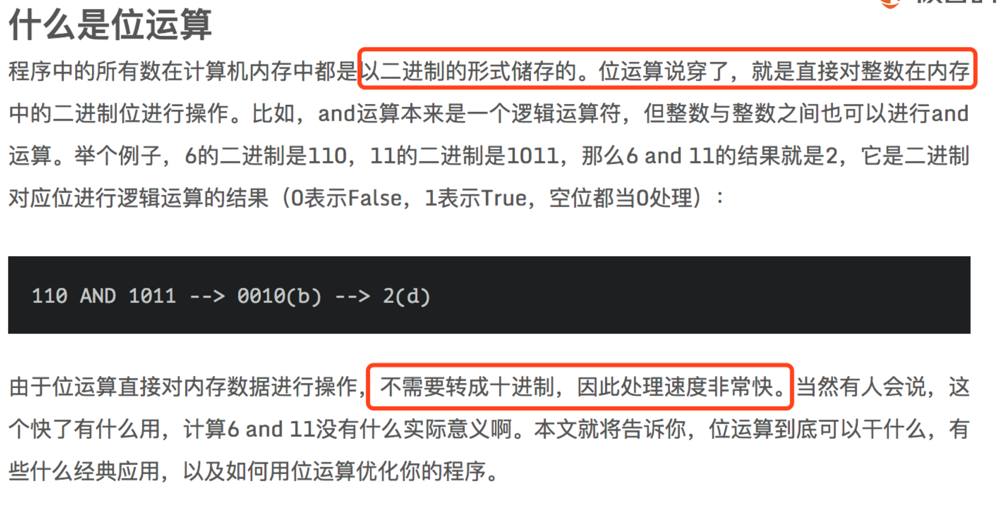
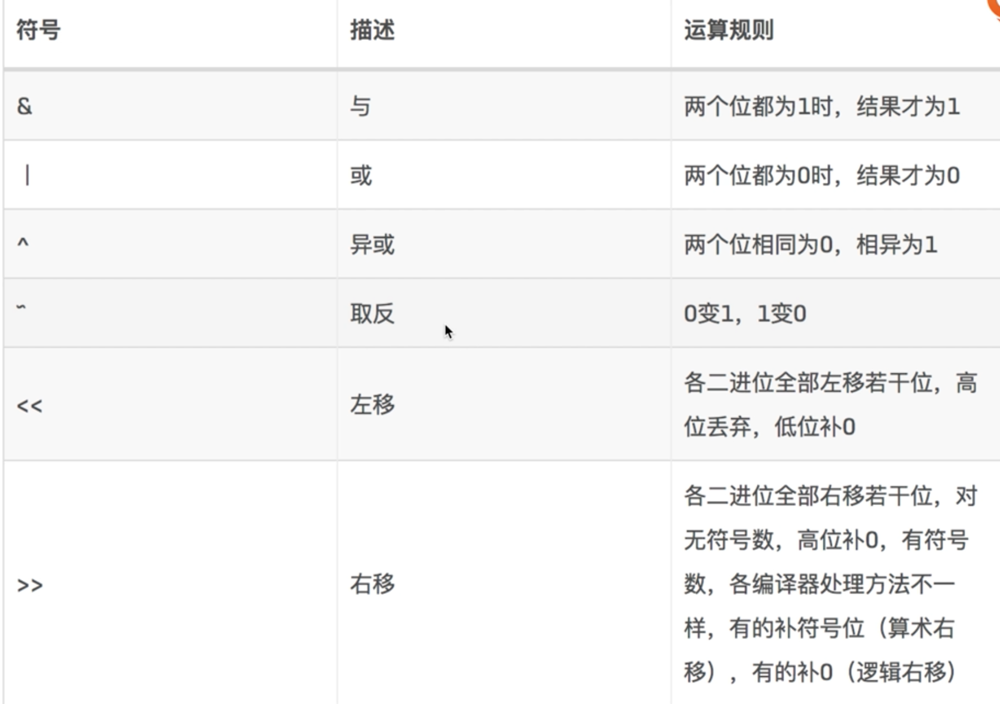

## 什么是位运算





\>>>   :   无符号右移，忽略符号位，空位都以0补齐


~ 取反 0变1  1 变0

-1 反码+1；

## &和&&的区别

&和&&都可以用作**逻辑与**的运算符，表示逻辑与（and），当运算符两边的表达式的结果都为true时，整个运算结果才为true，否则，只要有一方为false，则结果为false。

&&还具有短路的功能，即如果第一个表达式为false，则不再计算第二个表达式。

&还可以用作**按位与**的运算符，两个表达式的值按二进制位展开，对应的位(bit)按值进行“与”运算，结果保留在该位上

```java
a>1&b<5  

a>1&&b<5
  
1&2   
```


## 常用位运算操作

### X & 1 == 1 （奇数） OR == 0（偶数） 

如 1-> 

  01

  01

=01  1 -》 奇数

相当于 x%2==1  但是效率更高


### X&(X-1)    清零最低位的1

​     10

​     01

==00


### X&(-X)  得到最低位的1

​           **1110**

  反码  0001

  +1     **0010**

​         = 0010


### X & ~X => 0


## 运算符优先级表

| 优先级 | 运算符                                        | 结合性   |
| ------ | --------------------------------------------- | -------- |
| 1      | () [] .                                       | 从左到右 |
| 2      | ! +(正)  -(负) ~ ++ --                        | 从右向左 |
| 3      | * / %                                         | 从左向右 |
| 4      | +(加) -(减)                                   | 从左向右 |
| 5      | << >> >>>                                     | 从左向右 |
| 6      | < <= > >= instanceof                          | 从左向右 |
| 7      | ==  !=                                        | 从左向右 |
| 8      | &(按位与)                                     | 从左向右 |
| 9      | ^                                             | 从左向右 |
| 10     | \|                                            | 从左向右 |
| 11     | &&                                            | 从左向右 |
| 12     | \|\|                                          | 从左向右 |
| 13     | ?:                                            | 从右向左 |
| 14     | = += -= *= /= %= &= \|= ^=  ~=  <<= >>=  >>>= | 从右向左 |

 


有符号数和无符号数简单的说就是分别对应正数和负数，在二进制系统中是以bit（位）来作为数据存储单元的，**最高位（第一位）是符号位，正数符号位为“0” ，负数符号位为“1” 。**


负数的二进制表示形式   反码+1 =补码