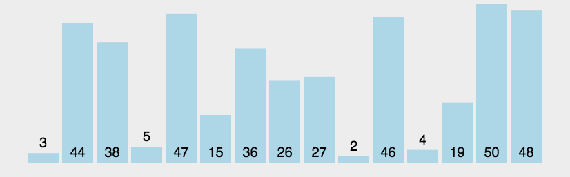
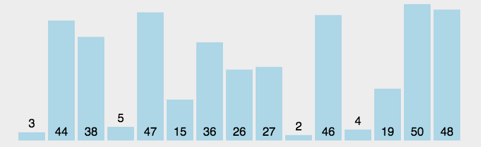

## 排序算法

* 冒泡排序
  


时间复杂度T(n) = O(n2)

```java
/**
 * 冒泡排序的第一种实现, 没有任何优化
 * @param a
 * @param n
 */
public static void bubbleSort1(int [] a, int n){
    int i, j;

    for(i=0; i<n; i++){//表示n次排序过程。
        for(j=1; j<n-i; j++){
            if(a[j-1] > a[j]){//前面的数字大于后面的数字就交换
                //交换a[j-1]和a[j]
                int temp;
                temp = a[j-1];
                a[j-1] = a[j];
                a[j]=temp;
            }
        }
    }
```

* 选择排序
  


时间复杂度T(n) = O(n2) 

```java
 public static int[] selectionSort(int[] array) {
        if (array.length == 0)
            return array;
        for (int i = 0; i < array.length; i++) {
            int minIndex = i;
            for (int j = i; j < array.length; j++) {
                if (array[j] < array[minIndex]) //找到最小的数
                    minIndex = j; //将最小数的索引保存
            }
            int temp = array[minIndex];
            array[minIndex] = array[i];
            array[i] = temp;
        }
        return array;
    }
```

?> * 快速排序算法 TODO

