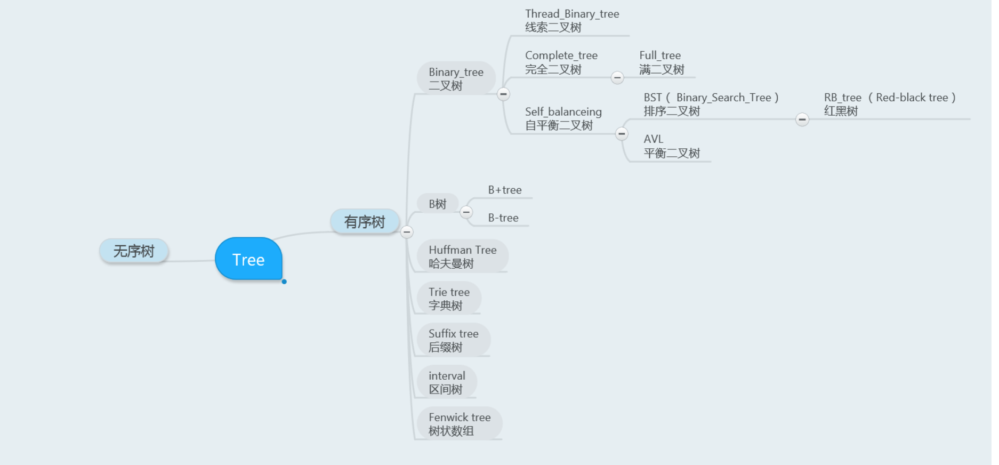

1)、二叉查找树(BST)：解决了排序的基本问题，但是由于无法保证平衡，可能退化为链表；

2)、平衡二叉树(AVL)：通过旋转解决了平衡的问题，但是旋转操作效率太低；

3)、红黑树：通过舍弃严格的平衡和引入红黑节点，解决了AVL旋转效率过低的问题，但是在磁盘等场景下，树仍然太高，IO次数太多；

4)、B树：通过将二叉树改为多路平衡查找树，解决了树过高的问题；

5)、B+树：在B树的基础上，将非叶节点改造为不存储数据的纯索引节点，进一步降低了树的高度；此外将叶节点使用指针连接成链表，范围查询更加高效。

[为什么有红黑树？什么是红黑树？看完这篇你就明白了](https://mp.weixin.qq.com/s/pwBnKfgivdE5EzBCXubZww)