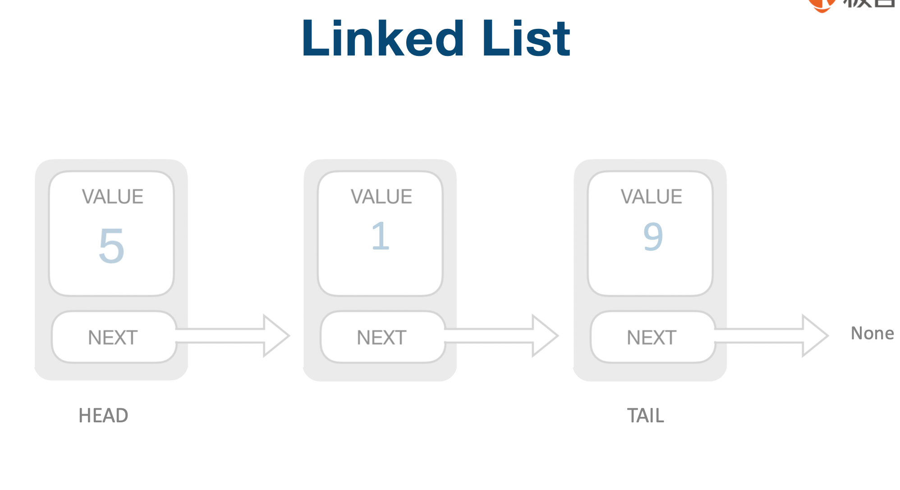
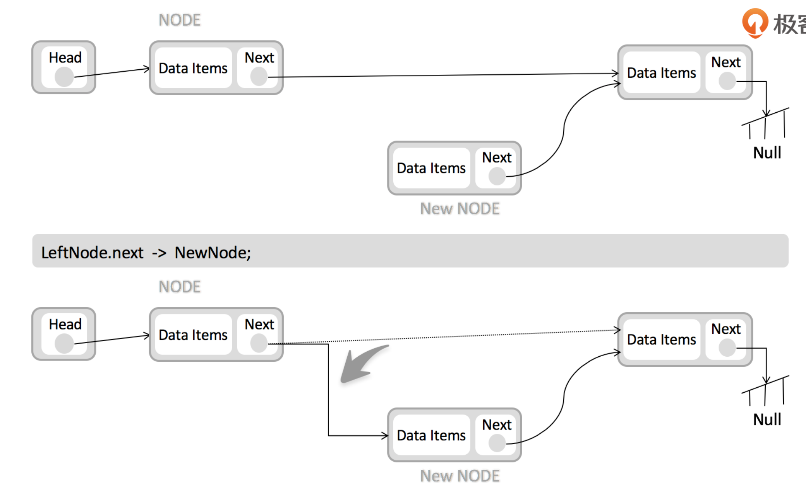
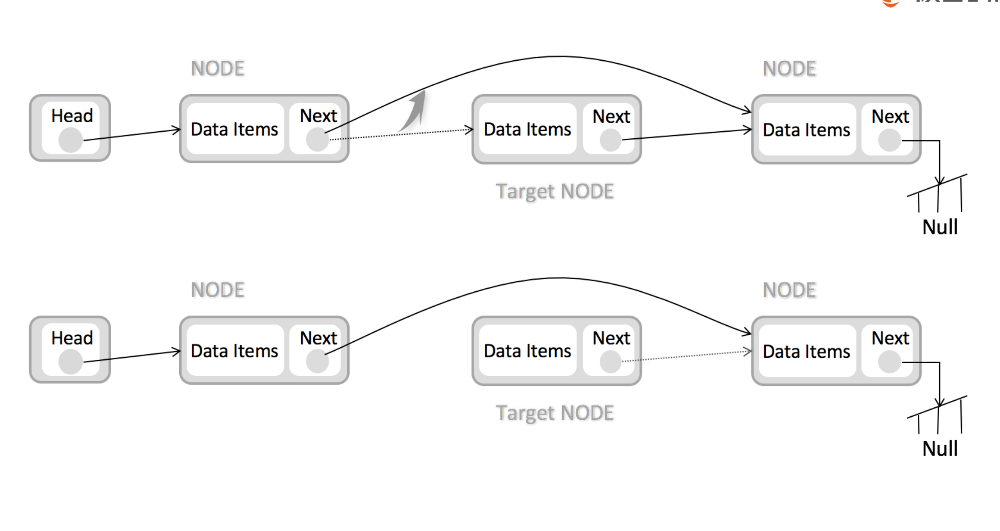
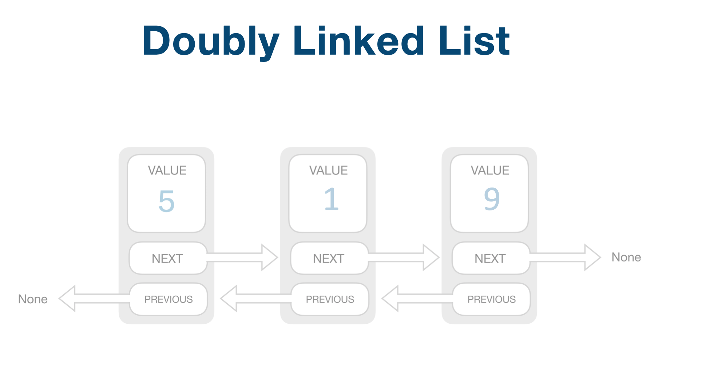

时间复杂度

**space** O(n) **prepend** O(1) **append** O(1) **lookup** O(n) **insert** O(1) **delete** O(1)


```java
public class ListNode{
  int val;
  ListNode next;
  public ListNode(int val){
    this.val=val;
  }
}

//数组转链表
public static ListNode arrToListNode(int[] data){
  ListNode root=new ListNode(data[0]);
  ListNode p=root;
  for(int i=1;i<data.length;i++){
    ListNode temp=new ListNode(i);
    p.next=temp;
    p=temp;
  }
  return root;
}
```


[Java链表与数组间的相互转换](https://www.jianshu.com/p/0d0dbfcbc1c3)

 