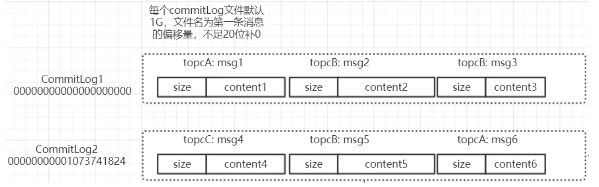
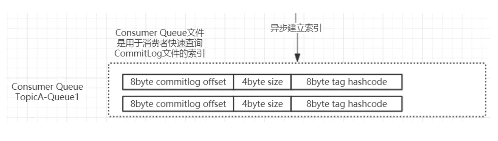

# RocketMQ

RocketMQ是阿里开源的消息中间件，它是纯Java开发，具有高吞吐量、高可用性、适合大规模分布式系统应用的特点。RocketMQ思路起源于Kafka，但并不是Kafka的一个Copy，它对消息的可靠传输及事务性做了优化，目前在阿里集团被广泛应用于交易、充值、流计算、消息推送、日志流式处理、binglog分发等场景。

**特点**

* 是一个队列模型的消息中间件，具有高性能、高可靠、高实时、分布式特点。
* Producer、Consumer、队列都可以分布式。
* Producer向一些队列轮流发送消息，队列集合称为Topic，Consumer如果做广播消费，则一个consumer实例消费这个Topic对应的所有队列，如果做集群消费，则多个Consumer实例平均消费这个* * * topic对应的队列集合。
* 能够保证严格的消息顺序
* 提供丰富的消息拉取模式
* 高效的订阅者水平扩展能力
* 实时的消息订阅机制
* 亿级消息堆积能力
* 较少的依赖

* Name Server是一个几乎无状态节点，可集群部署，节点之间无任何信息同步。 **路由**  用于给 Producer 和 Consumer 查找 Broker 信息
* Broker分为Master与Slave，一个Master可以对应多个Slave，但是一个Slave只能对应一个Master，每个Broker与Name Server集群中的所有节点建立长连接，定时注册Topic信息到所有Name Server。
* Producer与Name Server集群中的其中一个节点（随机选择）建立长连接，定期从Name Server取Topic路由信息，并向提供Topic服务的Master建立长连接，且定时向Master发送心跳。Producer完全无状态，可集群部署。
* Consumer与Name Server集群中的其中一个节点（随机选择）建立长连接，定期从Name Server取Topic路由信息，并向提供Topic服务的Master、Slave建立长连接，且定时向Master、Slave发送心跳。Consumer既可以从Master订阅消息，也可以从Slave订阅消息，订阅规则由Broker配置决定。
* 消息（Message）就是要传输的信息。一条消息必须有一个主题（Topic），主题可以看做是你的信件要邮寄的地址。一条消息也可以拥有一个可选的标签（Tag）和额处的键值对

**消息消费模式** 
消息消费模式有两种：集群消费（Clustering）和广播消费（Broadcasting）。默认情况下就是集群消费，该模式下一个消费者集群共同消费一个主题的多个队列，一个队列只会被一个消费者消费，如果某个消费者挂掉，分组内其它消费者会接替挂掉的消费者继续消费。而广播消费消息会发给消费者组中的每一个消费者进行消费。

## 消息如何保存

### CommitLog

- 保存**所有**topic的**原始消息**
- CommitLog分为多个文件，每个文件默认最大为1G
- 每条记录包括：消息长度和消息文本（消息体，属性，uid等等）
- 因每条消息长度不一致，每个commitLog的记录长度也不一致

### ConsumerQueue

- 保存**某个Topic下某个Queue**的**索引信息**
- 每条记录包括：消息在commitLog中的offset，消息大小，消息tag的哈希值
- 每条记录长度固定为20byte
- producer发送消息后，先保存到commitLog，再异步建立该条消息对应的topic + queue对应的ConsumerQueue索引
- **第三部分的Hash(tag)是服务端过滤消息的重要依据**

RocketMQ采用的是混合型的存储结构，即为Broker单个实例下所有的队列共用一个日志数据文件（即为CommitLog）来存储。RocketMQ的混合型存储结构(多个Topic的消息实体内容都存储于一个CommitLog中)针对Producer和Consumer分别采用了数据和索引部分相分离的存储结构，Producer发送消息至Broker端，然后Broker端使用同步或者异步的方式对消息刷盘持久化，保存至CommitLog中。只要消息被刷盘持久化至磁盘文件CommitLog中，那么Producer发送的消息就不会丢失。正因为如此，Consumer也就肯定有机会去消费这条消息。当无法拉取到消息后，可以等下一次消息拉取，同时服务端也支持长轮询模式，如果一个消息拉取请求未拉取到消息，Broker允许等待30s的时间，只要这段时间内有新消息到达，将直接返回给消费端。这里，RocketMQ的具体做法是，使用Broker端的后台服务线程—ReputMessageService不停地分发请求并异步构建ConsumeQueue（逻辑消费队列）和IndexFile（索引文件）数据。

## Tag过滤 

### 理论

#### Broker端消息过滤

在Broker中，按照Consumer的要求做过滤，优点是减少了对于Consumer无用消息的网络传输。
缺点是增加了Broker的负担，实现相对复杂。

1. 淘宝Notify支持多种过滤方式，包含直接按照消息类型过滤，灵活的语法表达式过滤，几乎可以满足最苛刻的过滤需求。
2. 淘宝RocketMQ支持按照简单的Message Tag过滤，也支持按照Message Header、body进行过滤。
3. CORBA Notification规范中也支持灵活的语法表达式过滤。

#### Consumer端消息过滤

这种过滤方式可由应用完全自定义实现，但是缺点是很多无用的消息要传输到Consumer端。

## RocketMq的具体实现

rocketMq的Tag过滤是borer过滤和cunsumer过滤相结合实现的。

 broker端的过滤：在拉取消息的时候会先去遍历ConsumeQueue的，然后根据tag的hashCode来进行比对看是否符合要求，这里会出现哈希冲突，但是没关系在consumer端会根据tag的字符串进行去比对了，保证了正确性。这里在consumeQueue里面进行比对有个好处，就是避免了对commitLog的访问，不需要再去访问磁盘里的消息了。

 consumer端的过滤：把从服务端获取到的消息根据tag进行字符串比对，这里确保了broker由于哈希冲突导致的过滤不干净的问题。

## Ref

> https://www.jianshu.com/p/ffffec6e5790
>
> https://juejin.im/post/5cfa7065f265da1ba647dddd
>
> https://juejin.im/post/5de3c8026fb9a07194761641
>
> https://github.com/apache/rocketmq/blob/master/docs/cn/design.md
>
> https://www.cnblogs.com/hzmark/p/mq-delay-msg.html

