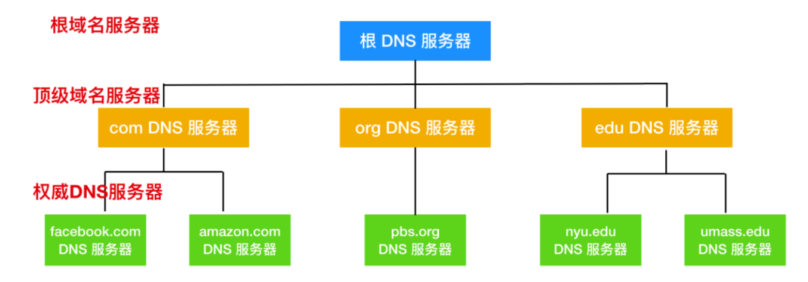

# 计算机网络

Socket是一个抽象概念，一个应用程序通过一个Socket来建立一个远程连接，

可以把Socket简单理解为IP地址加端口号。端口号总是由操作系统分配，它是一个0～65535之间的数字，其中，小于1024的端口属于*特权端口*，需要管理员权限，大于1024的端口可以由任意用户的应用程序打开。

端口 0-65535  其中0-1023为系统保留端口    http 80、 https 44、 ftp 21 、ssh 22、 zk 2181、 redis 6379


## TCP/IP 网络模型


还有一种就是 OSI 七层网络模型，它就是在五层协议之上加了**表示层和会话层**


## UDP 和 TCP 的区别

### UDP

UDP 的全称是 `User Datagram Protocol`，用户数据报协议。它不需要所谓的`握手`操作，从而加快了通信速度，允许网络上的其他主机在接收方同意通信之前进行数据传输。

> 数据报是与分组交换网络关联的传输单元。

UDP 的特点主要有

- UDP 能够支持容忍数据包丢失的带宽密集型应用程序
- UDP 具有低延迟的特点
- UDP 能够发送大量的数据包
- UDP 能够允许 DNS 查找，DNS 是建立在 UDP 之上的应用层协议。


* UDP 是无连接的；
* UDP 使用尽最大努力交付，即不保证可靠交付，因此主机不需要维持复杂的链接状态（这里面有许多参数）；
* UDP 是面向报文的；
* UDP 没有拥塞控制，因此网络出现拥塞不会使源主机的发送速率降低（对实时应用很有用，如 直播，实时视频会议等）；
* UDP 支持一对一、一对多、多对一和多对多的交互通信；
* UDP 的首部开销小，只有8个字节，比TCP的20个字节的首部要短。

### TCP

TCP 的全称是`Transmission Control Protocol` ，传输控制协议。它能够帮助你确定计算机连接到 Internet 以及它们之间的数据传输。通过三次握手来建立 TCP 连接，三次握手就是用来启动和确认 TCP 连接的过程。一旦连接建立后，就可以发送数据了，当数据传输完成后，会通过关闭虚拟电路来断开连接。

TCP 的主要特点有

- TCP 能够确保连接的建立和数据包的发送
- TCP 支持错误重传机制
- TCP 支持拥塞控制，能够在网络拥堵的情况下延迟发送
- TCP 能够提供错误校验和，甄别有害的数据包。


* TCP 是面向连接的。（就好像打电话一样，通话前需要先拨号建立连接，通话结束后要挂机释放连接）；
  每一条 TCP 连接只能有两个端点，每一条TCP连接只能是点对点的（一对一）；

* TCP 提供可靠交付的服务。通过TCP连接传送的数据，无差错、不丢失、不重复、并且按序到达；

* TCP 提供全双工通信。TCP 允许通信双方的应用进程在任何时候都能发送数据。TCP 连接的两端都设有发送缓存和接收缓存，用来临时存放双方通信的数据；

* 面向字节流。TCP 中的“流”（Stream）指的是流入进程或从进程流出的字节序列。“面向字节流”的含义是：虽然应用程序和 TCP 的交互是一次一个数据块（大小不等），但 TCP 把应用程序交下来的数据仅仅看成是一连串的无结构的字节流。

  


**
“端口→ IP 地址→ MAC 地址 ”** 这样的路径进行数据的封装和发送 ， 解包的时候反过 来操作即可。 

## TCP 协议如何保证可靠传输

- 应用数据被分割成 TCP 认为最适合发送的数据块。
- TCP 给发送的每一个包进行编号，接收方对数据包进行排序，把有序数据传送给应用层。
- **校验和：** TCP 将保持它首部和数据的检验和。这是一个端到端的检验和，目的是检测数据在传输过程中的任何变化。如果收到段的检验和有差错，TCP 将丢弃这个报文段和不确认收到此报文段。
- TCP 的接收端会丢弃重复的数据。
- **流量控制：** TCP 连接的每一方都有固定大小的缓冲空间，TCP的接收端只允许发送端发送接收端缓冲区能接纳的数据。当接收方来不及处理发送方的数据，能提示发送方降低发送的速率，防止包丢失。TCP 使用的流量控制协议是可变大小的滑动窗口协议。 （TCP 利用滑动窗口实现流量控制）
- **拥塞控制：** 当网络拥塞时，减少数据的发送。
- **停止等待协议** 也是为了实现可靠传输的，它的基本原理就是每发完一个分组就停止发送，等待对方确认。在收到确认后再发下一个分组。
- **超时重传：** 当 TCP 发出一个段后，它启动一个定时器，等待目的端确认收到这个报文段。如果不能及时收到一个确认，将重发这个报文段。

## 滑动窗口

- TCP 利用滑动窗口实现流量控制的机制。
- 滑动窗口（Sliding window）是一种流量控制技术。早期的网络通信中，通信双方不会考虑网络的拥挤情况直接发送数据。由于大家不知道网络拥塞状况，同时发送数据，导致中间节点阻塞掉包，谁也发不了数据，所以就有了滑动窗口机制来解决此问题。
- TCP 中采用滑动窗口来进行传输控制，滑动窗口的大小意味着接收方还有多大的缓冲区可以用于接收数据。发送方可以通过滑动窗口的大小来确定应该发送多少字节的数据。当滑动窗口为 0 时，发送方一般不能再发送数据报，但有两种情况除外，一种情况是可以发送紧急数据，例如，允许用户终止在远端机上的运行进程。另一种情况是发送方可以发送一个 1 字节的数据报来通知接收方重新声明它希望接收的下一字节及发送方的滑动窗口大小。


## TCP 三次握手和四次挥手

### TCP 三次握手


- SYN：它的全称是 `Synchronize Sequence Numbers`，同步序列编号。是 TCP/IP 建立连接时使用的握手信号。在客户机和服务器之间建立 TCP 连接时，首先会发送的一个信号。客户端在接受到 SYN 消息时，就会在自己的段内生成一个随机值 X。
- SYN-ACK：服务器收到 SYN 后，打开客户端连接，发送一个 SYN-ACK 作为答复。确认号设置为比接收到的序列号多一个，即 X + 1，服务器为数据包选择的序列号是另一个随机数 Y。
- ACK：`Acknowledge character`, 确认字符，表示发来的数据已确认接收无误。最后，客户端将 ACK 发送给服务器。序列号被设置为所接收的确认值即 Y + 1。


!> **三次握手就能确认双发收发功能都正常**

如果用现实生活来举例的话就是

小明 - 客户端 小红 - 服务端

- 小明给小红打电话，接通了后，小明说**喂，能听到吗**，这就相当于是连接建立。
- 小红给小明回应，**能听到，你能听到我说的话吗**，这就相当于是请求响应。
- 小明听到小红的回应后，**好的**，这相当于是连接确认。在这之后小明和小红就可以通话/交换信息了。


### TCP 四次挥手

在连接终止阶段使用四次挥手，连接的每一端都会独立的终止。下面我们来描述一下这个过程。


- 首先，客户端应用程序决定要终止连接(这里服务端也可以选择断开连接)。这会使客户端将 FIN 发送到服务器，并进入 `FIN_WAIT_1` 状态。当客户端处于 FIN_WAIT_1 状态时，它会等待来自服务器的 ACK 响应。
- 然后第二步，当服务器收到 FIN 消息时，服务器会立刻向客户端发送 ACK 确认消息。
- 当客户端收到服务器发送的 ACK 响应后，客户端就进入 `FIN_WAIT_2` 状态，然后等待来自服务器的 `FIN` 消息
- 服务器发送 ACK 确认消息后，一段时间（可以进行关闭后）会发送 FIN 消息给客户端，告知客户端可以进行关闭。
- 当客户端收到从服务端发送的 FIN 消息时，客户端就会由 FIN_WAIT_2 状态变为 `TIME_WAIT` 状态。处于 TIME_WAIT 状态的客户端允许重新发送 ACK 到服务器为了防止信息丢失。客户端在 TIME_WAIT 状态下花费的时间取决于它的实现，在等待一段时间后，连接关闭，客户端上所有的资源（包括端口号和缓冲区数据）都被释放。

还是可以用上面那个通话的例子来进行描述

- 小明对小红说，我所有的东西都说完了，我要挂电话了。
- 小红说，收到，我这边还有一些东西没说。
- 经过若干秒后，小红也说完了，小红说，我说完了，现在可以挂断了
- 小明收到消息后，又等了若干时间后，挂断了电话。


### 为什么 TCP 协议有 TIME_WAIT 状态

[https://draveness.me/whys-the-design-tcp-time-wait/](https://draveness.me/whys-the-design-tcp-time-wait/)

一个常见的关闭连接过程如下[1](https://draveness.me/whys-the-design-tcp-time-wait/#fn:1)：

1. 当客户端没有待发送的数据时，它会向服务端发送 `FIN` 消息，发送消息后会进入 `FIN_WAIT_1` 状态；
2. 服务端接收到客户端的 `FIN` 消息后，会进入 `CLOSE_WAIT` 状态并向客户端发送 `ACK` 消息，客户端接收到 `ACK` 消息时会进入 `FIN_WAIT_2` 状态；
3. 当服务端没有待发送的数据时，服务端会向客户端发送 `FIN` 消息；
4. 客户端接收到 `FIN` 消息后，会进入 `TIME_WAIT` 状态并向服务端发送 `ACK` 消息，服务端收到后会进入 `CLOSED` 状态；
5. 客户端等待**两个最大数据段生命周期**（Maximum segment lifetime，MSL）[2](https://draveness.me/whys-the-design-tcp-time-wait/#fn:2)的时间后也会进入 `CLOSED` 状态；


从上述过程中，我们会发现 `TIME_WAIT` 仅在主动断开连接的一方出现，被动断开连接的一方会直接进入 `CLOSED` 状态，进入 `TIME_WAIT` 的客户端需要等待 2 MSL 才可以真正关闭连接。TCP 协议需要 `TIME_WAIT` 状态的原因和客户端需要等待两个 MSL 不能直接进入 `CLOSED` 状态的原因是一样的[3](https://draveness.me/whys-the-design-tcp-time-wait/#fn:3)：

- 防止延迟的数据段被其他使用相同源地址、源端口、目的地址以及目的端口的 TCP 连接收到；
- 保证 TCP 连接的远程被正确关闭，即等待被动关闭连接的一方收到 `FIN` 对应的 `ACK` 消息；


在默认情况下，如果客户端等待足够长的时间就会遇到以下两种情况：

1. 服务端正常收到了 `ACK` 消息并关闭当前 TCP 连接；
2. 服务端没有收到 `ACK` 消息，重新发送 `FIN` 关闭连接并等待新的 `ACK` 消息；

只要客户端等待 2 MSL 的时间，客户端和服务端之间的连接就会正常关闭，新创建的 TCP 连接收到影响的概率也微乎其微，保证了数据传输的可靠性。


如果客户端等待的时间不够长，那么使用相同端口号重新与远程建立连接时会造成以下问题：

- 因为数据段的网络传输时间不确定，所以可能会收到上一次 TCP 连接中未被收到的数据段；
- 因为客户端发出的 `ACK` 可能还没有被服务端接收，服务端可能还处于 `LAST_ACK` 状态，所以它会回复 `RST` 消息终止新连接的建立；

## HTTP 状态码


* 状态码


1. 200 成功
2. 301移动http-https 302+loaction重定向 304 缓存
3. 401 认证  403 授权 404 找不到 405 方法禁止 
4. 500 内部错误 502	Bad Gateway 504	Gateway Time-out

## http头信息

**请求**

  *  Accept：告诉WEB服务器自己接受什么介质类型，*/* 表示任何类型，type/* 表示该类型下的所有子类型，type/sub-type。
  *  Content-Type： WEB 服务器告诉浏览器自己响应的对象的类型。例如：Content-Type：application/xml
  *  Referer：发送请求页面URL。浏览器向 WEB 服务器表明自己是从哪个 网页/URL 获得/点击 当前请求中的网址/URL
  *  Host： 发送请求页面所在域。
     **响应**
  *  refresh	应用于重定向或一个新的资源被创造，在5秒之后重定向（由网景提出，被大部分浏览器支持）Refresh: 5; url=http://www.zcmhi.com/archives/94.html
  *  Allow	对某网络资源的有效的请求行为，不允许则返回405 Allow: GET, HEAD

* 禁用缓存

```java
response.setDateHeader("Expires", 0);
response.setHeader("Cache-Control", "no-cache");
response.setHeader("Pragma", "no-cache");
```

* **文件下载**

```java
// 配置文件下载
response.setHeader("content-type", "application/octet-stream");
response.setContentType("application/octet-stream");
// 下载文件能正常显示中文
response.setHeader("Content-Disposition", "attachment;filename=" + URLEncoder.encode(fileName, "UTF-8"));

```


## HTTP GET and SET

get 和 post

* get 一般是从服务器获取资源 post 一般是提交数据
* get 是在url ？后 以name=value &分割的形式传递数据  post是在body中
* get 受到url长度限制（这个限制并不是http协议规定的 而是不同的浏览器限制不同 1kb 2kb ）
* get 数据会显示在地址栏上。 敏感数据可以用post

**深层次：**
GET和POST本质上就是TCP链接，并无差别。但是由于HTTP的规定和浏览器/服务器的限制，导致他们在应用过程中体现出一些不同。
GET产生一个TCP数据包；POST产生两个TCP数据包。

get 请求在发送过程中会产生一个 TCP 数据包；post 在发送过程中会产生两个 TCP 数据包。对于 get 方式的请求，浏览器会把 http header 和 data 一并发送出去，服务器响应 200（返回数据）；而对于 post，浏览器先发送 header，服务器响应 100 continue，浏览器再发送 data，服务器响应 200 ok（返回数据）。

### HTTP 1.1


HTTP 1.1 默认使用长连接，长连接就是只需一次建立就可以传输多次数据，传输完成后，只需要一次切断连接即可。长连接的连接时长可以通过请求头中的 `keep-alive` 来设置

Connection：请求：close（告诉WEB服务器或者代理服务器，在完成本次请求的响应后，断开连接，不要等待本次连接的后续请求了）。
 keepalive（告诉WEB服务器或者代理服务器，在完成本次请求的响应后，保持连接，等待本次连接的后续请求）。 
 响应：close（连接已经关闭）。 
 keepalive（连接保持着，在等待本次连接的后续请求）。
Keep-Alive：如果浏览器请求保持连接，则该头部表明希望 WEB 服务器保持连接多长时间（秒）。例如：Keep-Alive：300

而从HTTP/1.1起，默认使用长连接，用以保持连接特性。使用长连接的HTTP协议，会在响应头加入这行代码：
`Connection:keep-alive`

服务端 keepalvie timeout

Keep-Alive模式，客户端如何**判断请求所得到的响应数据已经接收完成**：
1.Conent-Length
2.Transfer-Encoding: chunked
 Chunked编码将使用若干个Chunk串连而成，由一个标明长度为0的chunk标示结束

http协议很重要 。 在java 代码的协议配置 调优 都需要http协议的知识来支撑
keepalive 我需要过 两个这个相关的问题。

  1. NoHttpResponseException 这个是在生产环境 偶发的 我是用的resttemplate 底层也是httpclient。 也是配置的了
     tryhandler。 排查发现  是走不到 重试逻辑 。 （深层次的原因还是 keepalive  连接池为了性能考虑复用了连接。 但是连接已经被服务端关闭了）第一种方法 是 改写重试逻辑  第二种  连接存活时间改小 ，
  2. 做爬虫。 批量检查http服务是否可用   因为keepalive的原因 。导致连接一直未能关闭。 解决方法 改写 response处理逻辑。不去读流 直接关闭

其实“池”技术是一种通用的设计，其设计思想并不复杂：

1. 当有连接第一次使用的时候建立连接
2. 结束时对应连接不关闭，归还到池中
3. 下次同个目的的连接可从池中获取一个可用连接
4. 定期清理过期连接


## **HTTPS**

**全称 Hypertext Transfer Protocol Secure HTTPS 就是身披了一层 SSL 的 HTTP**。

https=http+ssl/tls . 证书相当与 公私钥

https 使用了 对称加密和非对称加密相结合的方式。

请求一个https的网站，会返回一个 证书 证书包含公钥和过期时间 等信息。

客户端需要对 公钥进行认证。采用CA根证书的公钥 解密出网站的公钥 然后验签。确保 公钥没有被改动。 之后 客户端生成一个随机数作为对称加密的 key 加密需要传送的数据 之后对key 使用证书的公钥加密  然后 hash  

服务器 使用私钥 解密 key 然后使用key 解密 数据。 


- 在进行通信前，首先会进行 HTTP 的三次握手，握手完成后，再进行 TLS 的握手过程
- ClientHello：客户端通过向服务器发送 `hello` 消息来发起握手过程。这个消息中会夹带着客户端支持的 `TLS 版本号(TLS1.0 、TLS1.2、TLS1.3)` 、客户端支持的密码套件、以及一串 `客户端随机数`。
- ServerHello：在客户端发送 hello 消息后，服务器会发送一条消息，这条消息包含了服务器的 SSL 证书、服务器选择的密码套件和服务器生成的随机数。
- 认证(Authentication)：客户端的证书颁发机构会认证 SSL 证书，然后发送 `Certificate` 报文，报文中包含公开密钥证书。最后服务器发送 `ServerHelloDone` 作为 `hello` 请求的响应。第一部分握手阶段结束。
- `加密阶段`：在第一个阶段握手完成后，客户端会发送 `ClientKeyExchange` 作为响应，这个响应中包含了一种称为 `The premaster secret` 的密钥字符串，这个字符串就是使用上面公开密钥证书进行加密的字符串。随后客户端会发送 `ChangeCipherSpec`，告诉服务端使用私钥解密这个 `premaster secret` 的字符串，然后客户端发送 `Finished` 告诉服务端自己发送完成了。

> Session key 其实就是用公钥证书加密的公钥。

- `实现了安全的非对称加密`：然后，服务器再发送 `ChangeCipherSpec` 和 `Finished` 告诉客户端解密完成，至此实现了 RSA 的非对称加密。


## 地址栏输入 URL 发生了什么


总体来说分为以下几个过程:

1. DNS解析
2. TCP连接
3. 发送HTTP请求
4. 服务器处理请求并返回HTTP报文
5. 浏览器解析渲染页面
6. 连接结束


- 首先，你需要在浏览器中的 URL 地址上，输入你想访问的地址，如下


你应该访问不到的，对不对~

- 然后，浏览器会根据你输入的 URL 地址，去查找域名是否被本地 DNS 缓存，不同浏览器对 DNS 的设置不同，如果浏览器缓存了你想访问的 URL 地址，那就直接返回 ip。如果没有缓存你的 URL 地址，浏览器就会发起系统调用来查询本机 `hosts` 文件是否有配置 ip 地址，如果找到，直接返回。如果找不到，就向网络中发起一个 DNS 查询。

> 首先来看一下 DNS 是啥，互联网中识别主机的方式有两种，通过`主机名`和 `IP 地址`。我们人喜欢用名字的方式进行记忆，但是通信链路中的路由却喜欢定长、有层次结构的 IP 地址。
>
> 
>
> 所以就需要一种能够把主机名到 IP 地址的转换服务，这种服务就是由 DNS 提供的。DNS 的全称是 `Domain Name System` 域名系统。DNS 是一种由分层的 DNS 服务器实现的分布式数据库。DNS 运行在 UDP 上，使用 53 端口。
>
> 

DNS 是一种分层数据库，它的主要层次结构如下



一般域名服务器的层次结构主要是以上三种，除此之外，还有另一类重要的 DNS 服务器，它是 `本地 DNS 服务器(local DNS server)`。

严格来说，本地 DNS 服务器并不属于上述层次结构，但是本地 DNS 服务器又是至关重要的。每个 `ISP(Internet Service Provider)` 比如居民区的 ISP 或者一个机构的 ISP 都有一台本地 DNS 服务器。当主机和 ISP 进行连接时，该 ISP 会提供一台主机的 IP 地址，该主机会具有一台或多台其本地 DNS 服务器的 IP地址。

通过访问网络连接，用户能够容易的确定 DNS 服务器的 IP地址。当主机发出 DNS 请求后，该请求被发往本地 DNS 服务器，它起着代理的作用，并将该请求转发到 DNS 服务器层次系统中。

首先，查询请求会先找到本地 DNS 服务器来查询是否包含 IP 地址，如果本地 DNS 无法查询到目标 IP 地址，就会向根域名服务器发起一个 DNS 查询。

> 注意：DNS 涉及两种查询方式：一种是`递归查询(Recursive query)` ，一种是`迭代查询(Iteration query)`。《计算机网络：自顶向下方法》竟然没有给出递归查询和迭代查询的区别，找了一下网上的资料大概明白了下。
>
> 
>
> 如果根域名服务器无法告知本地 DNS 服务器下一步需要访问哪个顶级域名服务器，就会使用递归查询；
>
> 
>
> 如果根域名服务器能够告知 DNS 服务器下一步需要访问的顶级域名服务器，就会使用迭代查询。

在由根域名服务器 -> 顶级域名服务器 -> 权威 DNS 服务器后，由权威服务器告诉本地服务器目标 IP 地址，再有本地 DNS 服务器告诉用户需要访问的 IP 地址。

- 第三步，浏览器需要和目标服务器建立 TCP 连接，需要经过三次握手的过程，具体的握手过程请参考上面的回答。
- 在建立连接后，浏览器会向目标服务器发起 `HTTP-GET` 请求，包括其中的 URL，HTTP 1.1 后默认使用长连接，只需要一次握手即可多次传输数据。
- 如果目标服务器只是一个简单的页面，就会直接返回。但是对于某些大型网站的站点，往往不会直接返回主机名所在的页面，而会直接重定向。返回的状态码就不是 200 ，而是 301,302 以 3 开头的重定向码，浏览器在获取了重定向响应后，在响应报文中 Location 项找到重定向地址，浏览器重新第一步访问即可。
- 然后浏览器重新发送请求，携带新的 URL，返回状态码 200 OK，表示服务器可以响应请求，返回报文。


## 安全方面

* sql注入
* XSS Cross-Site Scripting
* CSRF 跨站请求伪造( Cross-Site Request Forgery )
  csrf 有另lj于 xss，从政击效果上 ， 两者有重合的地方。从技术原理上两者有 本质的不同 ， xss 是在正常用户请求的 HTML 页面中执行了黑客提供的恶意代码， csrf 是黑客直接盗用用户浏览器中的登录信息 ， 冒充用户去执行黑客指定的操作。 xss 问题出在用户数据没有过滤 、 转义 l cs盯 问题出在 HTTP 接口没有防范不受信 任的调用。很多工程师会混淆这两个概念，甚至认为这两种攻击是一样的。

#### 三、什么是WebSocket？

WebSocket是HTML5一种新的协议，WebSocket是真正实现了全双工通信的服务器向客户端推的互联网技术，是一种在单个TCP连接上进行全双工通讯协议。

 

#### 四、全双工通讯协议的概念？

全双工是通讯传输的一个术语。通信允许数据在两个方向上同时传输，他在能力上相当于两个单工通信方式的结合。全双工指可以同时进行信号的双向传输。

全双工是：例如我们使用的手机就是全双工，在同一时刻两个用户可以同时给对方传送数据

半双工：例如我们使用的对讲机，当A方按住通话按钮才可以向B方传送数据，B方也是，在同一时刻只有一个用户能够传送数据（A/用户都可以传递信息，但是不能够同时传递）

单工：例如我们看电视时，我们只能接收对方发送的信息，不能够给对方传递信息；


## Ref

> [面试 HTTP ，99% 的面试官都爱问这些问题！](https://mp.weixin.qq.com/s/81ZGJ_HdUIcYX6F6GEi0Nw)
>
> [https原理通俗了解](https://www.cnblogs.com/zhangshitong/p/6478721.html)


